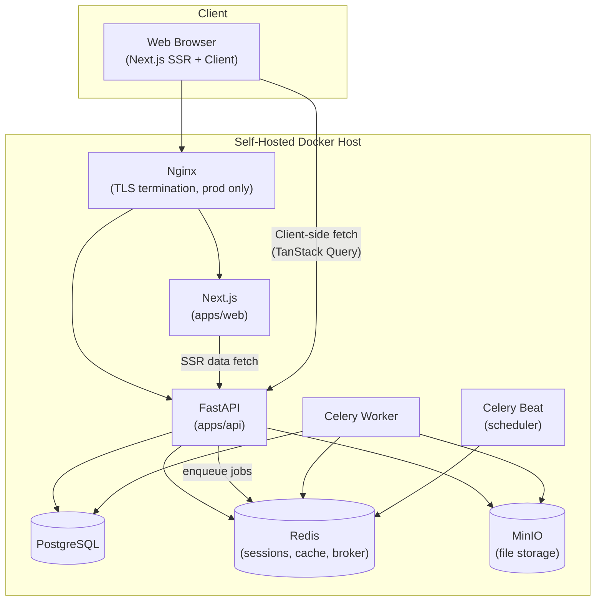

# LifeOS — Engineering Overview

# Document Information

| Field | Value |
|---|---|
| Document | Engineering Overview |
| File | `docs/architecture/00_Engineering_Overview.md` |
| Version | 1.1 |
| Status | Approved |
| Owner | Engineering Team |
| Last Updated | 2026-07-02 |
| Depends On | `docs/product/00_Glossary.md` through `06_Screen_Inventory.md`, `docs/design/00_Design_Handoff.md`, `docs/design/01_UX_Decision_Record.md`, `docs/decisions/` (DEC-001–013) |
| Used By | All future `docs/architecture/` documents, Engineering implementation |

---

## Purpose

This is the technical architecture of LifeOS — how the product defined in `docs/product/` and designed in `docs/design/` actually gets built. It assumes every prior decision (the Entity Platform, Vehicle as reference implementation, the 12 Modules and 28 Entity Types, the Standard Entity Capability Set, single-user V1 with SaaS-ready groundwork, self-hosted Docker deployment, no AI in MVP) as fixed input and does not re-litigate them — it translates them into a concrete engineering plan.

Four foundational engineering decisions were confirmed with the Product Owner before this document was written, since they would be expensive to reverse after implementation begins:

| Decision | Confirmed Choice |
|---|---|
| **Authentication** | Server-side sessions, Redis-backed, httpOnly cookies (not stateless JWT) |
| **API paradigm** | Hybrid — generic Capability endpoints shared by all Entity Types, plus conventional per-domain Entity endpoints |
| **Database modeling for the Entity Platform** | A shared base `entities` table + one detail table per domain Entity Type (not a single polymorphic/JSONB table, not fully separate tables with no shared base) |
| **Repository & CI** | GitHub + GitHub Actions |

Every section below is designed around these four confirmed choices. Where a genuine open question remains, it's called out explicitly in its section and summarized again in the Quality Review at the end — not assumed silently.

---

## 1. Recommended Technology Stack

This restates the fixed stack from `docs/product/01_Product_Vision.md` with the specific versions/libraries this architecture assumes:

| Layer | Technology | Notes |
|---|---|---|
| Frontend framework | Next.js (App Router), React, TypeScript | Fixed stack |
| Frontend styling | Tailwind CSS, shadcn/ui | Fixed stack |
| Frontend client state | Zustand | Fixed stack — UI-only state (modals, filters, sidebar) |
| Frontend server state | TanStack Query | Fixed stack — all data from the API |
| Forms & validation | React Hook Form + Zod | Fixed stack |
| Backend framework | FastAPI (async), Python 3.12+ | Fixed stack |
| ORM | SQLAlchemy 2.0 (async) | Async chosen over sync to match FastAPI's async request handling and avoid blocking the event loop on I/O |
| Migrations | Alembic | Fixed stack |
| Request/response validation | Pydantic v2 | Native to FastAPI |
| Database | PostgreSQL 16+ | Fixed stack |
| Session store / cache / job broker | Redis | Fixed stack |
| File storage | MinIO (S3-compatible) | Fixed stack |
| Background jobs | Celery + Celery Beat | New recommendation — see Section 10 |
| Reverse proxy (production) | Nginx | Fixed stack, "when needed" per original scope |
| Containerization | Docker + Docker Compose | Fixed stack |
| Password hashing | argon2 | Stronger against modern hardware than bcrypt, no meaningful downside |
| Repository & CI | GitHub + GitHub Actions | Confirmed above |

---

## 2. Monorepo Structure

LifeOS is polyglot (TypeScript frontend, Python backend) — a JavaScript-specific monorepo tool (Turborepo, Nx) would not manage the Python side, so "monorepo" here means **one Git repository, cleanly divided by concern**, not a single-language workspace tool:

```
lifeos/
├── apps/
│   ├── web/          # Next.js frontend
│   └── api/           # FastAPI backend
├── packages/
│   └── api-types/     # Generated TypeScript types from the FastAPI OpenAPI schema
├── infra/
│   ├── docker-compose.yml
│   ├── docker-compose.prod.yml
│   └── nginx/
├── docs/               # Already established (product, design, decisions, architecture)
├── design/             # Already established (sprint workspace)
└── .github/
    └── workflows/
```

**`packages/api-types` is the one piece of real "monorepo" tooling value here**: FastAPI generates a full OpenAPI schema from its Pydantic models automatically; a codegen step (e.g., `openapi-typescript`) turns that into TypeScript types the frontend imports directly. This means the API contract has exactly one source of truth (the FastAPI backend's Pydantic schemas) — the frontend can never silently drift out of sync with what the backend actually returns.

---

## 3. Project Folder Structure

### `apps/api/` (FastAPI) — structured to mirror the Platform Layer / Domain Layer split from `docs/product/00_Glossary.md`, Section 10

```
apps/api/
├── app/
│   ├── main.py
│   ├── core/                  # config, session/security, shared dependencies
│   ├── db/                    # engine, session factory, declarative base
│   ├── platform/               # PLATFORM LAYER — generic, reused by every domain
│   │   ├── entities/          # base `entities` table model + service
│   │   ├── attachments/
│   │   ├── relationships/
│   │   ├── reminders/
│   │   ├── expenses/           # generic linking; Expense itself is also a Domain (see below)
│   │   ├── notes/
│   │   ├── timeline/           # activity_log (auto) + timeline_entries (user-logged), unioned
│   │   ├── custom_fields/
│   │   ├── tags/
│   │   └── router.py           # ONE router mounted once, serving every entity_type generically
│   ├── domains/                # DOMAIN LAYER — thin, typed, one folder per Entity Type
│   │   ├── vehicles/           # reference implementation (DEC-001)
│   │   │   ├── models.py
│   │   │   ├── schemas.py
│   │   │   ├── router.py
│   │   │   └── service.py
│   │   ├── contacts/
│   │   ├── insurance_policies/
│   │   ├── documents/
│   │   ├── expenses/            # Expense as a first-class, standalone Finance entity
│   │   └── ...                  # further domains added the same way, per DEC-001's litmus test
│   ├── search/                  # Postgres full-text search integration
│   ├── notifications/           # channel abstraction: in-app, email
│   ├── jobs/                    # Celery tasks
│   └── auth/                    # session login/logout, password handling
├── alembic/
├── tests/
└── pyproject.toml
```

### `apps/web/` (Next.js) — mirrors the six reusable templates from `docs/design/00_Design_Handoff.md`, Section 6

```
apps/web/
├── app/
│   ├── (auth)/                 # login, register, forgot/reset password
│   ├── (dashboard)/
│   ├── (modules)/[domain]/     # Assets, Finance, Documents, ... per Module
│   └── settings/
├── components/
│   ├── ui/                     # shadcn/ui primitives
│   └── platform/               # the six reusable templates, each built ONCE:
│       ├── EntityForm/
│       ├── EntityOverview/
│       ├── CapabilityTabShell/
│       ├── FilterableListShell/
│       ├── ConfirmAction/
│       └── AttachmentViewer/
├── lib/
│   ├── api/                    # generated client using packages/api-types
│   └── queries/                # TanStack Query hooks, one set per domain, built on the shared client
├── stores/                     # Zustand stores (UI state only)
└── styles/
```

**This folder structure is not incidental** — a new Entity Type should require adding one small folder under `domains/`, never touching `platform/` or `components/platform/`. If it does, that's a signal the "domain" isn't actually thin, per the litmus test already established in `docs/decisions/DEC-001-vehicle-reference-implementation.md`.

---

## 4. High-Level System Architecture



Every service runs as its own Docker container, orchestrated by Docker Compose (Section 16). Nginx is only introduced once there's a real deployment beyond local development (per the original "Local Docker → Cloud Deploy" decision) — local dev can talk to `web`/`api` directly on their ports.

---

## 5. Communication Between Frontend and Backend

- **All data access goes through the FastAPI REST API** — Next.js Server Components fetch server-side (forwarding the session cookie), Client Components use TanStack Query against the same endpoints. There is no separate server-side-only data layer duplicating backend logic.
- **Session cookie** (httpOnly, `Secure`, `SameSite=Lax`) is set by FastAPI on login and automatically included by the browser on every subsequent request; Next.js's server-side fetches must explicitly forward it (Next.js doesn't do this automatically for server-to-server calls).
- **Generated types** (`packages/api-types`) are imported by every frontend API call and TanStack Query hook — a request or response shape can never silently drift from what FastAPI actually defines, since both sides read from the same generated source.
- **Real-time updates** (e.g., a Reminder firing while the app is open) are out of scope for V1 — Notifications are delivered via page load / periodic refetch (TanStack Query's refetch-on-focus/interval), not WebSockets. Revisit only if user research shows real need (see Future Roadmap, Section 21).

---

## 6. API Strategy

Per the confirmed **hybrid** paradigm:

### Generic Capability Endpoints (Platform Layer) — one implementation, every Entity Type
```
GET/POST    /api/v1/entities/{entity_type}/{entity_id}/attachments
GET/POST    /api/v1/entities/{entity_type}/{entity_id}/relationships
GET/POST    /api/v1/entities/{entity_type}/{entity_id}/reminders
GET/POST    /api/v1/entities/{entity_type}/{entity_id}/expenses
GET/POST    /api/v1/entities/{entity_type}/{entity_id}/notes
GET         /api/v1/entities/{entity_type}/{entity_id}/timeline
GET         /api/v1/entities/{entity_type}/{entity_id}/activity
POST        /api/v1/entities/{entity_type}/{entity_id}/archive
POST        /api/v1/entities/{entity_type}/{entity_id}/restore
DELETE      /api/v1/entities/{entity_type}/{entity_id}        # soft delete → Trash
```
These routes are registered **once**, driven by the `entity_type` path parameter resolving to the corresponding base `entities` row — adding a new domain does not add new routes here.

### Per-Domain Entity Endpoints (Domain Layer) — typed, one router per domain
```
GET/POST    /api/v1/vehicles
GET/PATCH   /api/v1/vehicles/{id}
GET/POST    /api/v1/contacts
GET/PATCH   /api/v1/contacts/{id}
...
```
Each domain's create/update schema is a distinct Pydantic model with real field validation (e.g., a Vehicle's VIN format), giving clean, accurate OpenAPI docs per domain — something the fully-generic alternative considered would have blurred.

### Cross-Cutting API Conventions
- **Versioned from day one**: `/api/v1/...`, even with only one version in existence — cheap insurance against a breaking change later.
- **Consistent list envelope**: `{ "data": [...], "page": ..., "page_size": ..., "total": ... }` for every paginated endpoint (Filterable List Shell, per `docs/design/01_UX_Decision_Record.md` UX-020).
- **Consistent error shape**: `{ "error": { "code": "...", "message": "...", "fields": { ... } } }` — the `code` maps to the plain-language, actionable messages already specified in UX-042; the API never leaks raw stack traces or ORM errors to the client.
- **OpenAPI/Swagger UI** auto-generated by FastAPI serves as both living API documentation and the codegen source for `packages/api-types`.

---

## 7. Database Strategy

Per the confirmed **shared base table + per-type detail tables** model:

### Core Platform Tables
| Table | Purpose |
|---|---|
| `entities` | The shared base row for every Entity Instance: `id`, `entity_type`, `owner_id`, `name`, `is_favorite`, `lifecycle_state` (active/archived/trashed), `trashed_at`, `created_at`, `updated_at`. Every generic Capability table below references **this one table**, regardless of Entity Type. |
| `attachments` | `entity_id` → `entities.id`, file metadata, MinIO object reference |
| `relationships` | `entity_a_id`, `entity_b_id` (both → `entities.id`), `relationship_type`, `is_system_type` (per `docs/decisions/DEC-009-hybrid-relationship-model.md`) |
| `reminders` | `entity_id` → `entities.id`, due date, recurrence, status |
| `notes` | `entity_id` → `entities.id`, freeform text, timestamp |
| `activity_log` | `entity_id` → `entities.id`, auto-generated, immutable — the system-generated half of Timeline (per `00_Glossary.md`) |
| `timeline_entries` | `entity_id` → `entities.id`, user-logged events (e.g., "service performed") — the Timeline itself is the union of this table and `activity_log`, ordered by date |
| `audit_log` | Security events (login, export, sensitive access) — not entity-scoped, per `docs/decisions/DEC-011-fold-activity-audit-module.md` |
| `custom_field_definitions` | Per `entity_type`, field name + data type |
| `custom_field_values` | Per `entity_id` + `custom_field_definition_id` |
| `tags`, `entity_tags` | Freeform labeling, many-to-many with `entities` |
| `notifications` | Per user, channel, read/unread state |

### Per-Domain Detail Tables
One table per domain Entity Type (`vehicles`, `contacts`, `insurance_policies`, `documents`, `expenses`, ...), each with an `entity_id` column that is both its primary key and a foreign key to `entities.id` (a strict 1:1 relationship — every domain row has exactly one base `entities` row and vice versa). Typed fields (a Vehicle's VIN, a Contact's phone number) live only here, never in the base table.

### Why This Model (vs. the Alternatives Considered)
A single polymorphic/JSONB table would have sacrificed real foreign-key integrity and DB-level validation on typed fields; fully separate tables with no shared base would have made every generic Capability table's joins (`WHERE entity_id IN (...)` across 28 different tables) far messier and impossible to enforce with real foreign keys. The chosen model gives **one join point for every generic capability, and full typing for every domain** — directly operationalizing the Platform Layer / Domain Layer split.

### Lifecycle & Soft Delete
`lifecycle_state` (`active` / `archived` / `trashed`) plus `trashed_at` on the base `entities` table implements the state model from `docs/product/04_Information_Architecture.md`, Section 5 directly. A scheduled Celery Beat job (Section 10) permanently purges any entity where `trashed_at` is older than 30 days, per `docs/decisions/DEC-007-soft-delete-retention.md`.

### Multi-Tenancy Readiness
Every table carries `owner_id` from day one, even though V1 seeds exactly one user — this is the concrete implementation of the "SaaS-ready architecture" commitment from `docs/product/01_Product_Vision.md`. No migration is needed later to *add* tenancy, only to *activate* sharing/multiple owners per household.

### Encryption
Per the Product Owner's earlier decision ("encrypt only sensitive fields, not the entire database"): specific columns (national ID numbers, bank account numbers) are encrypted at the application layer (e.g., a SQLAlchemy `TypeDecorator` wrapping AES/Fernet), not the whole database. This list of "sensitive fields" should be finalized per-domain as each domain is built — flagged as an implementation-time checklist, not a blocking decision now.

### Indexing
- `tsvector` column on `entities.name` (plus relevant per-domain fields) with a GIN index, for full-text Search (Section 12).
- Standard indexes on `owner_id`, `entity_type`, and `lifecycle_state` — the three columns every list/filter query will scope by.

---

## 8. Authentication & Authorization

Per the confirmed **server-side session** decision:

- **Sessions** stored in Redis, keyed by a random session ID set in an httpOnly, `Secure`, `SameSite=Lax` cookie. No session data (and certainly no password) ever reaches the browser.
- **Password hashing**: argon2.
- **CSRF**: since auth relies on cookies (not a bearer token the client must explicitly attach), state-changing requests (`POST`/`PATCH`/`DELETE`) require a CSRF token issued alongside the session and validated server-side — the necessary consequence of choosing cookies over JWT, and it must be built in from the start, not retrofitted.
- **Authorization**: every query is scoped by `owner_id` through a single shared dependency/base-repository layer (e.g., a FastAPI dependency that injects the current user and a repository that automatically filters by it) — centralizing this is the direct mitigation for the IDOR risk flagged repeatedly since the original Phase 0 discussion. No endpoint should write its own ad-hoc ownership check.
- **Rate limiting** on the login endpoint specifically, to blunt brute-force attempts.
- **Future auth methods** (OAuth/Google/Apple, passkeys, 2FA) are added as additional login paths into the same session system, per the Product Owner's original decision — not a redesign.
- **Mobile (Flutter) auth**, when built, will need a token-based path added alongside sessions, since native HTTP clients don't handle cookies as gracefully as browsers — noted in Future Roadmap (Section 21), not designed now.

---

## 9. File Storage Strategy

- **MinIO**, S3-compatible, one bucket for all Attachments (organized by `entity_type/entity_id/` prefixes for manageability, not as a user-facing hierarchy — per `docs/design/01_UX_Decision_Record.md`, UX-031, LifeOS itself has no folder concept for Attachments).
- **Server-side encryption (SSE) enabled by default** on the MinIO bucket — this is effectively free (no application code needed) and covers the highest-risk data category (passport scans, medical reports) without waiting on a broader encryption strategy.
- **Upload flow**: presigned-URL pattern — the client requests a presigned PUT URL from FastAPI, then uploads the file directly to MinIO, bypassing the API server for the file bytes themselves. This matters specifically for the large-file cases already flagged in `docs/product/06_Screen_Inventory.md` (videos, large PDFs) — routing large uploads through the API process would be a needless bottleneck.
- **Virus scanning** is not part of MVP infrastructure — flagged as a future security hardening step (Section 15), e.g., an optional ClamAV sidecar scanning new uploads asynchronously.

---

## 10. Background Jobs

**Recommendation: Celery, with Redis as both broker and result backend, plus Celery Beat for scheduling.** This wasn't asked as a blocking question since it's a conventional, low-risk choice given Redis is already a required dependency — but it's stated explicitly here since real jobs depend on it:

| Job | Trigger | Purpose |
|---|---|---|
| Reminder due-date sweep | Celery Beat, scheduled (e.g., every few minutes) | Finds Reminders due/overdue, creates Notifications |
| Notification dispatch | Enqueued by the sweep above, or immediately on relevant events | Delivers in-app + email Notifications through the channel abstraction (Section 13) |
| Soft-delete purge | Celery Beat, daily | Permanently deletes any entity where `trashed_at` is older than 30 days (`docs/decisions/DEC-007`) |
| Attachment post-processing | Enqueued on upload | Thumbnail/preview generation for images and PDFs (feeds the Attachment/File Viewer, `docs/product/06_Screen_Inventory.md`) |
| Email digest (future) | Celery Beat, daily/weekly | Optional summary email — not required for MVP |

Celery Beat directly replaces the need for external cron — everything scheduling-related runs inside the same Docker Compose stack.

---

## 11. Caching

Caching needs are intentionally modest for a single-user V1:

- **Redis** already serves as the session store and Celery broker — it doubles as a cache layer without adding a new service.
- **TanStack Query** already provides client-side caching and request deduplication, which covers most of the perceived-performance need without server-side caching.
- **Server-side response caching** is deliberately not built for MVP — Dashboard aggregate queries (Today's Agenda, Expiring Soon) are cheap at single-user data volumes. Revisit only if real usage shows a specific slow query, and cache that query's result in Redis with a short TTL rather than introducing a general-purpose caching layer prematurely.

---

## 12. Search

**PostgreSQL full-text search** (`tsvector` + GIN index, Section 7) is the MVP search implementation — covering entity names, key typed fields, Custom Field values, Tags, and Attachment/Document filenames, per the scope already defined in `docs/product/04_Information_Architecture.md`, Section 8.

A dedicated search engine (Meilisearch or Elasticsearch) is explicitly **deferred**, not adopted now — Postgres FTS is sufficient at single-user/single-tenant data volumes, and introducing a second data store to keep in sync with Postgres is unjustified complexity until real usage (data volume or relevance-quality complaints) demonstrates the need.

---

## 13. Notifications

- **Channels for V1**: in-app (a `notifications` table, surfaced via the Notification Center) and email, per `docs/product/03_Feature_Catalogue.md`.
- **Channel abstraction**: a `NotificationChannel` interface with one implementation per channel (`InAppChannel`, `EmailChannel` now; `PushChannel`, `WhatsAppChannel`, `SMSChannel` later) — adding a channel later means implementing the interface, not restructuring the dispatch logic.
- **Email delivery mechanism** (SMTP relay vs. a transactional email API vs. a self-hosted mail server) is **not yet decided** — this doesn't block the architecture (the abstraction accommodates any of them), but needs a decision before the Email channel is actually implemented. Flagged in Quality Review.
- **In-app delivery**: no WebSockets/real-time push for V1 (per Section 5) — the Notification Center reflects state on page load / periodic refetch.

---

## 14. Logging & Monitoring

- **Structured JSON logging** from FastAPI (e.g., via `structlog`), written to stdout — captured naturally by Docker's logging driver, consistent with the self-hosted deployment model (no assumption of a specific external log aggregator).
- **Health check endpoint** (`/health`) for Docker Compose healthchecks and any external uptime monitoring the self-hosting user chooses to add.
- **Error tracking**: no third-party SaaS error tracker (e.g., Sentry) is mandated by default — consistent with the self-hosted, "don't require external services" ethos already established for the deployed product (as distinct from the dev-tooling exception already made for GitHub in Section 1). Sentry (or a self-hosted equivalent like GlitchTip) can be optionally wired in later via its SDK without being a hard dependency of the architecture.
- **Audit Log** (`docs/decisions/DEC-011`) already covers security-relevant event logging at the product level — this section covers operational/application logging, a distinct concern.

---

## 15. Security Considerations

Consolidating and making concrete the security posture established across `docs/product/02_Product_Requirements_Document.md`, the original Phase 0 discussion, and this document's own decisions:

- **IDOR prevention**: centralized `owner_id` scoping via a shared dependency/repository layer (Section 8) — the single most important security pattern in the entire backend, since the Entity Platform is ID-heavy by design.
- **Field-level encryption** for designated sensitive DB columns (Section 7); **MinIO SSE** for all files (Section 9).
- **CSRF protection** for the cookie-based session model (Section 8).
- **Secrets management**: environment variables only, never committed; a documented, complete list of required secrets, with secure values auto-generated on first run rather than defaulting to something insecure.
- **Rate limiting** on authentication endpoints.
- **Dependency scanning**: GitHub's Dependabot (free, native to the chosen platform) for both the Python and TypeScript dependency trees.
- **Virus scanning** for uploaded files: deferred (Section 9), noted as a hardening step once MVP is stable.
- **Backup encryption**: any backup strategy adopted (Section 16) must encrypt backups at rest — this is a requirement on whatever backup mechanism is chosen, not a separate system.

---

## 16. Deployment Strategy

Per the Product Owner's earlier decision ("Local Docker now, Cloud Deploy later"):

- **Local/initial deployment**: Docker Compose running all services (`web`, `api`, `worker`, `beat`, `postgres`, `redis`, `minio`) on a single self-hosted host — a home server, NAS, or a single VPS. Nginx joins the stack only once TLS/a public domain is actually in play.
- **Configuration**: fully environment-variable driven (`.env`), with a documented, complete list of required variables and secure secret generation on first run — no hardcoded assumption of `localhost`.
- **Backups**: automated **daily PostgreSQL dumps** (`pg_dump`, encrypted at rest), written to a **local Docker-mounted backup directory** on the same host for V1 — a scheduled Celery Beat job (Section 10), not a manual step. The destination is implemented behind configuration, not hardcoded to the local filesystem, keeping it provider-agnostic for future cloud storage targets. See `docs/decisions/DEC-013-v1-backup-strategy.md`.
- **Later cloud deployment**: the same Docker images move to any VPS or cloud provider without modification — Compose remains sufficient; Kubernetes is explicitly **not** adopted preemptively. Revisit only if genuine multi-tenant SaaS scale (Section 20) makes Compose insufficient.
- **Zero-downtime upgrades**: not designed for MVP (a single self-hosted user can tolerate a brief restart); revisit if/when this becomes a hosted, multi-tenant product.

---

## 17. Testing Strategy

| Layer | Tooling | Approach |
|---|---|---|
| Backend unit/integration | `pytest` | Integration tests run against a real, ephemeral PostgreSQL instance (via a Docker Compose test service, not mocks) — catches real query and constraint bugs that a mocked database would hide, especially important given how much of this architecture's correctness depends on the `entities` base-table join pattern (Section 7) |
| Backend contract | Generated OpenAPI schema diff | CI fails if the checked-in generated schema (and downstream `packages/api-types`) is stale relative to the actual FastAPI models — prevents frontend/backend drift silently accumulating |
| Frontend unit/component | Vitest + React Testing Library | Focus on the six reusable templates (Section 3) first, since they're reused everywhere — a bug there is a bug in ~39 screens at once |
| End-to-end | Playwright | Test scenarios sourced directly from `docs/product/05_User_Journeys.md` — each journey (e.g., J3.1 "Adding a Vehicle," J7.1 "Connecting Entities Across Domains") becomes a real E2E test, keeping the test suite traceable back to documented product intent rather than ad hoc |
| Migration safety | Alembic upgrade/downgrade check in CI | Every migration must apply and roll back cleanly against a fresh database before merge |

---

## 18. CI/CD Approach

Per the confirmed **GitHub + GitHub Actions** decision:

| Pipeline | Trigger | Steps |
|---|---|---|
| Lint & Typecheck | Every PR | Ruff/mypy (backend), ESLint/`tsc --noEmit` (frontend), run in parallel |
| Unit & Integration Tests | Every PR | `pytest` (with ephemeral Postgres service), Vitest — both must pass before merge |
| API Contract Check | Every PR touching `apps/api` | Regenerate OpenAPI schema and `packages/api-types`; fail if the diff isn't committed |
| Migration Check | Every PR touching models | Alembic upgrade + downgrade against a fresh database |
| End-to-End (Playwright) | On merge to `main` (and nightly) | Full journey-based E2E suite (Section 17) |
| Docker Build & Push | On tagged release | Builds and publishes versioned images for `web` and `api` |
| Dependency Scanning | Scheduled (weekly) | Dependabot alerts for both dependency trees |

Auto-deploy to a self-hosted user's own instance is explicitly out of scope for this document — that's a per-deployment choice the user makes (e.g., manually pulling a new image tag), not something GitHub Actions should assume it can reach into.

---

## 19. Coding Standards

- **Backend**: Ruff (lint + format), mypy (type checking, non-negotiable given the ORM-heavy, ID-heavy nature of the Entity Platform), consistent module layout per domain (`models.py`, `schemas.py`, `router.py`, `service.py`) mirroring the Platform/Domain split throughout.
- **Frontend**: ESLint + Prettier, TypeScript `strict` mode, and — most importantly — **the six reusable templates from `docs/design/00_Design_Handoff.md` are literal shared components**, imported by every domain's screens, never copy-pasted and modified per domain. A code review red flag: any new domain screen that doesn't import from `components/platform/`.
- **Commit conventions**: Conventional Commits, enabling automated changelog generation later.
- **Decision discipline carries into code**: any architecture-significant choice made during implementation (a new background job pattern, a new caching rule) gets logged in `docs/decisions/` as a new `DEC-XXX`, exactly as Product and Design have done throughout this project — this document does not introduce a separate engineering-only decision log, since architecture decisions are product-significant by nature.

---

## 20. Scalability Considerations

- **Single-user V1 load is trivial** — scalability work now is about *not painting the product into a corner*, not about handling real traffic today.
- **Horizontal scaling path, when needed**: the API tier is already stateless aside from the session store, which lives in shared Redis — running multiple `api` containers behind Nginx/a load balancer requires no architectural change, only more containers.
- **Database**: connection pooling via SQLAlchemy's pool (and PgBouncer if ever needed at real multi-tenant scale); the indexing plan (Section 7) is already built around `owner_id`/`entity_type` scoping, which is exactly what tenant-scoped queries need at higher scale.
- **File storage**: MinIO scales horizontally natively (S3-compatible); not a near-term concern.
- **Search**: Postgres FTS has a known, well-understood scaling ceiling; the swap-in path to Meilisearch/Elasticsearch (Section 12) is already the documented escape hatch if that ceiling is ever reached.
- **The real scalability risk in this architecture is the base `entities` table becoming a hot, heavily-joined table** as data volume grows across many domains — mitigated by the indexing plan above, and revisit with real query-plan analysis (not speculative optimization) once actual usage data exists.

---

## 21. Future Roadmap

| Direction | How this architecture supports it |
|---|---|
| **Mobile (Flutter)** | Consumes the same FastAPI REST API. Requires adding a token-based auth path alongside the session model (Section 8), since native HTTP clients handle cookies less gracefully than browsers — an additive change, not a redesign. |
| **Desktop** | **Confirmed not a V1 target platform.** Documented here only as a future possibility the web-first architecture happens to enable — a wrapped-web approach (Tauri or Electron around `apps/web`) or Flutter's own desktop target (reusing the mobile codebase) would both be low-cost precisely because nothing here assumes a browser-only environment beyond the UI layer itself. No further design or commitment beyond this note. |
| **Multi-user / Household Sharing** | The `owner_id` → `household_id`/shared-access model is already provisioned for at the schema level (Section 7) — this becomes an authorization-layer feature (who can see which entities) rather than a schema migration. |
| **Multi-tenant Hosted SaaS** | Every table is already tenant-scoped by `owner_id`; the remaining work is operational (per-tenant isolation guarantees, billing, onboarding) rather than architectural. Explicitly out of scope until actually pursued, per `docs/product/02_Product_Requirements_Document.md`'s Product Boundaries. |
| **AI Features** | No AI ships in MVP (fixed decision). The Platform Layer's generic structure — Timeline, Custom Fields, Attachments, Relationships — already gives natural integration points (document field extraction feeding Custom Field Values, Timeline summarization, natural-language Search layered over the existing Postgres FTS index) without restructuring, exactly as anticipated in `docs/product/05_User_Journeys.md`'s Cross-Journey Analysis. |

---

## Quality Review

**Resolved by the Product Owner:**
- **Desktop** is confirmed **not** a V1 target platform — the Future Roadmap entry (Section 21) now documents it strictly as a future possibility the web-first architecture happens to enable, not a commitment.
- **Backup strategy** is confirmed: automated daily Postgres dumps to a local Docker-mounted directory for V1, kept provider-agnostic for future cloud storage — see `docs/decisions/DEC-013-v1-backup-strategy.md` and Section 16.

**One decision remaining, intentionally deferred (not overlooked):**
- **Email delivery provider** (Section 13) — SMTP relay vs. transactional email API vs. self-hosted mail server. Confirmed as deliberately deferred until the Email channel is actually implemented; the `NotificationChannel` abstraction accommodates any of them, so this does not block the architecture.

**Consistency check against prior documents:** this document introduces no new product or UX decisions — every domain, entity, capability, and lifecycle rule referenced here (`entities`/lifecycle_state, Relationships' System/Custom split, 30-day Trash, the Standard Entity Capability Set) is a direct, unmodified translation of what `docs/product/` and `docs/decisions/` already established. Where this document *does* make new calls (Celery for background jobs, Postgres FTS confirmed for search, the specific API route shapes in Section 6), those are implementation-level engineering decisions within the four confirmed foundational choices, not reversals of anything already approved.

---

## Document Status

**Version:** 1.1
**Status:** Approved
**Dependencies:**
- `docs/product/00_Glossary.md` through `docs/product/06_Screen_Inventory.md`
- `docs/design/00_Design_Handoff.md`
- `docs/design/01_UX_Decision_Record.md`
- `docs/decisions/` (DEC-001 through DEC-013)

**Generated On:** 2026-07-02
**Revision Note:** v1.1 applies the Product Owner's approval clarifications — Desktop confirmed out of V1 scope (Section 21), V1 backup strategy confirmed and logged as `DEC-013` (Section 16), email provider confirmed as a deliberate deferral (Section 13).

**Next Document:** `docs/architecture/01_System_Architecture.md` — Platform vs. Domain Layer, module boundaries, dependency rules, and request/service/job/search/notification/error/logging flows.
