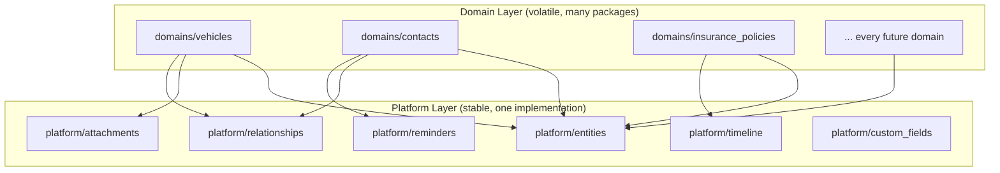
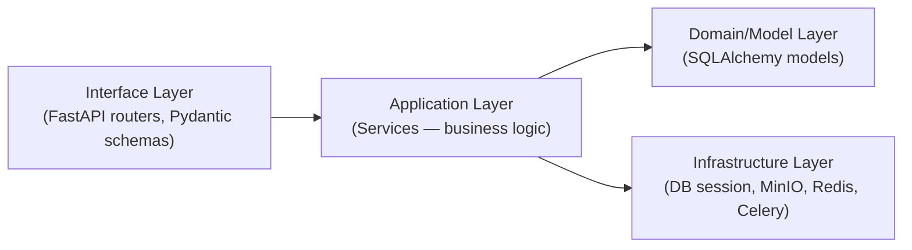
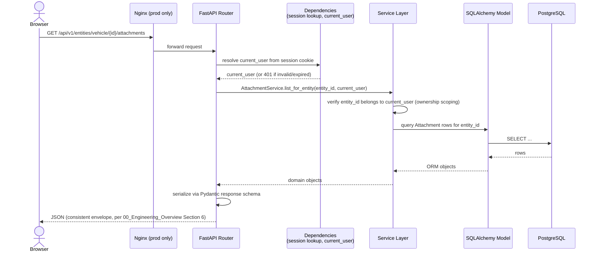
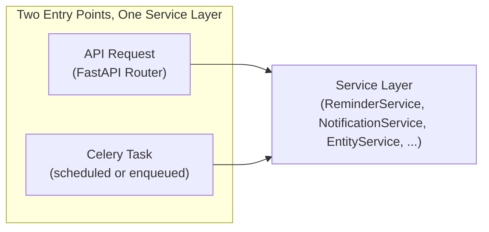
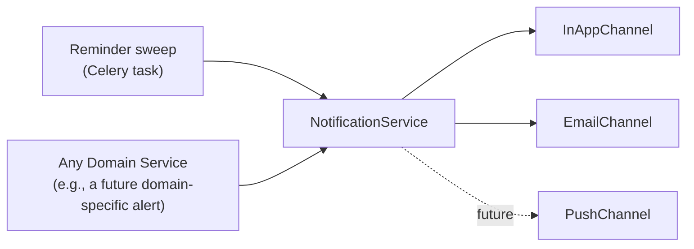
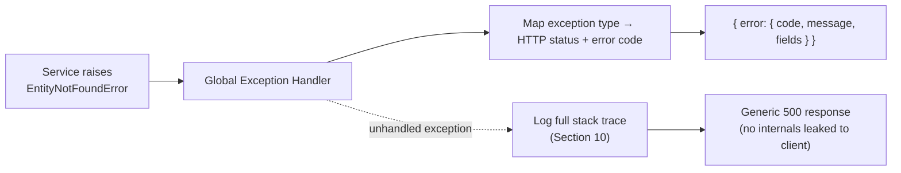

# LifeOS — System Architecture

# Document Information

| Field | Value |
|---|---|
| Document | System Architecture |
| File | `docs/architecture/01_System_Architecture.md` |
| Version | 1.0 |
| Status | Approved |
| Owner | Engineering Team |
| Last Updated | 2026-07-02 |
| Depends On | `docs/architecture/00_Engineering_Overview.md`, `docs/product/00_Glossary.md`, `docs/decisions/DEC-001` |
| Used By | Backend/Frontend implementation, all future `docs/architecture/` documents |

---

## Purpose

`docs/architecture/00_Engineering_Overview.md` established *what* technology LifeOS is built on and *where* things live in the repository. This document defines the **internal boundaries and flow rules** that keep that structure honest as the codebase grows past a single reference implementation (Vehicle) to all 28 Entity Types — who is allowed to depend on whom, what happens on every request, and where every cross-cutting concern (jobs, search, notifications, errors, logs) actually lives. No code is written here — only the rules code must follow.

---

## 1. Platform Layer vs. Domain Layer

`docs/product/00_Glossary.md`, Section 10 already defines these terms at the product level:
> **Platform Layer** — "the conceptual layer of LifeOS containing every generic Capability, shared by all Domain Entities."
> **Domain Layer** — "the conceptual layer containing what's unique to a specific Entity Type — its typed fields and domain-specific behavior."

This section makes that concrete in code, on top of the folder structure already defined in `docs/architecture/00_Engineering_Overview.md`, Section 3:

| | Platform Layer | Domain Layer |
|---|---|---|
| **Backend location** | `apps/api/app/platform/` | `apps/api/app/domains/{entity_type}/` |
| **Frontend location** | `apps/web/components/platform/` | `apps/web/app/(modules)/[domain]/` |
| **Contains** | Entity base table + service, Attachments, Relationships, Reminders, Notes, Timeline, Custom Fields, Tags, the six reusable UI templates | Typed fields, domain-specific validation, domain-specific Overview layout |
| **Changes when...** | A capability needs to change for *every* Entity Type at once (rare, high-impact) | A single Entity Type's fields or rules change (common, low-impact) |
| **Reference implementation** | Validated against Vehicle first (`docs/decisions/DEC-001`), then Contact, before being considered truly generic | Vehicle *is* a Domain Layer package — the first and best-tested one |

### The Governing Rule
**Domain Layer code may depend on Platform Layer code. Platform Layer code must never depend on Domain Layer code.**

If a Platform module ever needs an `if entity_type == "vehicle"` branch, that is a defect, not a feature — it means a genuinely domain-specific need was implemented in the wrong layer. The fix is always to either (a) generalize the capability so it doesn't need to know the specific type, or (b) move the special case into the Domain package, never to special-case Platform code per type.

---

## 2. Module Boundaries

**Naming note, stated once here to prevent confusion everywhere else:** "Module" already has a fixed meaning in `docs/product/04_Information_Architecture.md` — one of the 12 top-level, user-facing navigation areas (Assets, Finance, Dashboard, Settings, ...). This document also needs to talk about **code modules** — Python packages and TypeScript directories. These are related but not identical, and the rest of this document uses **"Product Module"** for the former and **"package"** for the latter to keep them distinct — the same discipline `00_Glossary.md` already applies to Note vs. Notes and Reminder vs. Task.

### Product Module → Package Mapping
Each Product Module maps to one or more Domain Layer packages:

| Product Module | Domain Layer package(s) |
|---|---|
| Assets | `domains/vehicles`, `domains/properties`, `domains/devices`, `domains/valuables`, `domains/digital_assets` |
| Finance | `domains/bank_accounts`, `domains/loans`, `domains/investments`, `domains/insurance_policies`, `domains/expenses`, `domains/income`, `domains/subscriptions` |
| Documents | `domains/documents` |
| ...and so on for Health, Planning, Home, Knowledge, People | one package per Entity Type each owns |

Dashboard, Global Search, Notifications, and Settings (the four cross-cutting Product Modules, per `docs/decisions/DEC-011`) have **no Domain Layer package of their own** — they are built entirely from Platform Layer services, since none of them own an Entity Type.

### The Governing Rule
**A Domain Layer package never imports another Domain Layer package directly.** `domains/vehicles` does not import from `domains/insurance_policies`, even though a Vehicle is frequently related to an Insurance Policy in practice. All cross-domain connection happens exclusively through the Platform Layer's generic Relationship mechanism (`entity_id` references resolved at the Platform layer, per `docs/architecture/00_Engineering_Overview.md`, Section 7) — never a direct code dependency between two domain packages.

This is what keeps adding the 29th, 30th, and 40th Entity Type cheap: no domain package's import graph grows as more domains are added, because none of them know about each other.

---

## 3. Clean Architecture & Dependency Rules

Within *any* package (Platform or Domain), code is organized into four layers, with dependencies pointing strictly inward — the classic Dependency Rule, adapted to this stack:

| Layer | Contains | Depends On | Never Depends On |
|---|---|---|---|
| **Interface** | FastAPI routers, Pydantic request/response schemas | Application (Service) layer | Nothing else calls into this layer |
| **Application** | Services (`VehicleService`, `AttachmentService`, ...) — all business logic, including ownership scoping and lifecycle rules | Model layer, Infrastructure layer (via injected dependencies) | The Interface layer — a Service must never import FastAPI-specific types (`Request`, `Depends`, etc.); this keeps business logic testable with plain Python, no HTTP framework required |
| **Model** | SQLAlchemy ORM models (the `entities` base table and every Platform/domain table from `docs/architecture/00_Engineering_Overview.md`, Section 7) | Nothing above it | The Application or Interface layers |
| **Infrastructure** | DB session/engine, MinIO client, Redis client, Celery app | Nothing above it | Business logic — infrastructure clients are dumb, swappable connectors, not decision-makers |

### Why This Matters Here Specifically
The Entity Platform's whole value proposition is reuse — a `VehicleService` and a `ContactService` both need to reliably call the *same* `AttachmentService`, `RelationshipService`, and `ReminderService` and get identical behavior. That's only guaranteed if those Platform services contain the actual business rules (ownership scoping, lifecycle checks) and don't leak logic into routers, where it would have to be duplicated across every domain's router by hand.

---

## 4. Request Flow

Every synchronous API request follows the same path, regardless of which Product Module or Entity Type it touches — this is what "generic Capability endpoints, per `docs/architecture/00_Engineering_Overview.md` Section 6" actually looks like at runtime.

**Every step above is identical whether the Entity Type is `vehicle`, `contact`, or the 28th type ever added** — the only thing that varies is which Domain package's router initiated the call for typed CRUD endpoints; the generic Capability endpoints (Attachments, Relationships, Reminders, etc., shown above) are the *same* router and Service regardless of `entity_type`. This is the request-flow-level proof of the Platform/Domain split in Section 1.

Ownership scoping (the `current_user` check) happens **once, in the Service layer**, never re-implemented per router — this is the concrete mechanism behind the IDOR mitigation already committed to in `docs/architecture/00_Engineering_Overview.md`, Section 8.

---

## 5. Service Boundaries

A **Service** is the only thing allowed to touch a table's rows directly (via its Model). Every Service owns exactly one table or one tightly-related cluster of tables, and every *other* piece of code that needs that data goes through the Service's public methods — never a direct query into another Service's table.

| Service | Owns | Called By |
|---|---|---|
| `EntityService` | `entities` (the shared base table) | Every Domain Service, on every create/archive/restore/soft-delete |
| `AttachmentService` | `attachments` | Any Domain Service, the Attachments API router |
| `RelationshipService` | `relationships` | Any Domain Service, the Relationships API router |
| `ReminderService` | `reminders` | Any Domain Service, the Reminders API router, the reminder-sweep Celery task |
| `NotesService` | `notes` | Any Domain Service, the Notes API router |
| `TimelineService` | `activity_log` + `timeline_entries` (unioned) | Any Domain Service (to log a user event), the Timeline API router |
| `CustomFieldService` | `custom_field_definitions`, `custom_field_values` | Any Domain Service, Settings' Custom Field Management |
| `TagService` | `tags`, `entity_tags` | Any Domain Service, Settings' Tag Management |
| `NotificationService` | `notifications` | `ReminderService`, any Domain Service raising an alert, the reminder-sweep task |
| `SearchService` | Read-only, queries across `entities` + registered searchable fields | The Search API router only |
| `VehicleService`, `ContactService`, ... (one per Domain) | Their own detail table (`vehicles`, `contacts`, ...) | Only their own Domain router |

### The Governing Rule
**A Domain Service calls Platform Services through their public interface; it never queries a Platform table directly.** `VehicleService` does not run its own query against `attachments` — it calls `AttachmentService.list_for_entity(...)`. This is what makes it possible to change how Attachments are stored or queried without touching a single line in any of the 28 Domain Services that use them.

---

## 6. Background Job Boundaries

Celery tasks (`docs/architecture/00_Engineering_Overview.md`, Section 10) are **thin entry points into the same Service layer used by synchronous API requests** — never a second, parallel implementation of business logic.

| Task | Calls | Never Does |
|---|---|---|
| Reminder due-date sweep | `ReminderService.find_due()`, then `NotificationService.dispatch(...)` for each | Query the `reminders` or `notifications` tables directly |
| Soft-delete purge | `EntityService.purge_expired_trash()` | Run a raw `DELETE` against domain tables itself |
| Attachment post-processing | `AttachmentService.generate_preview(attachment_id)` | Talk to MinIO directly without going through the Service |
| Backup job (`docs/decisions/DEC-013`) | A dedicated `BackupService`, wrapping `pg_dump` and the configured destination | Contain any product business logic — this is the one task that is closer to Infrastructure than Application layer, and is scoped narrowly on purpose |

**Why this boundary matters:** if reminder-firing logic existed once inside a Celery task and again inside an API endpoint (e.g., "mark reminder done" triggering an immediate check), a future bug fix applied to only one of them would silently reintroduce the bug in the other. Routing both entry points through the same `ReminderService` method makes that class of bug structurally impossible.

---

## 7. Search Boundaries

`SearchService` (Section 5) is a **read-only Platform service** that knows how to query the `tsvector` index on `entities` (`docs/architecture/00_Engineering_Overview.md`, Section 7/12) — it does not know *why* a given field is searchable, only *that* it's registered as such.

- **Domain packages register their searchable fields at startup**, as part of the same Entity Type Configuration concept referenced throughout `docs/design/00_Design_Handoff.md` (which fields, which Custom Field Definitions) — `SearchService` reads this registry generically rather than having per-domain field names hardcoded into its query logic.
- **The Governing Rule**: `SearchService` is the *only* code path that queries across multiple Entity Types at once. No Domain Service ever writes a cross-entity-type query — if a Domain Service needs to "find related things," that's a Relationship traversal (`RelationshipService`), not a search query.
- **Boundary with Filtering**: Global Search's post-query filters (Domain, Entity Type, date range — per `docs/product/04_Information_Architecture.md`, Section 8) are applied by `SearchService` itself, not pushed back out to individual Domain Services to interpret.

---

## 8. Notification Boundaries

`NotificationService` (Section 5) is the **only** code allowed to write to the `notifications` table or invoke a channel implementation (`InAppChannel`, `EmailChannel`, per `docs/architecture/00_Engineering_Overview.md`, Section 13).

- **The Governing Rule**: nothing outside `NotificationService` ever calls an email library or writes a Notification Center row directly — every caller passes `NotificationService` a structured message and lets it decide (based on stored user channel preferences, per `docs/product/03_Feature_Catalogue.md`, Section 2.2) which channel(s) actually fire.
- `NotificationService` itself has **no knowledge of *why*** a notification was requested — it doesn't know what a Reminder or a Vehicle is, only that it received a message payload, a target user, and a category. This is what keeps adding a new channel later (push, WhatsApp, SMS — `docs/product/00_Design_Handoff.md`, Section 9) additive rather than a rewrite of every caller.

---

## 9. Error Handling Flow

Errors are handled in exactly two places, never in between:

1. **The Application (Service) layer raises plain Python exceptions** with no FastAPI dependency — `EntityNotFoundError`, `PermissionDeniedError`, `ValidationError`, `LifecycleStateError` (e.g., attempting to act on a Trashed entity). These exceptions carry structured data (an error code, a human-readable message, optionally field-level detail) but know nothing about HTTP.
2. **One centralized FastAPI exception handler**, registered globally (not per-router), catches these exceptions and translates them into the consistent JSON error envelope already defined in `docs/architecture/00_Engineering_Overview.md`, Section 6.

| Exception | HTTP Status | Client-Facing `code` |
|---|---|---|
| `EntityNotFoundError` | 404 | `entity_not_found` |
| `PermissionDeniedError` | 403 | `permission_denied` |
| `ValidationError` (raised by a Service, distinct from Pydantic's own request validation) | 422 | `validation_error` (with `fields`) |
| `LifecycleStateError` | 409 | `invalid_lifecycle_state` |
| Anything unhandled | 500 | `internal_error` (generic message only — the real exception is logged, per Section 10, but never returned to the client) |

**The Governing Rule**: no router ever writes its own `try/except` to translate a Service exception into an HTTP response — that would mean 40+ routers each deciding independently (and inconsistently) how to phrase the same error. One handler, one mapping table, used everywhere. This is also what makes the plain-language, actionable error copy from `docs/design/01_UX_Decision_Record.md` UX-042 implementable as a single, small set of `code` → copy mappings on the frontend, rather than scattered per-screen error strings.

---

## 10. Logging Flow

**Naming note, stated explicitly to prevent a real collision:** `docs/product/00_Glossary.md` already defines **Activity Log** as a user-facing product concept — an immutable, per-entity record of *data changes*, stored in the `activity_log` table and shown to the user (Section 4, `docs/architecture/00_Engineering_Overview.md`). This section's **"logging"** is a completely different, operational concern — structured JSON logs written to stdout for developers/operators, per `docs/architecture/00_Engineering_Overview.md`, Section 14. **The two must never be conflated**: a request log line is not an Activity Log entry, and writing to one is never a substitute for writing to the other. Where both are warranted (e.g., an Entity was edited), the Service layer does both explicitly and separately — `TimelineService.log_activity(...)` for the user-facing record, and a normal structured log line for operational visibility.

| Log Point | What's Logged | Where |
|---|---|---|
| Request middleware (every request) | method, path, status code, duration, `user_id` | stdout (JSON) |
| Service layer (significant business events) | e.g., "entity soft-deleted", "backup job completed" — operational visibility only, distinct from the Activity Log table | stdout (JSON) |
| Global exception handler (Section 9) | Full stack trace for any unhandled exception, **before** the sanitized generic error is returned to the client | stdout (JSON), never sent to the client |
| Celery tasks | Job start/end, success/failure, duration | stdout (JSON), captured the same way as API logs since both run in Docker |

No log destination beyond stdout is assumed — Docker's logging driver captures it, and the self-hosting user chooses whatever aggregation (or none) they want, consistent with the "no mandatory third-party service" stance already taken in `docs/architecture/00_Engineering_Overview.md`, Section 14.

---

## Quality Review

**Two genuine naming collisions were identified and resolved while writing this document**, in the same spirit as `docs/product/00_Glossary.md`'s Note/Notes and Reminder/Task resolutions:

1. **"Module"** meant one thing in `docs/product/04_Information_Architecture.md` (a top-level navigation area) and would have silently meant something else here (a code package) if not disambiguated. Resolved in Section 2 with **"Product Module"** vs. **"package."**
2. **"Logging"** (this document's Section 10 — operational stdout logs) risked being conflated with **"Activity Log"** (`docs/product/00_Glossary.md`'s user-facing, per-entity change record). Resolved explicitly in Section 10, with a stated rule that the two are never substitutes for each other.

**Recommendation:** both distinctions are significant enough to be worth folding into `docs/product/00_Glossary.md` itself as canonical entries (a "Product Module vs. Package" and "Activity Log vs. (operational) Logging" note), rather than living only in this engineering document — otherwise a future contributor reading the Glossary alone won't know either collision was ever a risk. This is a suggestion for the Product team's next Glossary revision, not a change made unilaterally here.

**Consistency check:** every Section reference to `docs/architecture/00_Engineering_Overview.md` in this document (Sections 6, 7, 8, 10, 12, 13, 14, 16) was checked against that document's current (v1.1, approved) section numbering and confirmed accurate — the clarifications applied to that document earlier in this session did not shift any section numbers.

**No new product or UX decisions were introduced.** Every boundary and flow rule here is a direct implementation of already-approved architecture (`docs/architecture/00_Engineering_Overview.md`) and product decisions (`docs/decisions/DEC-001` through `DEC-013`) — this document adds engineering discipline, not new scope.

---

## Document Status

**Version:** 1.0
**Status:** Approved
**Dependencies:**
- `docs/architecture/00_Engineering_Overview.md`
- `docs/product/00_Glossary.md`
- `docs/decisions/DEC-001-vehicle-reference-implementation.md`

**Generated On:** 2026-07-02

**Next Document:** `docs/architecture/02_Database_Architecture.md` — the `entities` base table, every Platform table, and the per-domain detail tables at the column level, building directly on the boundaries defined here.
