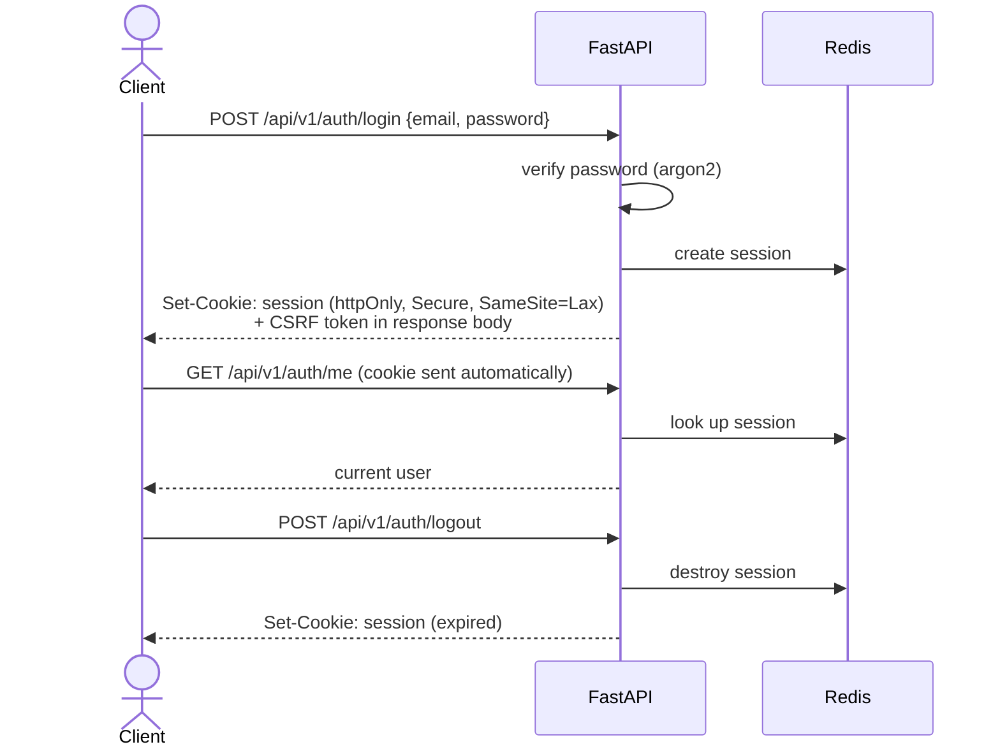

# LifeOS — API Design

# Document Information

| Field | Value |
|---|---|
| Document | API Design |
| File | `docs/architecture/03_API_Design.md` |
| Version | 1.0 |
| Status | Approved |
| Owner | Engineering Team |
| Last Updated | 2026-07-02 |
| Depends On | `docs/architecture/00_Engineering_Overview.md`, `docs/architecture/01_System_Architecture.md`, `docs/architecture/02_Database_Architecture.md` |
| Used By | Backend implementation, `packages/api-types` codegen, Frontend implementation |

---

## Purpose

This document defines the complete API **contract** — every convention a client can rely on — without implementing a single endpoint. It builds on the hybrid API paradigm already confirmed (`docs/architecture/00_Engineering_Overview.md`, Section 6), the Service Boundaries it must route to (`docs/architecture/01_System_Architecture.md`, Section 5), and the tables it ultimately reads and writes (`docs/architecture/02_Database_Architecture.md`). No controller code, no routing implementation — only the shape of the contract itself.

---

## 1. API Philosophy

- **One contract, every client.** The API is the only way any client — the web app today, Flutter mobile later — reaches LifeOS's data. Nothing is exposed to the frontend through a private, undocumented channel.
- **Predictability over cleverness.** Every endpoint uses the same pagination, filtering, error, and envelope conventions (Sections 8, 9, 12, 18). A client that has learned how *one* list endpoint behaves can correctly predict how all ~28 of them behave, without checking documentation each time.
- **The API mirrors Service Boundaries, not a separate design.** Every route ultimately calls exactly one Service (`docs/architecture/01_System_Architecture.md`, Section 5) — the API layer translates HTTP into Service calls and Service results back into HTTP; it makes no decisions of its own.
- **Additive by default.** New optional fields and new endpoints are added freely; anything that would change an existing field's meaning or remove a field requires a new API version (Section 5).

---

## 2. REST Conventions

| Convention | Rule |
|---|---|
| Resource naming | Plural nouns, `kebab-case` in URLs (`/insurance-policies`), even though the database uses `snake_case` internally — a deliberate, thin translation layer at the API boundary for URL readability |
| `GET` | Read a resource or list — never has side effects |
| `POST` | Create a new resource, or invoke an explicit action that doesn't fit pure CRUD (e.g., `.../archive`) |
| `PATCH` | Partial update of an existing resource — preferred over `PUT`, since LifeOS forms are rarely full-record replacements |
| `DELETE` | **Soft delete** — moves the resource to Trash (`docs/product/04_Information_Architecture.md`, Section 5), never a permanent delete. Permanent deletion only ever happens via the scheduled purge job (`docs/decisions/DEC-007`), never through a client-facing endpoint |
| Explicit action endpoints | Used only where a lifecycle action doesn't naturally fit CRUD — `POST /{resource}/{id}/archive`, `POST /{resource}/{id}/restore` — rather than forcing every state transition into a `PATCH` to an ambiguous field |

---

## 3. Resource Hierarchy

```
/api/v1/
├── auth/                       # login, logout, session, csrf-token
├── vehicles/                   # per-domain Entity resources (28 total)
├── contacts/
├── insurance-policies/
├── documents/
├── ... (one per Domain Entity Type)
├── entities/{entity_type}/{entity_id}/
│   ├── attachments/            # generic Capability resources — one implementation, every type
│   ├── relationships/
│   ├── reminders/
│   ├── expenses/
│   ├── notes/
│   ├── timeline/
│   ├── activity/
│   ├── archive                  # POST action
│   └── restore                  # POST action
├── search/                      # Global Search
├── notifications/
├── tags/
├── custom-field-definitions/
├── trash/                       # Archive & Trash List
└── dashboard/                   # aggregation endpoint for Dashboard widgets
```

This is a direct, literal expression of the Platform Layer / Domain Layer split (`docs/architecture/01_System_Architecture.md`, Section 1): everything under `entities/{entity_type}/{entity_id}/` is implemented once; everything at the top level (`vehicles/`, `contacts/`, ...) is a thin, typed Domain router.

---

## 4. URL Naming

- Plural nouns only — never `/vehicle`, always `/vehicles`.
- `kebab-case` for multi-word resources — `/insurance-policies`, `/custom-field-definitions`.
- Path parameters are explicit and typed in documentation — `{entity_type}`, `{entity_id}`, `{id}` — never ambiguous single-letter placeholders.
- No trailing slashes; lowercase only; no verbs in resource names (verbs only appear as the explicit action endpoints in Section 2).

---

## 5. Versioning Strategy

**URI-based versioning**: `/api/v1/...` — chosen over header-based versioning for visibility and simplicity, especially valuable for a self-hosted product where the person debugging an integration issue may not be a professional API consumer.

| Change Type | Requires a New Version? |
|---|---|
| New optional field on a response | No |
| New endpoint | No |
| New optional query parameter | No |
| Removing or renaming a field | **Yes** |
| Changing a field's type or meaning | **Yes** |
| Changing default behavior (e.g., default page size) | **Yes** |

Only one version (`v1`) exists for the foreseeable future — this table exists so that if a breaking change is ever genuinely necessary, there's no ambiguity about whether it warrants `v2`.

---

## 6. Authentication Flow

Per the confirmed server-side session decision (`docs/architecture/00_Engineering_Overview.md`, Section 8):



| Endpoint | Purpose |
|---|---|
| `POST /api/v1/auth/login` | Authenticates, creates a Redis-backed session, sets the session cookie, returns the current user and a CSRF token |
| `POST /api/v1/auth/logout` | Destroys the session |
| `GET /api/v1/auth/me` | Returns the current authenticated user — used by the frontend on load to determine auth state |
| `GET /api/v1/auth/csrf-token` | Reissues a CSRF token if the client's has expired, without requiring a full re-login |

Every state-changing request (`POST`/`PATCH`/`DELETE`) beyond login itself must include the CSRF token as a request header — the necessary consequence of cookie-based auth, per `docs/architecture/01_System_Architecture.md` (implicitly) and `00_Engineering_Overview.md`, Section 8.

---

## 7. Authorization

Every request is scoped to `current_user` (Section 6), enforced once at the Service layer (`docs/architecture/01_System_Architecture.md`, Section 4) — but the **API contract** itself makes one deliberate choice worth stating explicitly:

**Requesting an entity that exists but belongs to a different owner returns `404 Not Found`, never `403 Forbidden`.** Returning `403` would confirm to a client that the resource exists at all — a small but real information disclosure. `404` is indistinguishable from "this ID was never valid," which is the correct behavior for a resource the requester has no relationship to. `403` is reserved for cases where a resource is legitimately visible to the requester (e.g., a future shared household entity) but a specific action on it isn't permitted — not yet applicable in single-user V1, but the convention is established now so it doesn't need to be decided under pressure later.

---

## 8. Pagination

Every list endpoint is paginated — traditional page-based pagination, per `docs/design/01_UX_Decision_Record.md`, UX-020 (not infinite scroll).

| Query Parameter | Default | Max |
|---|---|---|
| `page` | `1` | — |
| `page_size` | `25` | `100` |

Every paginated response uses the envelope defined in Section 18, including `page`, `page_size`, `total`, and `total_pages` — never a bare array.

---

## 9. Filtering

Filters are applied as query parameters, one convention per kind of comparison, consistent across every list endpoint:

| Pattern | Meaning | Example |
|---|---|---|
| `{field}={value}` | Exact match | `?entity_type=vehicle` |
| `{field}_after`, `{field}_before` | Date range | `?created_after=2026-01-01&created_before=2026-06-30` |
| `{field}_in={a,b,c}` | Multi-select match | `?tag_in=urgent,2026-taxes` |

All filters combine with `AND` logic — there is no `OR` filtering in V1 (no journey in `docs/product/05_User_Journeys.md` requires it). This mirrors the filter panel pattern already decided in `docs/design/01_UX_Decision_Record.md`, UX-018/022.

---

## 10. Sorting

A single query parameter, `sort`, taking one field name, optionally prefixed with `-` for descending: `?sort=-created_at`. Only one sort field is supported per request in V1 — matching the "sort always visible, simple dropdown" decision in `docs/design/01_UX_Decision_Record.md`, UX-018, which never called for multi-column sorting.

---

## 11. Search Endpoints

```
GET /api/v1/search?q={query}&entity_type=...&module=...&created_after=...&page=...
```

- `q` is the only required parameter — everything else is an optional filter, using the **same filter conventions as Section 9**, per the "reuse the exact same filter pattern" decision in `docs/design/01_UX_Decision_Record.md`, UX-022.
- Each result includes `entity_type`, `entity_id`, the entity's name, and a short match context (which field or Attachment filename matched) — enough for the client to render a meaningful result without a second request.
- Results are paginated identically to any other list endpoint (Section 8).
- Per `docs/product/04_Information_Architecture.md`, Section 8: Timeline/Activity entries are **not** part of the search surface — a search result is always an Entity (or an Attachment resolving to its owning Entity), never a raw log entry.

---

## 12. Error Response Format

The canonical error envelope, already established in `docs/architecture/00_Engineering_Overview.md`, Section 6 and `01_System_Architecture.md`, Section 9 — restated here as the authoritative reference, with the complete code table:

```
{ "error": { "code": "...", "message": "...", "fields": { ... } } }
```

| `code` | HTTP Status | When |
|---|---|---|
| `entity_not_found` | 404 | Resource doesn't exist, or belongs to a different owner (Section 7) |
| `permission_denied` | 403 | Resource exists and is visible, but the action isn't permitted |
| `validation_error` | 422 | Request failed schema or business-rule validation (`fields` populated per-field) |
| `invalid_lifecycle_state` | 409 | Action attempted on an Entity in an incompatible state (e.g., acting on a Trashed entity) |
| `file_too_large` | 413 | Upload exceeds the configured size limit |
| `unsupported_file_type` | 415 | Upload's MIME type isn't in the supported list |
| `rate_limited` | 429 | Request exceeded the applicable rate limit (Section 17) |
| `internal_error` | 500 | Unhandled exception — message is always generic; the real error is only in the server's operational log (`docs/product/00_Glossary.md`, Operational Logging) |

No error response ever includes a stack trace, raw exception text, or internal identifiers — only the `code`, a plain-language `message` (feeding the copy already specified in `docs/design/01_UX_Decision_Record.md`, UX-042), and structured `fields` where applicable.

---

## 13. Validation Strategy

Two distinct validation layers, both funneling into the same error envelope (Section 12), but operating at different points:

1. **Schema-level validation (Pydantic, automatic)** — type mismatches, missing required fields, malformed values. FastAPI produces a `422` automatically; the response is reshaped into the standard envelope (`validation_error`) rather than FastAPI's raw default format, so clients only ever handle one error shape.
2. **Business-rule validation (Service layer, explicit)** — rules Pydantic can't express, such as "this Custom Field is required for this Entity Type" or "this Relationship Type isn't valid between these two Entity Types." These are raised as the same `ValidationError` described in `docs/architecture/01_System_Architecture.md`, Section 9, and caught by the same global exception handler.

A client never needs to know which layer produced a `validation_error` — the envelope and `fields` structure are identical either way.

---

## 14. File Upload API

Per the presigned-URL pattern already decided (`docs/architecture/00_Engineering_Overview.md`, Section 9):

```
1. POST /api/v1/entities/{entity_type}/{entity_id}/attachments/upload-url
   Request:  { "filename": "...", "mime_type": "...", "size_bytes": ... }
   Response: { "attachment_id": "...", "upload_url": "https://...", "expires_at": "..." }

2. Client PUTs the file directly to `upload_url` (MinIO) — bypasses the API server entirely for the file bytes.

3. POST /api/v1/entities/{entity_type}/{entity_id}/attachments/{attachment_id}/confirm
   Marks the Attachment as fully uploaded and available.
```

The Attachment row is created in a `pending` state at step 1, before the file exists in MinIO — this means an interrupted upload leaves a `pending` row rather than no record at all. A background job (`docs/architecture/00_Engineering_Overview.md`, Section 10) periodically reconciles and removes `pending` Attachments that were never confirmed within a reasonable window, so an abandoned upload doesn't accumulate as permanent clutter.

---

## 15. Bulk Operations

**No bulk endpoints exist in V1**, per the explicit deferral in `docs/design/01_UX_Decision_Record.md`, UX-019 — this is an intentional exclusion, not a gap. No User Journey in `docs/product/05_User_Journeys.md` requires acting on multiple Entities at once.

If ever added, the recommended shape (documented here for future reference, not designed now) is a single `POST /{resource}/bulk` endpoint accepting an array of operations and returning a **per-item result array** — a partial-success model, since some items in a bulk request may legitimately fail while others succeed, and the client needs to know which is which.

---

## 16. Idempotency

**Create (`POST`) requests that create a new Entity support an optional `Idempotency-Key` header** (a client-generated UUID). If a request with a previously-seen key arrives again — most commonly a client retry after a network timeout where the original request actually succeeded server-side — the API returns the original result rather than creating a duplicate.

This matters specifically because Entity creation has no draft/partial state (`docs/product/05_User_Journeys.md`, J1.4 — an Entity is either created or it isn't): without idempotency support, a retried create request after an ambiguous network failure could silently produce two Vehicles where the user only intended one.

---

## 17. Rate Limiting

LifeOS is self-hosted and (in V1) single-user — rate limiting here is a **safety net against runaway clients and credential attacks**, not multi-tenant throttling.

| Scope | Limit Philosophy |
|---|---|
| `POST /api/v1/auth/login` | Strict — protects against brute-force password guessing (`docs/architecture/00_Engineering_Overview.md`, Section 15) |
| `POST .../attachments/upload-url` | Moderate — prevents abuse of presigned URL generation |
| Everything else | Generous — high enough that no legitimate UI interaction ever approaches it; exists only to catch a misbehaving client (e.g., a polling bug) |

Exceeding a limit returns `429` with a `Retry-After` header and the standard error envelope (`rate_limited`, Section 12).

---

## 18. Response Envelope

**One envelope shape, used everywhere, so a client's unwrapping logic never has to special-case "is this a list or a single object."**

| Response Type | Shape |
|---|---|
| List | `{ "data": [ ... ], "page": 1, "page_size": 25, "total": 137, "total_pages": 6 }` |
| Single resource | `{ "data": { ... } }` — **always wrapped**, never a bare object, specifically so `.data` is the one universal unwrapping rule regardless of endpoint |
| Error | `{ "error": { "code": "...", "message": "...", "fields": { ... } } }` (Section 12) |

---

## 19. Webhooks (Future)

**Not part of V1.** Sketched here only so a future decision doesn't start from nothing:

- A user would configure a target URL and subscribed event types (e.g., `entity.created`, `reminder.fired`) in Settings.
- LifeOS would `POST` a signed payload (an HMAC signature header, so the receiver can verify authenticity) to that URL when a matching event occurs, with retry/backoff on delivery failure.
- Most relevant once third-party integrations or the hosted multi-tenant product (`docs/architecture/00_Engineering_Overview.md`, Section 21) are actually pursued — not before.

---

## 20. API Documentation Strategy

FastAPI generates interactive documentation (Swagger UI and ReDoc) automatically from the same Pydantic schemas and routers that implement the API — there is no hand-maintained API reference to keep in sync.

**A documentation quality standard, not just an automatic byproduct:** every Pydantic schema field should carry a description and, where non-obvious, an example value, so the generated docs are actually useful to a reader — not merely a list of field names and types with no explanation of what they mean or why a field exists.

---

## 21. OpenAPI Generation Strategy

The OpenAPI schema is generated automatically from the live FastAPI application — never hand-written — and feeds `packages/api-types` (`docs/architecture/00_Engineering_Overview.md`, Section 2), which the frontend imports directly for full type safety against the real API contract.

**CI enforces that the checked-in generated schema and types can never silently drift** from what the backend actually returns (`docs/architecture/00_Engineering_Overview.md`, Section 18) — a pull request that changes a response shape without regenerating and committing the updated types fails automatically, rather than being caught later as a runtime bug in the frontend.

---

## 22. Future GraphQL Considerations

**REST (the confirmed hybrid model) was chosen over GraphQL for V1**, and this section states why, so the choice can be revisited deliberately later rather than re-litigated from scratch:

GraphQL's core advantage — letting diverse clients request exactly the fields they need, avoiding over- or under-fetching — matters most when there are multiple, meaningfully different client types with divergent data needs. LifeOS today has exactly one client (the web app); REST's simplicity, plus FastAPI's native OpenAPI tooling (Section 20, 21), outweighs GraphQL's benefit at this stage.

**Worth reconsidering only if**: the Flutter mobile client (`docs/architecture/00_Engineering_Overview.md`, Section 21) develops genuinely different data-shape needs from the web client, and REST's fixed response shapes start producing real over-fetching problems (most likely candidate: the Dashboard aggregation endpoint, which already pulls from many Domains at once). If that happens, the recommended path is a **single GraphQL gateway layered in front of the existing REST Services** — not a rewrite of the Service layer itself, which remains valid regardless of which API style sits in front of it.

---

## Standard Request Examples

**List, with sort and filter** — `GET /api/v1/vehicles?sort=-created_at&tag_in=daily-driver&page=1&page_size=25`
*(no request body — GET)*

**Create** — `POST /api/v1/vehicles`
```json
{
  "make": "Honda",
  "model": "City",
  "year": 2022,
  "registration_number": "MH12AB1234",
  "vin": "MRHGM6640NP012345"
}
```

**Generic capability — add a Reminder** — `POST /api/v1/entities/vehicle/6d1f...e2a9/reminders`
```json
{
  "title": "Registration renewal",
  "due_date": "2027-03-15",
  "recurrence": null
}
```

**Add a Relationship** — `POST /api/v1/entities/vehicle/6d1f...e2a9/relationships`
```json
{
  "target_entity_id": "9a3c...41f0",
  "relationship_type": "insured_by"
}
```

---

## Standard Response Examples

**List response**
```json
{
  "data": [
    {
      "id": "6d1f...e2a9",
      "entity_type": "vehicle",
      "name": "Honda City",
      "is_favorite": true,
      "lifecycle_state": "active",
      "make": "Honda",
      "model": "City",
      "year": 2022,
      "created_at": "2026-01-14T09:12:00Z",
      "updated_at": "2026-06-01T18:03:00Z"
    }
  ],
  "page": 1,
  "page_size": 25,
  "total": 2,
  "total_pages": 1
}
```

**Single-resource response** (note the same `data` wrapper as the list above)
```json
{
  "data": {
    "id": "6d1f...e2a9",
    "entity_type": "vehicle",
    "name": "Honda City",
    "is_favorite": true,
    "lifecycle_state": "active",
    "make": "Honda",
    "model": "City",
    "year": 2022,
    "registration_number": "MH12AB1234",
    "vin": "MRHGM6640NP012345",
    "created_at": "2026-01-14T09:12:00Z",
    "updated_at": "2026-06-01T18:03:00Z"
  }
}
```

**File upload — step 1 response**
```json
{
  "data": {
    "attachment_id": "b7e2...c410",
    "upload_url": "https://minio.internal/lifeos-attachments/...&X-Amz-Signature=...",
    "expires_at": "2026-07-02T15:30:00Z"
  }
}
```

---

## Standard Error Examples

**404 — entity not found (or not owned by the requester)**
```json
{
  "error": {
    "code": "entity_not_found",
    "message": "We couldn't find that item.",
    "fields": null
  }
}
```

**422 — validation error**
```json
{
  "error": {
    "code": "validation_error",
    "message": "Please check the highlighted fields.",
    "fields": {
      "year": "Must be a valid four-digit year.",
      "registration_number": "This field is required."
    }
  }
}
```

**429 — rate limited**
```json
{
  "error": {
    "code": "rate_limited",
    "message": "Too many attempts. Please try again in a moment.",
    "fields": null
  }
}
```

---

## Quality Review

**Consistency check against prior architecture documents:** every convention here (the error envelope, the 404-not-403 authorization rule, the presigned-upload flow, the session/CSRF auth flow) is a direct, unmodified continuation of what `docs/architecture/00_Engineering_Overview.md` and `01_System_Architecture.md` already established — no prior decision was reopened.

**New API-level decisions made within this document** (implementation-level judgment calls within the already-confirmed hybrid REST paradigm, consistent with how prior architecture documents made similar in-scope calls):
- `404`, not `403`, for cross-owner access attempts (Section 7) — an information-disclosure-minimizing choice worth flagging explicitly since it's easy to get backwards.
- Single-resource responses wrapped in `{ "data": ... }` rather than returned bare (Section 18) — chosen purely for one universal client-side unwrapping rule.
- `Idempotency-Key` support on entity creation (Section 16) — directly motivated by the "no draft state" product decision (`docs/product/05_User_Journeys.md`, J1.4), which makes accidental duplicate creation a real risk without it.

**Explicitly excluded, not overlooked:** Bulk Operations (Section 15) has no V1 endpoints, matching `docs/design/01_UX_Decision_Record.md`, UX-019's deferral exactly — restated here so the API design doesn't silently reintroduce scope the UX decision record deliberately cut.

**No new product or UX decisions were introduced.** This document defines contract mechanics only, within boundaries already approved.

---

## Document Status

**Version:** 1.0
**Status:** Approved
**Dependencies:**
- `docs/architecture/00_Engineering_Overview.md`
- `docs/architecture/01_System_Architecture.md`
- `docs/architecture/02_Database_Architecture.md`

**Generated On:** 2026-07-02
**Approval Note:** Approved with explicit agreement on: `404` (not `403`) for cross-owner access attempts (Section 7), deferring all Bulk Operations from V1 (Section 15), and `Idempotency-Key` support for create operations (Section 16).

**Next Document:** `docs/architecture/04_Backend_Architecture.md`