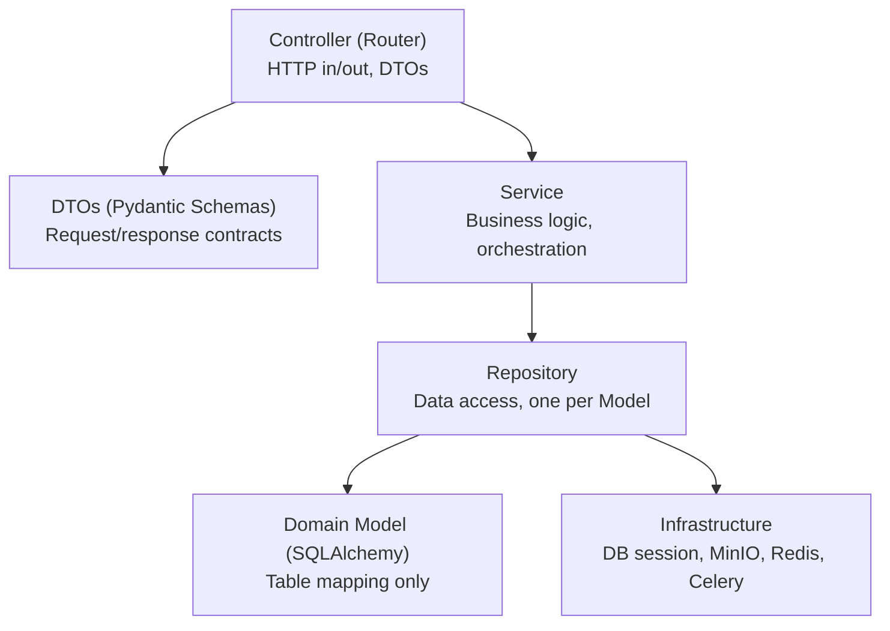
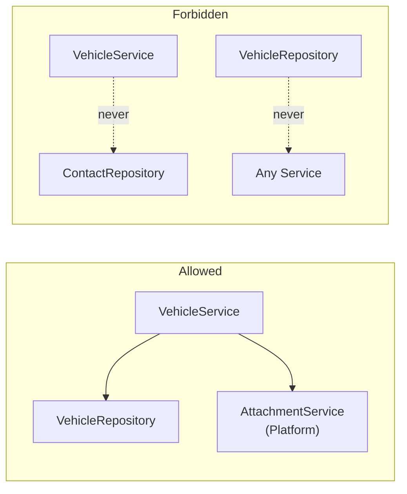
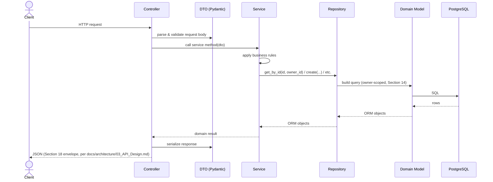
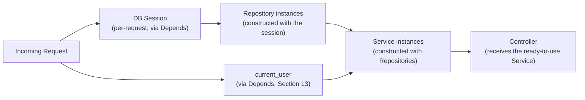

# LifeOS — Backend Architecture

# Document Information

| Field | Value |
|---|---|
| Document | Backend Architecture |
| File | `docs/architecture/04_Backend_Architecture.md` |
| Version | 1.0 |
| Status | Approved |
| Owner | Engineering Team |
| Last Updated | 2026-07-02 |
| Depends On | `docs/architecture/00_Engineering_Overview.md`, `docs/architecture/01_System_Architecture.md`, `docs/architecture/02_Database_Architecture.md`, `docs/architecture/03_API_Design.md` |
| Used By | Backend implementation, `docs/architecture/05_Frontend_Architecture.md` (or equivalent next document) |

---

## Purpose

`docs/architecture/01_System_Architecture.md` established a four-layer dependency model (Interface → Application → Model → Infrastructure) and the Platform/Domain boundary rules. This document goes one level deeper specifically for the backend — introducing the **Repository** as its own explicit layer (refining, not replacing, that earlier model), and defining every remaining backend concern: DI, transactions, configuration, and the concrete checklist for adding a new Domain. It references rather than repeats what `00`–`03` already settled. No implementation code is written here.

---

## 1. Overall Backend Philosophy

- **Explicit over implicit.** No relied-upon "magic" ORM behavior, no hidden side effects in a getter — if something happens, it's because a specific layer's code made it happen, traceably.
- **Boring and predictable over clever.** Every Domain's backend code (`domains/vehicles/`, `domains/contacts/`, ...) looks structurally identical — same five files, same responsibilities — so a contributor who has read one Domain can immediately navigate any other.
- **Testable by construction, not by discipline.** The layering in Section 3 exists specifically so business logic can be tested without a running database or HTTP server — not because engineers are asked to remember to write testable code, but because the architecture makes untestable code awkward to write in the first place.
- **The Platform/Domain and Service Boundary rules from `docs/architecture/01_System_Architecture.md` (Sections 1, 2, 5) are unchanged and binding** — this document adds structure beneath them, it doesn't revisit them.

---

## 2. Folder / Package Organization

Extends `docs/architecture/00_Engineering_Overview.md`, Section 3 with the Repository layer (Section 8) made explicit as its own file per package:

```
apps/api/app/domains/vehicles/
├── models.py        # Domain Model — SQLAlchemy ORM class (Section 9)
├── repository.py     # Repository — data access only (Section 8)
├── schemas.py         # DTOs — Pydantic request/response schemas (Section 10)
├── service.py         # Service — business logic (Section 7)
└── router.py           # Controller — FastAPI router (Section 6)
```

Every Domain package (all 28) and every Platform package (`platform/attachments/`, `platform/relationships/`, ...) follows this exact five-file shape. A package that doesn't need one of these files (e.g., a Platform package with no HTTP-facing router of its own) simply omits it — it never restructures the pattern.

---

## 3. Layered Architecture

`docs/architecture/01_System_Architecture.md`, Section 3 described four layers (Interface, Application, Model, Infrastructure). This document **refines the Application/Model boundary into three layers**, making explicit what was previously an implicit responsibility of the Service:



| Layer | Responsibility | Must Never |
|---|---|---|
| **Controller** | Parse the request, delegate to exactly one Service method, serialize the result via a DTO | Contain business logic or direct database access |
| **DTO** | Define and validate the shape of data crossing the API boundary (Section 10) | Be used internally between Service and Repository |
| **Service** | Business rules, orchestration across one or more Repositories/other Services | Issue a raw query itself, or import anything FastAPI-specific |
| **Repository** | CRUD and query operations for exactly one Domain Model | Contain business rules, or call another Domain's Repository |
| **Domain Model** | SQLAlchemy table mapping | Contain business logic (Section 9 — deliberately "thin") |

This five-layer refinement is fully compatible with `01_System_Architecture.md`'s Application/Model layers — Repository is simply the part of "Application depends on Model" that was previously left as an implicit detail, now given its own name, file, and rules.

---

## 4. Dependency Rules

All rules from `docs/architecture/01_System_Architecture.md` (Sections 1, 2, 5) remain binding. This document adds the Repository-specific rules that complete the five-layer picture:

- **A Service never writes a raw SQLAlchemy query.** It calls its own Repository, or another Platform Service's public method (`docs/architecture/01_System_Architecture.md`, Section 5) — never another Domain's Repository directly.
- **A Repository never calls a Service, and never calls another Repository.** It has exactly one job: translate method calls into queries against its one Model.
- **A Domain Model has no methods beyond what SQLAlchemy itself requires.** Business logic that might tempt a "fat model" (e.g., a `Vehicle.is_insured()` method) belongs in `VehicleService`, not on the `Vehicle` class itself (Section 9).



---

## 5. Request Lifecycle

Extends the sequence diagram in `docs/architecture/01_System_Architecture.md`, Section 4 with the Repository step made explicit:



---

## 6. Controllers

**Naming note**: "Controller" (used in this document's outline) and "Router" (FastAPI's own term) refer to the same thing — the Interface-layer component that receives HTTP requests. This document uses both interchangeably; the codebase uses "router" since that's FastAPI's native vocabulary.

A Controller's responsibilities, and *only* these:
1. Declare the route (path, method, per `docs/architecture/03_API_Design.md`'s URL conventions).
2. Accept a validated DTO (Pydantic handles this automatically before the function body even runs).
3. Call **exactly one** Service method.
4. Return the Service's result, shaped into the response DTO and the standard envelope.

A Controller never contains an `if`/`else` business decision, never queries the database, and never catches an exception to handle it locally — all exceptions propagate to the single global handler (`docs/architecture/01_System_Architecture.md`, Section 9).

---

## 7. Services

A Service is where business logic actually lives — the Application layer. Each Domain has one Service (`VehicleService`); each Platform capability has one Service (`AttachmentService`, `RelationshipService`, ...), matching the Service Boundary map already defined in `docs/architecture/01_System_Architecture.md`, Section 5.

- **Constructed with its dependencies** (its own Repository, and any other Services it legitimately calls) **injected**, not instantiated internally — this is what makes Section 25's testing strategy possible.
- **Owns every business rule**: ownership checks (defense-in-depth alongside Section 14's Repository-level scoping), lifecycle-state checks (e.g., refusing to act on a Trashed entity), and orchestration (e.g., "creating a Vehicle" may involve calling `EntityService.create_base()` then `VehicleRepository.create_detail()` in the same transaction, Section 23).
- **Never imports anything FastAPI-specific** — a Service can be unit-tested with plain Python and a fake Repository, with no HTTP framework involved at all.

---

## 8. Repositories

**The one layer this document introduces that wasn't explicit in `docs/architecture/01_System_Architecture.md`.** A Repository is the *only* code allowed to construct a query against its Model.

- **One Repository per Model** — `VehicleRepository` for `vehicles`, `EntityRepository` for the base `entities` table, `AttachmentRepository` for `attachments`, and so on, mapping directly to `docs/architecture/02_Database_Architecture.md`'s tables.
- **Contains only data access methods**: `get_by_id`, `list` (with pagination/filter/sort parameters passed in, per `docs/architecture/03_API_Design.md`, Sections 8–10), `create`, `update`, `soft_delete` — never a business rule about *whether* an action should happen, only *how* to persist it once a Service has decided it should.
- **Owns eager-loading strategy** for its own Model's typical access patterns (Section 28) — this is where N+1 query prevention actually lives in code.
- **Every Repository inherits from a shared `BaseRepository`** that provides the common CRUD methods and — critically — automatically scopes every query by `owner_id` (Section 14). A new Repository gets ownership scoping for free; it cannot forget to add it, because the base class already did.

---

## 9. Domain Models

SQLAlchemy ORM classes, one per table (`docs/architecture/02_Database_Architecture.md`) — **deliberately thin ("anemic"), not "fat" ActiveRecord-style models.**

**The alternative considered**: rich domain models with embedded behavior (e.g., a `Vehicle.check_insurance_status()` method living on the model class itself) — a legitimate pattern in some architectures, rejected here specifically because the Entity Platform's whole design (`docs/product/00_Glossary.md`, Platform Layer) centers on *generic, shared* business logic operating identically across 28 Model classes. Putting business logic on each Model would mean re-implementing it per Domain rather than once in a shared Service — the opposite of the reuse this entire architecture exists to achieve. Business logic belongs in Services (Section 7); Models only describe structure.

---

## 10. DTOs

**"DTO" (Data Transfer Object) is the generic pattern name; "Pydantic schema" is its concrete implementation in this stack** — the same relationship as Controller/Router in Section 6. This document uses "DTO" when discussing the pattern, "schema" when discussing the FastAPI-specific artifact.

- **One DTO per operation, not one shared DTO reused everywhere.** `VehicleCreateSchema`, `VehicleUpdateSchema`, and `VehicleResponseSchema` are three distinct Pydantic models, even though they overlap heavily in fields — this prevents an internal-only field (e.g., `owner_id`) from accidentally being accepted as client input just because it happened to be present on a shared schema.
- DTOs are the **only** representation of data that crosses the Controller boundary in either direction — a Domain Model instance is never returned directly from a Controller (Section 11 restates why).

---

## 11. Validation

Two tiers, per `docs/architecture/03_API_Design.md`, Section 13 — restated here in terms of *which backend layer* owns each:

| Tier | Layer | Example |
|---|---|---|
| Schema-level | DTO (Pydantic, automatic) | "year must be an integer" |
| Business-rule | Service (explicit, raised as an exception) | "this Custom Field is required for this Entity Type" |

**A Domain Model is never returned directly as a response, specifically because of this split**: a raw SQLAlchemy object has no concept of "which fields are safe to expose" or "what shape the client expects" — only the response DTO does, and only the DTO layer's serialization enforces it. Returning a Model directly would silently bypass both validation tiers on the way out.

---

## 12. Middleware

**Middleware** (true ASGI middleware, wrapping *every* request indiscriminately) is distinct from **FastAPI dependencies** (`Depends()`, applied selectively per route) — a distinction worth being explicit about, since both are easily conflated:

| Concern | Implemented As | Why |
|---|---|---|
| Request/response logging (Section 16) | Middleware | Applies to literally every request, no exceptions |
| CORS handling | Middleware | Same reasoning |
| CSRF token validation | Middleware (state-changing methods only) | Structural, not business logic |
| Current-user resolution | Dependency | Not every future endpoint necessarily requires auth (e.g., a `/health` check) — a dependency can be selectively applied per route, middleware cannot as cleanly |
| DB session-per-request (Section 23) | Dependency | Same reasoning — injected where needed via DI (Section 22) |

---

## 13. Authentication

Fully specified in `docs/architecture/00_Engineering_Overview.md`, Section 8 and `docs/architecture/03_API_Design.md`, Section 6 — restated here only in terms of backend placement: session resolution (cookie → Redis lookup → `current_user`) is implemented as a **FastAPI dependency**, injected into any Controller that requires authentication, not as global middleware — per the distinction in Section 12.

---

## 14. Authorization

Fully specified at the product/API level in `docs/architecture/01_System_Architecture.md`, Section 4 and `docs/architecture/03_API_Design.md`, Section 7 (404, not 403). **This document adds one concrete backend reinforcement**: ownership scoping is enforced **twice**, not once — defense in depth:

1. **In the Repository's `BaseRepository`** (Section 8) — every query method automatically filters by `owner_id`, structurally, before a Service even runs its own logic.
2. **In the Service**, as a business-rule check, for cases involving more than a single Repository fetch (e.g., verifying a Relationship's *both* referenced entities belong to the current owner, per `docs/architecture/02_Database_Architecture.md`, Section 2's noted gap).

If a Service ever forgets its own explicit check, the Repository-level scoping still prevents cross-owner data from ever being fetched in the first place — this is the concrete backend mechanism that makes the IDOR mitigation (raised repeatedly since the original Phase 0 discussion) structural rather than a matter of remembering to check every time.

---

## 15. Error Handling

Fully specified in `docs/architecture/01_System_Architecture.md`, Section 9 and `docs/architecture/03_API_Design.md`, Section 12. This document adds exactly where each exception originates, by layer:

| Exception | Raised By |
|---|---|
| `EntityNotFoundError` | Repository (a scoped fetch returned nothing) |
| `PermissionDeniedError` | Service (an action-level check, not a fetch-level one) |
| `ValidationError` | Service (business-rule validation) or automatically by the DTO layer (schema validation) |
| `LifecycleStateError` | Service (e.g., attempting to edit a Trashed entity) |

All of them are plain Python exceptions with no FastAPI dependency, caught by the one global handler (Section 6) — never by a `try`/`except` inside a Controller or Service method itself.

---

## 16. Logging

Fully specified in `docs/architecture/01_System_Architecture.md`, Section 10 (including the Operational Logging vs. Activity Log distinction, canonicalized in `docs/product/00_Glossary.md`). Backend placement:

| Log Point | Layer |
|---|---|
| Request/response line | Middleware (Section 12) |
| Significant business event (operational, not user-facing) | Service |
| Full stack trace on unhandled exception | Global exception handler, before the sanitized response is returned |
| Job start/end/failure | Celery task wrapper (Section 17) |

Repositories and Domain Models do not log — they are the lowest-level, most-called layer, and logging there would be excessive noise for little diagnostic value beyond what the Service-level event log already captures.

---

## 17. Background Jobs

Fully specified in `docs/architecture/00_Engineering_Overview.md`, Section 10 and `docs/architecture/01_System_Architecture.md`, Section 6 — restated here only for backend placement: **a Celery task is a thin function that resolves its dependencies (DB session, Repositories, Services) the same way a Controller would, then calls a Service method** — it is architecturally a second Controller-equivalent entry point into the same Service layer, never a parallel implementation of business logic (already the governing rule in `01_System_Architecture.md`, Section 6).

---

## 18. File Handling

Fully specified in `docs/architecture/03_API_Design.md`, Section 14 (presigned URL flow) and `docs/architecture/00_Engineering_Overview.md`, Section 9 (MinIO, SSE). Backend composition: `AttachmentService` (business logic — e.g., deciding an upload is allowed, generating the presigned URL request) calls `AttachmentRepository` (persisting the Attachment row) and a thin **MinIO client wrapper**, living in the Infrastructure layer (Section 3) — the wrapper knows only how to talk to MinIO's API, never anything about Attachments as a product concept.

---

## 19. Search Integration

Fully specified in `docs/architecture/01_System_Architecture.md`, Section 7 and `docs/architecture/02_Database_Architecture.md`, Section 11. Backend mechanism for the "Domain registers its searchable fields" pattern: each Domain package declares a small, static **search configuration** (which of its own fields are searchable) as part of its package, per the Configuration concept (`docs/product/00_Glossary.md`, Section 10). At application startup, every Domain package's configuration is collected into a single in-memory registry that `SearchService` reads from — a Domain never calls `SearchService` to "register" itself at runtime; it simply declares its configuration statically, and the Platform Layer discovers all registered Domains once, at boot.

---

## 20. Notification Integration

Fully specified in `docs/architecture/01_System_Architecture.md`, Section 8. Backend structure: `NotificationService` depends on a list of `NotificationChannel` implementations (`InAppChannel`, `EmailChannel`), injected via DI (Section 22) — adding a channel later means registering one more implementation of the same interface at startup, never modifying `NotificationService` itself or any of its callers.

---

## 21. Configuration Management

All configuration (database URL, Redis URL, MinIO credentials, session secret, cookie settings) is loaded from environment variables into **one typed configuration object** at application startup — never read from `os.environ` scattered throughout the codebase.

- **Fails fast, not late.** If a required environment variable is missing, the application refuses to start at all, with a clear error naming the missing variable — rather than starting successfully and failing confusingly the first time that particular config value is actually used.
- **The configuration object is injected via DI (Section 22)**, like everything else — a Service or Repository that needs a config value receives it through its constructor, not by importing a global settings object directly, which would make it harder to test with different configurations.
- **Secrets are never logged**, even at debug log levels — logging middleware (Section 12) and the exception handler (Section 15) both explicitly exclude configuration/secret values from anything they emit.

---

## 22. Dependency Injection Strategy

FastAPI's built-in `Depends()` mechanism is the **only** DI mechanism used — no additional DI framework is introduced, since FastAPI's is already sufficient for this architecture's needs.



- **Constructor injection throughout**: a Service receives its Repository (and any other Services it needs) as constructor arguments, never instantiating them internally. This is precisely what makes Section 25's unit testing strategy possible — a test can construct a Service with a fake Repository instead of a real one, with no code changes to the Service itself.
- **Scoped per request**: the DB session, and everything built from it (Repositories, Services), lives for exactly the duration of one request (or one Celery task execution) — never shared or reused across requests, avoiding an entire class of subtle bugs around stale sessions or leaked state between unrelated requests.

---

## 23. Database Transaction Strategy

**One transaction per request, by default** — opened when the per-request DB session is created (Section 22), committed automatically if the request completes without an exception, rolled back automatically if any exception propagates to the global handler (Section 15).

- **Multi-step Service operations are atomic by construction, not by careful coding.** When `VehicleService.create()` calls `EntityService.create_base()` and then `VehicleRepository.create_detail()`, both happen inside the same request-scoped transaction — if the second step fails, the first is rolled back automatically, since they share one session. This is the literal database-level guarantee behind the "no partial/draft Entity" product decision (`docs/product/05_User_Journeys.md`, J1.4): it was never just a UX rule, it's enforced by the transaction boundary.
- **Background jobs (Section 17) get their own transaction per task execution**, following the same one-transaction-per-entry-point rule as requests, via the same DI pattern (Section 22).

---

## 24. Caching Strategy

Fully specified in `docs/architecture/00_Engineering_Overview.md`, Section 11 — modest for V1: Redis is available (already required for sessions and Celery), but no server-side response caching is built preemptively. Nothing new added at the backend-code level beyond what's already decided; this section exists only to confirm no additional caching layer (e.g., an ORM-level query cache) is introduced without a demonstrated need.

---

## 25. Testing Strategy

Extends `docs/architecture/00_Engineering_Overview.md`, Section 17 with the layer-specific test pyramid this architecture enables:

| Layer | Test Type | Why |
|---|---|---|
| Repository | Integration (real, ephemeral Postgres) | Repositories exist specifically to talk to the database — testing them against a fake would test nothing meaningful |
| Service | Unit (fake/in-memory Repository) | Business logic is tested in isolation, fast, with no database — possible *only* because Services depend on Repository interfaces, injected (Section 22), not concrete database calls |
| Controller | Thin integration (FastAPI `TestClient`, real Service + Repository + test DB) | Controllers have no logic of their own to unit-test in isolation — the only meaningful test is "does the full request/response cycle work," which is inherently an integration concern |
| End-to-end | Playwright, sourced from `docs/product/05_User_Journeys.md` (per `00_Engineering_Overview.md`, Section 17) | Unchanged from the existing plan |

The Repository/Service split (Section 3) is what makes the *middle* row possible at all — without it, "unit testing business logic" would always secretly be an integration test against a real database.

---

## 26. Module Creation Guidelines

A concrete checklist operationalizing `docs/decisions/DEC-001-vehicle-reference-implementation.md`'s litmus test — what adding the 29th Domain Entity Type actually involves:

1. **Migration**: add one row to the `entity_type` registry (`docs/architecture/02_Database_Architecture.md`, Section 3) and create the new detail table.
2. **Create the package**: `domains/{new_type}/` with the standard five files (Section 2) — `models.py`, `repository.py`, `schemas.py`, `service.py`, `router.py`.
3. **Register Search configuration** (Section 19): declare which fields are searchable.
4. **Register Capability applicability**: which of the Standard Entity Capability Set's capabilities apply (per `docs/product/03_Feature_Catalogue.md`, Section 6) and any default Custom Field Definitions.
5. **Mount the router** in the application's route registration.
6. **Write tests**: Repository (integration), Service (unit), Controller (thin integration) — per Section 25.

**If any step requires touching a Platform Layer file** (anything under `platform/`) **or another Domain's package, that is a signal the new Domain isn't actually thin** — per `docs/architecture/01_System_Architecture.md`, Section 1's governing rule — and should be treated as a design problem to resolve before proceeding, not worked around.

---

## 27. Coding Conventions

Extends `docs/architecture/00_Engineering_Overview.md`, Section 19 with backend-specific additions:

- **Naming**: `{Domain}Repository`, `{Domain}Service`, `{domain}_router` — consistent across all 28 Domains and every Platform package, with no per-package naming variation.
- **Type hints are mandatory everywhere** (mypy strict, per `00_Engineering_Overview.md`, Section 19) — especially load-bearing given how ID-heavy and cross-referenced the Entity Platform is; a typo in an `entity_id` parameter's type is exactly the class of bug static typing catches before it reaches a database query.
- **Docstrings on public Service methods explain the *business rule*, not the types** (types are already visible via hints) — e.g., "raises `LifecycleStateError` if the vehicle is Trashed," not a restatement of the function signature.
- **No bare `except:` clauses** — every caught exception is a specific, named type; unexpected exceptions propagate to the global handler (Section 15) rather than being silently swallowed anywhere in application code.

---

## 28. Performance Considerations

- **N+1 query prevention is a Repository-layer responsibility** (Section 8) — eager loading (e.g., loading a Vehicle list alongside each row's Attachment count in one query, not one query per row) is decided once, per Repository, based on known access patterns from `docs/product/06_Screen_Inventory.md`'s Filterable List Shell — not left to accumulate as ad hoc query tuning scattered across Controllers.
- **Fully async I/O** — SQLAlchemy 2.0 async, async MinIO/Redis clients — so no blocking call ever stalls the event loop; this matters more here than in a typical sync framework given FastAPI's single-process-many-concurrent-requests model.
- **Pagination is enforced everywhere**, per `docs/architecture/03_API_Design.md`, Section 8 — no Repository method returns an unbounded result set; every `list` method takes and respects `page`/`page_size`.
- **Connection pool sizing** is a deployment-time concern (`docs/architecture/00_Engineering_Overview.md`, Section 20) — not designed in code-level detail here, since real tuning requires real usage data, consistent with this document's "avoid speculative optimization" stance throughout.

---

## 29. Future Extensibility

Extends `docs/architecture/00_Engineering_Overview.md`, Section 21 with the backend-specific angle: the five-layer model (Section 3) keeps every future direction additive at the *edges*, never requiring the Service/Repository/Model core to change.

| Future Direction | What Changes | What Doesn't |
|---|---|---|
| Flutter mobile (token-based auth) | A new auth dependency (Section 13), alongside sessions | Every Service, Repository, and Model — completely untouched |
| Multi-user / household sharing | `BaseRepository`'s scoping logic (Section 8/14) evolves from `owner_id` to a household-aware equivalent | The five-layer structure itself; every Domain's five files are unaffected |
| Hosted multi-tenant SaaS | Deployment and scoping-layer concerns (`docs/architecture/02_Database_Architecture.md`, Section 21) | The Service/Repository/Model layering, which is already tenant-agnostic in its design |
| AI features | New Services calling into the same Repository layer for the data they need (e.g., a future `DocumentExtractionService` reading via `AttachmentRepository`) | The Platform/Domain boundary — AI-driven features are just new callers, not a new architectural layer |

---

## Quality Review

**Consistency check**: this document refines, and does not contradict, `docs/architecture/01_System_Architecture.md`'s four-layer model — Repository is presented explicitly as a split of the existing Application/Model relationship, not a new, competing architecture. Every Section here traces back to an already-approved decision in `00`–`03`, with the Repository layer and its two new mechanisms (Repository-level ownership scoping, request-scoped transactions) as the genuinely new content.

**The most consequential new idea in this document**: pushing ownership scoping into `BaseRepository` (Section 8, 14) so that it happens automatically for every query, rather than relying on each Service to remember an explicit check. This directly strengthens the IDOR mitigation that has been flagged as a top security concern since the original Phase 0 discussion, turning it from "a rule every Service must follow" into "a property the architecture guarantees."

**No new product, UX, or database decisions were introduced.** This document is entirely an internal elaboration of already-approved architecture, expressed at the backend code-organization level.

---

## Document Status

**Version:** 1.0
**Status:** Approved
**Dependencies:**
- `docs/architecture/00_Engineering_Overview.md`
- `docs/architecture/01_System_Architecture.md`
- `docs/architecture/02_Database_Architecture.md`
- `docs/architecture/03_API_Design.md`

**Generated On:** 2026-07-02
**Approval Note:** Approved with explicit agreement on: Repository as a dedicated layer (Section 8), automatic ownership scoping inside `BaseRepository` (Section 8/14), and the layered architecture Controller → Service → Repository → Database (Section 3).

**Next Document:** `docs/architecture/05_Frontend_Architecture.md`