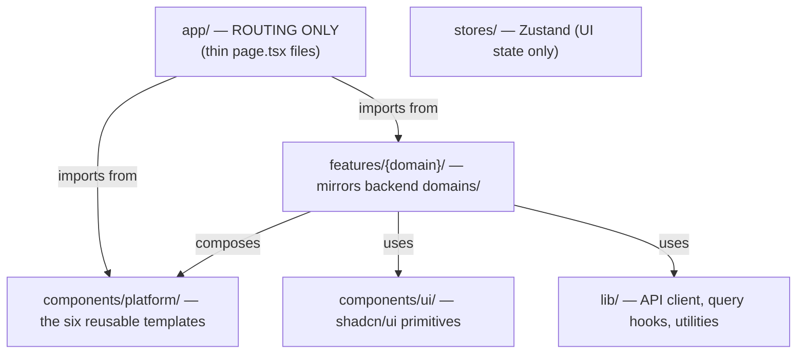
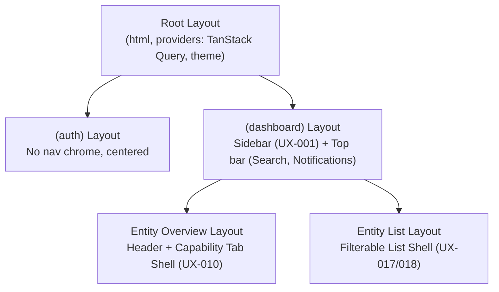
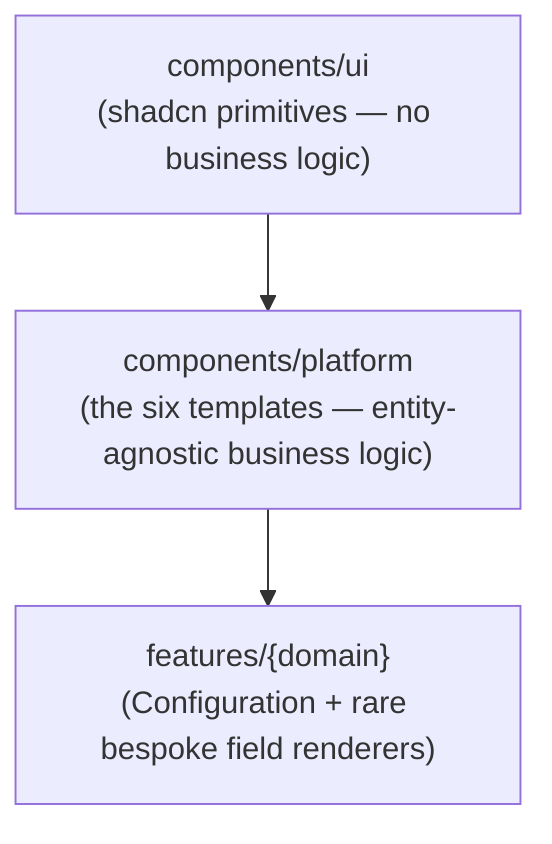
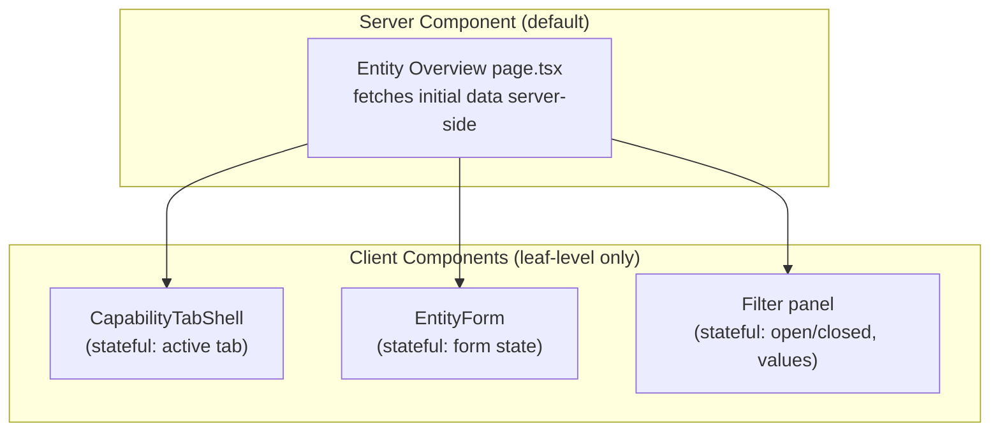
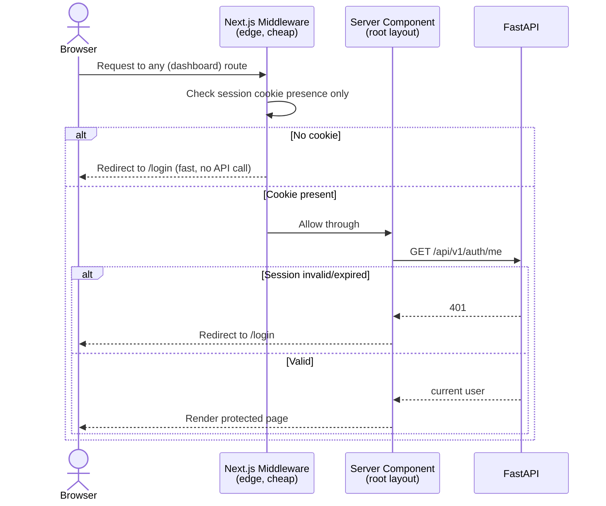
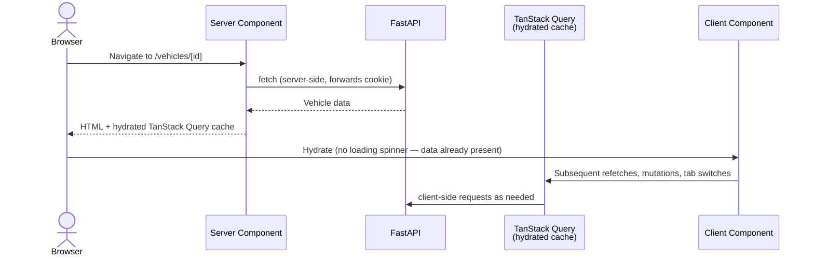
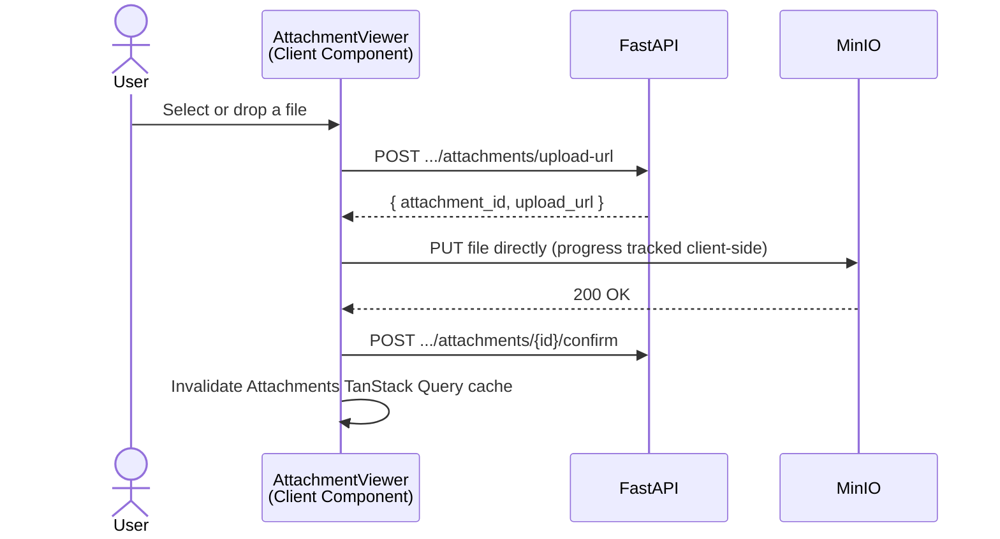
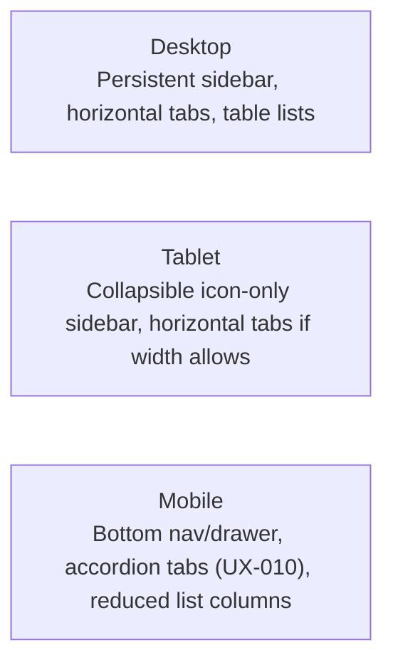

# LifeOS — Frontend Architecture

# Document Information

| Field | Value |
|---|---|
| Document | Frontend Architecture |
| File | `docs/architecture/05_Frontend_Architecture.md` |
| Version | 1.0 |
| Status | Approved |
| Owner | Engineering Team |
| Last Updated | 2026-07-02 |
| Depends On | `docs/architecture/00_Engineering_Overview.md`, `docs/architecture/03_API_Design.md`, `docs/architecture/04_Backend_Architecture.md`, `docs/design/00_Design_Handoff.md`, `docs/design/01_UX_Decision_Record.md` |
| Used By | Frontend implementation, `docs/architecture/06_*` (future documents) |

---

## Purpose

This document defines the frontend engineering architecture — how `apps/web` (Next.js) is structured so it mirrors the backend's discipline (`docs/architecture/04_Backend_Architecture.md`) and faithfully implements the approved design system (`docs/design/00_Design_Handoff.md`, `01_UX_Decision_Record.md`). No implementation code. The guiding symmetry throughout: **wherever the backend has a Domain package, the frontend has a matching Feature folder** — the same Platform/Domain split, expressed in React instead of FastAPI.

---

## 1. Frontend Philosophy

- **Server Components by default; Client Components only where interactivity genuinely requires them.** This isn't a stylistic preference — it's the direct performance and simplicity consequence of Next.js's App Router, and it minimizes the JavaScript shipped to the browser for a product whose core value (viewing and organizing records) is mostly about displaying data, not manipulating it in real time.
- **Templates over one-off screens.** The ~36–39-screen count in `docs/product/06_Screen_Inventory.md` only holds if the six reusable templates (`docs/design/00_Design_Handoff.md`, Section 6) are actually shared components, not a starting point copy-pasted per Domain.
- **The design system is not optional per screen.** A Feature never introduces its own spacing, color, or interaction pattern — every visual decision traces back to `docs/design/01_UX_Decision_Record.md` or the eventual Design System sprint (`design/sprint-03/`).
- **Explicit over implicit, mirroring `docs/architecture/04_Backend_Architecture.md`, Section 1** — no relied-upon hidden framework magic; every data flow is traceable.

---

## 2. Feature-Based Folder Structure



```
apps/web/
├── app/                          # Next.js App Router — routing shell only
│   ├── (auth)/
│   ├── (dashboard)/
│   ├── (modules)/[domain]/
│   └── settings/
├── features/                     # ONE folder per Domain — mirrors apps/api/app/domains/
│   ├── vehicles/                 # reference implementation (DEC-001)
│   │   ├── config.ts             # field Configuration (Section 28) — labels, types, order
│   │   ├── hooks.ts               # TanStack Query hooks specific to Vehicle
│   │   └── fields/                # rare, genuinely bespoke field renderers (Section 6)
│   ├── contacts/
│   ├── insurance-policies/
│   └── ...
├── components/
│   ├── ui/                        # shadcn/ui primitives, unmodified
│   └── platform/                  # the six reusable templates (Section 6)
│       ├── EntityForm/
│       ├── EntityOverview/
│       ├── CapabilityTabShell/
│       ├── FilterableListShell/
│       ├── ConfirmAction/
│       └── AttachmentViewer/
├── lib/
│   ├── api/                       # generated client (packages/api-types)
│   └── queries/                    # shared TanStack Query conventions (Section 14)
└── stores/                         # Zustand — UI state only (Section 8)
```

**`app/` contains no business logic** — every `page.tsx` is a thin file that imports a Feature's components and passes them into a Platform template. This keeps Next.js's file-based routing requirement from forcing feature logic to live inside the routing tree, the same way `docs/architecture/04_Backend_Architecture.md`, Section 6 keeps Controllers thin.

---

## 3. App Router Architecture

- **Route Groups** (`(auth)`, `(dashboard)`) organize routes without affecting the URL, matching Next.js App Router conventions — `(auth)` has no persistent navigation chrome; `(dashboard)` has the full Global Navigation shell (Section 5).
- **Server Components are the default** for any route segment whose job is "fetch and display" — the Entity List and Entity Overview pages fetch their initial data server-side (Section 13).
- **Client Components (`'use client'`) are reserved for leaf-level interactivity**: the Capability Tab Shell's tab switching, any form, the Filterable List Shell's filter panel, modals. A Server Component page composes Client Components as children — the interactivity boundary is drawn as far down the tree as possible, not at the page level.

## 4. Route Organization

```
/login, /register, /forgot-password              (auth)
/                                                  Dashboard
/search                                            Global Search results
/notifications                                     Notification Center
/vehicles, /vehicles/[id]                          Vehicle (Assets)
/contacts, /contacts/[id]                          Contact (People)
/insurance-policies, /insurance-policies/[id]       Insurance Policy (Finance)
/documents, /documents/[id]                         Document (Documents)
... one pair of routes per Domain Entity Type
/settings, /settings/security, /settings/tags, ... Settings
/trash                                              Archive & Trash List
```

**Frontend routes deliberately mirror the API's resource naming** (`docs/architecture/03_API_Design.md`, Section 4) — `/vehicles/[id]` maps directly to `GET /api/v1/vehicles/{id}`. A flatter structure (`/vehicles`) was chosen over nesting every route under its Product Module (`/modules/assets/vehicles`) specifically for this symmetry: a developer moving between the API and the web app sees the same resource names, and URLs stay short and memorable — appropriate for a personal tool that's never indexed by search engines, where SEO-driven URL nesting has no value.

## 5. Layout Architecture



- **Root layout**: global providers only (TanStack Query client, theme provider per Section 23) — no visual chrome.
- **`(dashboard)` layout**: the persistent sidebar + top bar (`docs/design/01_UX_Decision_Record.md`, UX-001), rendered once and shared by every Product Module route — this is what makes Global Navigation "always available" (`docs/product/04_Information_Architecture.md`, Section 3) an architectural guarantee, not a per-page convention.
- **Entity Overview layout**: nested one level deeper, rendering the Capability Tab Shell (UX-010) around whatever tab is active — identical structure regardless of Entity Type, per Section 6.

---

## 6. Component Architecture

Three tiers, in increasing order of specificity:



**How a Domain's typed fields actually render inside a generic template — the central mechanism of this architecture**: rather than each Feature writing its own JSX layout for `EntityOverview` or `EntityForm`, a Domain contributes a **field Configuration** — an ordered list of `{ name, label, type, required }` — and the Platform template's own **field renderer** (a shared `type → component` mapping, e.g. `text → <TextField>`, `date → <DateField>`, `select → <SelectField>`) renders each field generically. This is the frontend expression of the same Configuration concept already defined in `docs/product/00_Glossary.md`, Section 10, and it directly explains why a new Domain rarely needs new frontend code at all (Section 28) — it needs new *configuration*.

A Domain registers a **custom field renderer** only for the rare field that genuinely can't be expressed generically (e.g., a VIN field with barcode-scanning input) — without abandoning the shared template for the rest of that Entity Type's fields.

---

## 7. Shared UI vs. Feature UI

| Tier | Contains | Ownership Rule |
|---|---|---|
| `components/ui` | shadcn/ui primitives (Button, Input, Dialog, ...) | Never modified to be entity- or feature-aware |
| `components/platform` | The six templates, the entity chip (UX-025), Confirm Action, skeleton loaders | Entity-agnostic — must work identically for Vehicle and Contact, per `docs/design/00_Design_Handoff.md`, Section 5's validation requirement |
| `features/{domain}` | Field Configuration, rare bespoke field renderers | **The moment a piece of UI is needed by a second Domain, it graduates to `components/platform`** — mirroring the backend's Platform/Domain promotion rule (`docs/architecture/01_System_Architecture.md`, Section 1) exactly |

A Feature folder that contains anything resembling a full custom page layout is a signal the Platform template is missing a capability — the same litmus test as `docs/decisions/DEC-001-vehicle-reference-implementation.md`, applied to the frontend.

---

## 8. State Management Strategy

**The boundary is unchanged from the original stack decision, restated precisely**: Zustand owns **client-only UI state that could never be re-fetched from the API** — sidebar collapsed/expanded, which filter panel is open, which modal is active. TanStack Query owns **everything that originates from the server** — every Entity, every list, every Search result.

**The test for "which one owns this state"**: if refreshing the page and re-fetching from the API would reasonably restore it, it's TanStack Query's. If it would be lost (and that's fine — it's ephemeral UI presentation state), it's Zustand's. A Zustand store never holds an Entity, a list of Entities, or anything shaped like API response data — that would create a second, competing source of truth for data the API already owns.

## 9. Server Components vs. Client Components



- The **page itself is a Server Component**: it fetches the Entity's data (Section 13) and renders the static shell (name, breadcrumb-equivalent header).
- **Interactive pieces are Client Components**, composed as children — this keeps the JavaScript bundle minimal (a Server Component ships no client JS at all) while still allowing the Capability Tab Shell, forms, and filters to be fully interactive where it matters.
- **The dividing line is always drawn at the most specific component that actually needs interactivity** — never at the page level "just in case," which would force the entire page (including genuinely static content) into client-side rendering unnecessarily.

## 10. API Communication Layer

`lib/api/` wraps the generated client (`packages/api-types`, per `docs/architecture/00_Engineering_Overview.md`, Section 2) with exactly three responsibilities:

1. **Base configuration**: base URL, `credentials: 'include'` (forwards the session cookie, per `docs/architecture/03_API_Design.md`, Section 6).
2. **CSRF token injection**: automatically attaches the current CSRF token (Section 12) to every state-changing request header.
3. **Error envelope parsing**: converts the API's error envelope (`docs/architecture/03_API_Design.md`, Section 12) into a typed error object the rest of the frontend handles uniformly (Section 17) — no call site needs to know the raw JSON shape of an error response.

No Feature or Platform component calls `fetch` directly — every API call goes through this one layer, the frontend's equivalent of the backend's Repository boundary (`docs/architecture/04_Backend_Architecture.md`, Section 8): one place responsible for talking to the outside world, everything else calls it, never bypasses it.

---

## 11. Authentication Flow

**Two-tier check**, since a fast, cheap check and a fully authoritative one serve different purposes:



- **Next.js Middleware** performs a cheap, cookie-presence-only check at the edge — it cannot validate the session against Redis without an extra network round trip, so it only catches the *obviously* logged-out case fast.
- **A Server Component in the root `(dashboard)` layout performs the authoritative check** (`GET /api/v1/auth/me`) — this is what actually redirects a user whose cookie exists but whose session has expired or been invalidated.

## 12. Session Management

- **The session token itself is never accessible to frontend JavaScript** — it lives only in the httpOnly cookie (`docs/architecture/00_Engineering_Overview.md`, Section 8), by design, as protection against XSS-based session theft.
- **"Is the user authenticated" is tracked client-side via a TanStack Query-cached call to `/auth/me`**, invalidated explicitly on login and logout actions — not via any client-readable token.
- **The CSRF token, unlike the session token, must be readable by JavaScript** (it has to be attached to headers, Section 10) — held in memory only (a small Zustand store or React context, never `localStorage`, to limit its exposure window), refreshed via `/auth/csrf-token` if a request is rejected for a stale token.

## 13. Data Fetching Strategy



- **Initial data for any page is fetched server-side** (in the Server Component) and **hydrated directly into TanStack Query's cache** — the client never re-fetches data it already received in the initial HTML, avoiding both a loading spinner on first paint and a redundant request.
- **Every subsequent interaction** (switching Capability Tabs, applying a filter, paginating) is a normal client-side TanStack Query fetch, using the same generated API client (Section 10).

## 14. Caching Strategy

- **TanStack Query's cache is the frontend's only data cache** — no separate client-side cache is introduced.
- **Query keys mirror the API's resource hierarchy** (`docs/architecture/03_API_Design.md`, Section 3), e.g. `['vehicles', 'list', filters]`, `['vehicles', 'detail', id]`, `['entities', entityType, entityId, 'attachments']` — this makes invalidation predictable: mutating a Vehicle invalidates every query key starting with `['vehicles', ...]`, and TanStack Query's key-prefix matching handles the rest without manual bookkeeping per query.
- **`staleTime` varies deliberately by data type**: Dashboard widgets (frequently relevant, cheap to refetch) use a short `staleTime`; a rarely-changing Entity Overview uses a longer one — tuned per query type, not globally uniform.

---

## 15. Forms Architecture

The `EntityForm` template (`docs/design/00_Design_Handoff.md`, Section 6) implements React Hook Form + Zod, per the fixed stack, and the two behaviors already decided in `docs/design/01_UX_Decision_Record.md`:

- **Single-page, with optional/Custom Fields behind an explicit expansion** (UX-013) — driven generically by the field Configuration (Section 6), not a per-Domain layout decision.
- **Explicit Save on create; autosave on edit** (UX-015) — the same `EntityForm` component operates in two modes, since both were decided to be the correct behavior for the "no draft state" rule (`docs/product/05_User_Journeys.md`, J1.4) versus editing an already-real Entity.
- **Zod schemas are maintained per-Feature, not generated from the backend.** `packages/api-types` gives TypeScript *types*, not runtime Zod *validators* — a real, accepted seam. Each Feature's Zod schema should mirror its Domain's backend validation rules (required fields, basic format checks) closely enough to give accurate instant feedback, and should be revisited whenever the corresponding backend DTO (`docs/architecture/04_Backend_Architecture.md`, Section 10) changes. This is flagged explicitly in Quality Review as the one place drift could silently accumulate if not disciplined.

## 16. Validation Strategy

**Client-side Zod validation is a UX optimization, never a security boundary** — the API's own validation (`docs/architecture/03_API_Design.md`, Section 13) is authoritative. Concretely:

- Zod validates on blur, then again on submit (`docs/design/01_UX_Decision_Record.md`, UX-014).
- If the API still returns a `422 validation_error` (e.g., a business rule only the Service layer knows about — `docs/architecture/04_Backend_Architecture.md`, Section 11), the error envelope's `fields` object is mapped directly onto the corresponding React Hook Form field via `setError` — the user sees the same inline error experience regardless of which layer actually caught the problem.

## 17. Error Handling

A single, shared error-code-to-message dictionary (keyed by the API's `code` values, `docs/architecture/03_API_Design.md`, Section 12) implements the plain-language, actionable copy already specified in `docs/design/01_UX_Decision_Record.md`, UX-042 — every error surface in the app reads from this one dictionary, never inventing its own phrasing per screen.

| Error Class | Handling |
|---|---|
| Field-level (`validation_error`) | Inline, via `setError` (Section 16) |
| Action-level, no field to attach to (`entity_not_found`, `permission_denied`) | Toast (per UX-034's toast/inline split) |
| Unexpected (`internal_error`, network failure) | Toast + a generic "something went wrong, try again" — never the raw error |
| Destructive action (Archive, Delete) | **Optimistic UI removal + an Undo toast, per UX-043** — implemented as a delayed-commit pattern: the item disappears from the UI immediately, but the actual API call is held for a few seconds; clicking "Undo" simply cancels the pending call (no compensating restore request needed in the common case); letting the toast expire sends the real request |

## 18. Loading States

- **Initial page loads** use Next.js's `loading.tsx` / Suspense boundaries per route — a route-level skeleton shown only for the brief window before the Server Component's data resolves.
- **Client-side refetches** (a filter change, pagination) show skeleton components living in `components/platform` — one shared skeleton per template (Entity List, Entity Overview, each Capability Tab), not one skeleton implementation per Domain.
- Every loading state in `docs/product/06_Screen_Inventory.md`, Section 10 maps to one of these two mechanisms — there is no third, ad hoc loading pattern introduced per Feature.

## 19. Empty States

Per `docs/design/01_UX_Decision_Record.md`, UX-012 (minimal text + a single clear action, no illustration): empty states are a **prop on the Platform template** (Filterable List Shell, Capability Tab Shell), not a custom component per Domain. A Feature supplies only its specific copy (e.g., "No vehicles yet — Add your first vehicle") via Configuration (Section 6) — never a bespoke empty-state layout.

---

## 20. Search Implementation

Per `docs/design/01_UX_Decision_Record.md`, UX-021 (instant, debounced) and UX-025 (entity chip): the global search bar (Section 5's top bar) is a Client Component that debounces keystrokes, queries `GET /api/v1/search` (`docs/architecture/03_API_Design.md`, Section 11) via TanStack Query, and renders each result using the shared entity chip component (`components/platform`) — the same component used for Relationship links (Section 6), so a search result and a related-entity link look and behave identically. Recent searches (shown on focus, before typing) are Zustand-held UI state (Section 8), since they're ephemeral and local to the client, not server data.

## 21. File Upload Flow



The file's bytes never pass through the Next.js server — the browser uploads directly to MinIO using the presigned URL (`docs/architecture/03_API_Design.md`, Section 14), with upload progress tracked via the browser's native upload-progress events, satisfying `docs/product/06_Screen_Inventory.md`'s large-file upload requirement without routing gigabytes through the frontend server process.

## 22. Responsive Architecture

Per `docs/design/01_UX_Decision_Record.md`, UX-039 (three intentionally distinct layouts, not one scaled down):



- Tailwind's responsive utilities implement the breakpoints; **the interaction pattern itself changes, not just sizing** — the Capability Tab Shell (`components/platform`) contains both its horizontal-tab rendering and its mobile accordion rendering internally, branching on breakpoint, rather than existing as two separate components. This keeps "one template per capability" (Section 1) true even though its rendered output genuinely differs by breakpoint.

---

## 23. Theme Architecture

- **shadcn/ui's CSS-variable theming approach** is used as-is — colors, spacing, and radius tokens are defined as CSS variables at the root, consumed by every `components/ui` primitive automatically.
- **Tone is calm and trustworthy, moderately dense** (`docs/design/01_UX_Decision_Record.md`, UX-040) — expressed through the actual token *values* the Design System sprint (`design/sprint-03/colors/`, `typography/`) will define, not through this document, which only fixes the *mechanism*.
- **Dark mode is structurally free to add later, whether or not it ships in V1** — CSS-variable theming means a dark token set is a second variable definition, not a rewrite of any component. Whether it actually ships remains Open UX Decision #7 (`docs/design/00_Design_Handoff.md`, Section 11) — this document only confirms the mechanism doesn't block either answer.

## 24. Accessibility Strategy

Target: **WCAG 2.1 AA** (`docs/design/01_UX_Decision_Record.md`, UX-036), operationalized at the frontend level:

- **shadcn/ui is built on Radix primitives**, which already provide strong keyboard navigation, focus management, and ARIA semantics out of the box — a significant reason this stack was chosen (`docs/product/01_Product_Vision.md`'s Learning Section, restated here as a concrete accessibility payoff).
- **Keyboard operability and focus management are required properties of every `components/platform` component**, not a per-Feature concern (UX-037) — since Features only contribute Configuration (Section 6), they inherit this "for free" from the Platform tier.
- **Automated accessibility testing** (e.g., `axe-core` integrated into component tests, Section 26) is run against every `components/platform` component in CI — a new, concrete addition this document introduces, catching regressions in the highest-leverage, most-reused components before they ship.

## 25. Performance Optimization

- **Server Components minimize shipped JavaScript by default** (Section 9) — the single biggest performance lever available in this architecture, and it's structural, not a manual optimization applied after the fact.
- **Route-level code splitting is automatic** in Next.js's App Router — no manual configuration needed.
- **Attachment thumbnails use Next.js's Image component** for automatic optimization and lazy loading.
- **List virtualization is not implemented for V1** — pagination (`docs/architecture/03_API_Design.md`, Section 8) already bounds every list's rendered size; virtualization is noted as a future option only if a page size limit is ever raised significantly.
- **Prefetching via Server Component + TanStack Query hydration** (Section 13) avoids request waterfalls on initial page load — the single most valuable performance pattern in this architecture, applied consistently rather than per-page.

## 26. Testing Strategy

Extends `docs/architecture/00_Engineering_Overview.md`, Section 17:

| Layer | Tooling | Focus |
|---|---|---|
| `components/platform` | Vitest + React Testing Library + `axe-core` | Highest priority — a bug or accessibility regression here affects every Domain at once |
| `features/{domain}` | Vitest + React Testing Library | Configuration correctness (right fields, right validation) — thinner tests, since there's little logic to test beyond configuration |
| End-to-end | Playwright, sourced from `docs/product/05_User_Journeys.md` | Unchanged from `docs/architecture/00_Engineering_Overview.md` |
| Visual regression (optional, future) | Screenshot-diff tooling | Not required for V1, but worth naming given how much this architecture depends on the six templates staying visually consistent across 28 Entity Types — flagged as a good candidate once the Design System (`design/sprint-03/`) stabilizes |

---

## 27. Frontend Coding Conventions

- ESLint + Prettier + TypeScript `strict` mode (`docs/architecture/00_Engineering_Overview.md`, Section 19) — unchanged, restated as binding.
- **One component per file, PascalCase filenames matching the component name**, colocated test files (`EntityForm.tsx`, `EntityForm.test.tsx`).
- **The binding code-review rule from `docs/architecture/00_Engineering_Overview.md`, Section 19 is the single most important frontend convention in this document**: any new Domain screen that doesn't import from `components/platform` is a red flag, to be questioned before merge, not after.
- Zustand stores are named for the UI concern they hold (`useSidebarStore`, `useSearchUIStore`), never for a Domain — a store named `useVehicleStore` would be an immediate signal that server data has leaked into client state (Section 8).

## 28. Module Creation Checklist

Mirrors `docs/architecture/04_Backend_Architecture.md`, Section 26, for the frontend side of adding the 29th Domain:

1. **Create `features/{new_type}/`** with its `config.ts` (field Configuration) and `hooks.ts` (TanStack Query hooks).
2. **Fetch, don't redeclare, Capability applicability.** The Standard Entity Capability Set's applicability per Entity Type (`docs/product/03_Feature_Catalogue.md`, Section 6) is defined **once, on the backend** (`docs/architecture/04_Backend_Architecture.md`, Section 19's registration pattern) and exposed via a small metadata endpoint (e.g., `GET /api/v1/entity-types/{type}/config`), which the frontend fetches and caches long-term via TanStack Query. **This is a deliberate architectural decision, not an implementation detail**: declaring Capability applicability twice — once in the backend's registry, once again in frontend code — would create exactly the kind of drift risk this entire project has worked to eliminate elsewhere (`docs/product/00_Glossary.md`'s naming-collision discipline is the same instinct applied to configuration instead of terminology). One source of truth, one consumer.
3. **Add bespoke field renderers only if truly needed** (Section 6) — the exception, not the expectation.
4. **Add the route**: a thin `page.tsx` under `app/(modules)/`, importing the Feature and composing it into the relevant Platform template.
5. **Write tests** per Section 26.

**If step 4 requires writing anything beyond a thin composition file, or step 2 tempts a second, frontend-only declaration of Capability rules, that's a signal to stop and reconsider** — the same discipline as the backend's equivalent checklist.

## 29. Future Flutter Integration

- **The same backend API, and the same generated OpenAPI schema, serve a future Flutter client** — OpenAPI codegen isn't TypeScript-specific; a Dart/Flutter client can be generated from the identical schema (`docs/architecture/03_API_Design.md`, Section 21), keeping exactly one contract source of truth across three eventual clients (web, and later mobile clients on both platforms via Flutter).
- **Flutter will need the token-based auth path** already flagged in `docs/architecture/00_Engineering_Overview.md`, Section 21 and `docs/architecture/04_Backend_Architecture.md`, Section 29 — native HTTP clients handle cookies less gracefully than browsers.
- **The Configuration-driven rendering philosophy (Section 6) is architecturally portable, not code-portable.** Flutter's widget system would re-implement the same idea — a generic Entity Overview widget rendering fields from the same backend-owned Configuration endpoint (Section 28) — in Dart, not by sharing React code, since the two ecosystems don't share a runtime. The *pattern* transfers; the *implementation* doesn't, and shouldn't be forced to.

---

## Quality Review

**Consistency check**: this document's Feature/Platform split, Configuration-driven rendering, and "graduate to Platform the moment two Domains need it" rule are the frontend-exact mirror of `docs/architecture/04_Backend_Architecture.md`'s Domain/Platform and Repository-promotion rules — the symmetry was maintained deliberately throughout, not just at the folder-structure level.

**The most consequential new decision in this document**: Capability applicability Configuration is owned **once**, by the backend, and fetched (never redeclared) by the frontend (Section 28). This is the frontend-specific instance of a pattern this whole project has repeated at every layer — one canonical source of truth, everything else references it — and it's flagged here because it would have been easy, and wrong, to let the frontend maintain its own parallel copy for convenience.

**One accepted seam, flagged rather than hidden**: Zod schemas (Section 15) are maintained separately from the backend's Pydantic DTOs, since `packages/api-types` provides types but not runtime validators. This is a deliberate, accepted gap — not an oversight — but one worth remembering whenever a Domain's validation rules change on the backend.

**No new product, UX, or backend architecture decisions were introduced.** This document is entirely a frontend-specific elaboration of already-approved architecture and design decisions.

---

## Document Status

**Version:** 1.0
**Status:** Approved
**Dependencies:**
- `docs/architecture/00_Engineering_Overview.md`
- `docs/architecture/03_API_Design.md`
- `docs/architecture/04_Backend_Architecture.md`
- `docs/design/00_Design_Handoff.md`
- `docs/design/01_UX_Decision_Record.md`

**Generated On:** 2026-07-02

**Next Document:** `docs/implementation/00_Implementation_Roadmap.md` — the core Engineering architecture phase (`00`–`05`) is complete; the Roadmap sequences it into implementation phases.