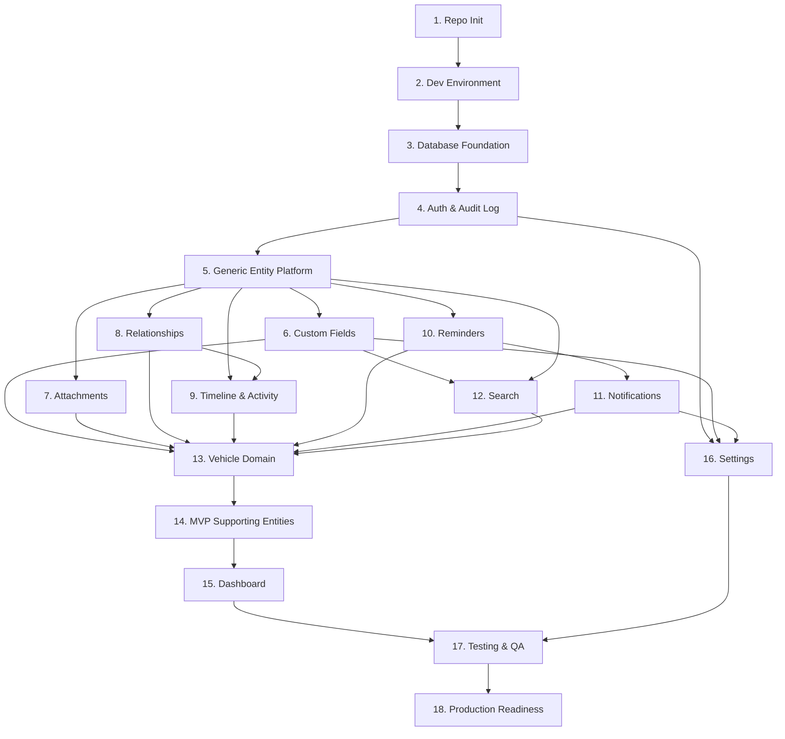

# LifeOS — Implementation Roadmap

# Document Information

| Field | Value |
|---|---|
| Document | Implementation Roadmap |
| File | `docs/implementation/00_Implementation_Roadmap.md` |
| Version | 1.0 |
| Status | Approved |
| Owner | Engineering Team |
| Last Updated | 2026-07-02 |
| Depends On | `docs/architecture/00_Engineering_Overview.md` through `05_Frontend_Architecture.md`, `docs/product/` (all), `docs/decisions/` (DEC-001–013) |
| Used By | All development sprints; this is the master source of truth for build order |

---

## Purpose

This is the master plan translating the approved architecture (`docs/architecture/00`–`05`) into an ordered sequence of small, independently testable implementation phases, ending at a production-ready application. No implementation code is written here — only what to build, in what order, and how each phase is verified before the next begins.

---

## How This Roadmap Deviates From the Suggested 16-Phase Structure

The suggested structure is sound but had three real gaps, corrected here rather than silently followed:

1. **Custom Fields had no phase of its own.** Every Domain — including the Vehicle reference implementation — needs Custom Fields working from day one (the "Dealer Notes" example used throughout `docs/product/`). Added as **Phase 6**, before Attachments/Relationships, so it's available before any Domain is built.
2. **"Vehicle Domain" alone doesn't reach true MVP scope.** Per `docs/decisions/DEC-010-mvp-supporting-entities.md`, Vehicle alone proves nothing — Insurance Policy, Expense, Document, and Contact are required alongside it. Added as its own phase, **Phase 14**, immediately after Vehicle.
3. **Notifications was ordered after Search and Vehicle, but Reminders directly depends on it.** `docs/architecture/01_System_Architecture.md`, Section 8 states the reminder-sweep job calls `NotificationService.dispatch()` directly — placing Notifications 3 phases later would leave Reminders non-functional for longer than necessary. **Reordered to Phase 11**, immediately after Reminders (Phase 10).

The result is **18 phases instead of 16** — consistent with "prefer many small milestones over a few huge ones."

---

## Phase Dependency Overview



---

## Phase 1 — Repository Initialization

| Field | Detail |
|---|---|
| **Objective** | Establish the monorepo skeleton exactly as defined in `docs/architecture/00_Engineering_Overview.md`, Sections 2–3 — no functional code. |
| **Why This Phase Exists** | Every later phase needs a place to put its code; fixing the structure first avoids restructuring mid-project. |
| **Prerequisites** | None — the true starting point. |
| **Dependencies on Previous Phases** | None. |
| **Estimated Complexity** | Low |

**Deliverables**
- Monorepo folder structure (`apps/web`, `apps/api`, `packages/api-types`, `infra/`, `.github/workflows/`)
- A booting (empty) FastAPI app with a `/health` endpoint
- A booting (empty) Next.js app with a placeholder page
- Linting/formatting/type-checking configs wired: Ruff, mypy, ESLint, Prettier, TypeScript `strict`

**Files/Folders Expected**
```
apps/api/pyproject.toml, app/main.py
apps/web/package.json, app/page.tsx (placeholder)
packages/api-types/ (empty placeholder)
infra/docker-compose.yml (stub)
.github/workflows/ci.yml (lint job only)
```

**Testing Requirements**
- CI lint job runs and passes against the stub codebase
- `/health` returns `200`
- Next.js dev server boots and renders the placeholder page

**Acceptance Criteria**
A fresh clone, following only documented setup steps, produces a running (empty) frontend and backend with passing CI.

**Risks**
Over-engineering the folder structure speculatively before real code exists — mitigated by following `docs/architecture/00_Engineering_Overview.md` exactly rather than adding folders "just in case."

**Future Extensions**
None — this phase is foundation only.

---

## Phase 2 — Development Environment

| Field | Detail |
|---|---|
| **Objective** | A complete local Docker Compose stack: `web`, `api`, `worker`, `beat`, `postgres`, `redis`, `minio`, all wired together per `docs/architecture/00_Engineering_Overview.md`, Section 4. |
| **Why This Phase Exists** | Every subsequent phase needs a working local environment to develop and test against — this must be solid before any feature work begins. |
| **Prerequisites** | Phase 1 |
| **Dependencies on Previous Phases** | Phase 1 |
| **Estimated Complexity** | Medium |

**Deliverables**
- Complete `docker-compose.yml` with healthchecks and correct startup ordering
- `.env.example` documenting every required variable
- `apps/api/app/core/config.py` — typed settings that fail fast on a missing variable (`docs/architecture/04_Backend_Architecture.md`, Section 21)

**Files/Folders Expected**
```
infra/docker-compose.yml
infra/.env.example
apps/api/app/core/config.py
```

**Testing Requirements**
- `docker compose up` starts all seven services successfully
- A smoke test confirms the API can reach Postgres, Redis, and MinIO

**Acceptance Criteria**
A new contributor clones the repo, copies `.env.example` to `.env`, runs one command, and has the full stack running with no manual steps.

**Risks**
Service startup ordering (e.g., API starting before Postgres is ready) — mitigated with healthcheck-based `depends_on`, not fixed sleep delays.

**Future Extensions**
`docker-compose.prod.yml` (Phase 18).

---

## Phase 3 — Database Foundation

| Field | Detail |
|---|---|
| **Objective** | The base `entities` table and the `entity_type` registry table, Alembic fully wired, per `docs/architecture/02_Database_Architecture.md`, Sections 3 and 19. |
| **Why This Phase Exists** | Every Platform and Domain table depends on `entities` existing first — the single most foundational piece of schema in the entire product. |
| **Prerequisites** | Phase 2 (a running Postgres to migrate against) |
| **Dependencies on Previous Phases** | Phase 2 |
| **Estimated Complexity** | Low–Medium |

**Deliverables**
- Alembic initialized with a linear migration history
- `entities` table: `id` (UUID), `entity_type`, `owner_id`, `name`, `is_favorite`, `lifecycle_state`, `trashed_at`, timestamps
- `entity_type` registry table
- A seeded single V1 user

**Files/Folders Expected**
```
apps/api/alembic/versions/0001_create_entities.py
apps/api/alembic/versions/0002_entity_type_registry.py
apps/api/app/platform/entities/models.py
```

**Testing Requirements**
- `alembic upgrade head` and `alembic downgrade base` both tested in CI, per the reversibility rule in `docs/architecture/02_Database_Architecture.md`, Section 19
- A seeded-user test confirms exactly one V1 user exists

**Acceptance Criteria**
Migrations apply and roll back cleanly against a fresh database; the seeded user is queryable.

**Risks**
Getting the `entity_type` registry pattern wrong here would be expensive to unwind later, since every subsequent Domain depends on it — mitigate by validating the pattern against at least two hypothetical Entity Types before treating it as locked in.

**Future Extensions**
`household_id` evolution (`docs/architecture/02_Database_Architecture.md`, Section 21).

---

## Phase 4 — Authentication & Audit Log

| Field | Detail |
|---|---|
| **Objective** | Session-based authentication (login/logout/`me`/CSRF token, per `docs/architecture/03_API_Design.md`, Section 6) and the `audit_log` table capturing security events. |
| **Why This Phase Exists** | Nothing can be meaningfully "owner-scoped" without a real authenticated user — this unlocks every later phase's ownership-scoping requirement. |
| **Prerequisites** | Phase 3 |
| **Dependencies on Previous Phases** | Phase 3 |
| **Estimated Complexity** | Medium |

**Deliverables**
- `/api/v1/auth/*` endpoints (login, logout, me, csrf-token)
- Redis-backed sessions; argon2 password hashing; CSRF middleware
- `audit_log` table + insert-only `AuditService`
- Frontend login page + the two-tier auth check (`docs/architecture/05_Frontend_Architecture.md`, Section 11)

**Files/Folders Expected**
```
apps/api/app/auth/{models,service,router}.py
apps/api/app/platform/audit/{models,service}.py
apps/web/app/(auth)/
apps/web/middleware.ts
```

**Testing Requirements**
- Integration tests: successful login, logout, expired session rejection, CSRF rejection on a missing/stale token
- A failed login attempt produces an `audit_log` row
- E2E test for the login journey

**Acceptance Criteria**
A user logs in via the web UI, remains authenticated across a page refresh, and logs out; an invalid session redirects to `/login`.

**Risks**
CSRF implementation errors are a genuine security risk if rushed — mitigate with a dedicated security-focused test pass for this phase specifically, before any later phase builds on top of it.

**Future Extensions**
OAuth/passkeys/2FA (additive); Flutter token-based auth path (`docs/architecture/00_Engineering_Overview.md`, Section 21).

---

## Phase 5 — Generic Entity Platform Core

| Field | Detail |
|---|---|
| **Objective** | Full CRUD, lifecycle (Archive/Trash/Restore/Permanent Delete via the 30-day purge job), Tags, and Favorites on the base `entities` table — the Platform Layer's core. |
| **Why This Phase Exists** | Every future Domain and Capability builds on this working correctly first; it's the highest-leverage phase in the roadmap. |
| **Prerequisites** | Phase 4 (ownership scoping needs real auth to mean anything) |
| **Dependencies on Previous Phases** | Phase 4 |
| **Estimated Complexity** | High |

**Deliverables**
- `EntityRepository` (inheriting a `BaseRepository` that automatically scopes every query by `owner_id`, per `docs/architecture/04_Backend_Architecture.md`, Section 14) and `EntityService`
- Archive / Restore / Soft Delete / Permanent Delete actions, wired to the 30-day Trash purge Celery Beat job (`docs/decisions/DEC-007`)
- `tags` / `entity_tags` tables and endpoints
- Archive & Trash List endpoint
- Frontend Confirm Action component + the Archive/Undo pattern (UX-043)

**Files/Folders Expected**
```
apps/api/app/platform/entities/{repository,service,router}.py
apps/api/app/platform/base_repository.py
apps/api/app/platform/tags/{models,service,router}.py
apps/api/app/jobs/purge_trash.py
apps/web/components/platform/ConfirmAction/
```

**Testing Requirements**
- A deliberate cross-owner access attempt returns `404`, per `docs/architecture/03_API_Design.md`, Section 7 — tested explicitly against `BaseRepository`
- Time-mocked test of the 30-day purge job
- Full lifecycle transition tests: Active→Archived→Active, Active→Trashed→Restored, Trashed→Purged

**Acceptance Criteria**
A test entity can be created, archived, unarchived, soft-deleted, restored, and (after the purge job runs) permanently deleted — entirely via the API, with correct `lifecycle_state` at every step.

**Risks**
A bug in `BaseRepository`'s owner-scoping here would silently affect every future Domain — this phase should not be considered complete until its test coverage is genuinely thorough, not just passing.

**Future Extensions**
Household-shared ownership (`docs/architecture/02_Database_Architecture.md`, Section 21).

---

## Phase 6 — Custom Fields

| Field | Detail |
|---|---|
| **Objective** | `custom_field_definitions` and `custom_field_values` tables (typed columns, per `docs/architecture/02_Database_Architecture.md`, Section 7) and `CustomFieldService`. |
| **Why This Phase Exists** | Vehicle (Phase 13) and every later Domain needs Custom Fields working from day one — building it before any Domain exists keeps every future Domain build genuinely thin. |
| **Prerequisites** | Phase 5 |
| **Dependencies on Previous Phases** | Phase 5 |
| **Estimated Complexity** | Medium |

**Deliverables**
- Custom Field Definition CRUD (Settings-facing)
- Custom Field Value read/write, scoped per Entity Instance
- Typed-column value storage (text / number / date / boolean / select)

**Files/Folders Expected**
```
apps/api/app/platform/custom_fields/{models,repository,service,router}.py
```

**Testing Requirements**
- Each of the 5 field types can be defined and a matching value stored and retrieved correctly
- Storing a value that doesn't match its Definition's declared type is rejected

**Acceptance Criteria**
A Custom Field Definition created for a test Entity Type is usable end-to-end (define → set a value → retrieve it) via the API.

**Risks**
The typed-column storage approach was already flagged in `docs/architecture/02_Database_Architecture.md`'s Quality Review as the design choice most likely to need revisiting — validate it thoroughly here, before many Domains depend on it.

**Future Extensions**
Additional field types beyond the current five, if a genuine need arises.

---

## Phase 7 — Attachments

| Field | Detail |
|---|---|
| **Objective** | The `attachments` table and the presigned-URL upload flow (`docs/architecture/03_API_Design.md`, Section 14), with MinIO server-side encryption. |
| **Why This Phase Exists** | Nearly every Entity Type needs file attachments — one of the most-used Capabilities in the whole product. |
| **Prerequisites** | Phase 5 (needs entities to attach to) |
| **Dependencies on Previous Phases** | Phase 5 |
| **Estimated Complexity** | Medium |

**Deliverables**
- Upload-URL / confirm endpoints; `AttachmentService` / `AttachmentRepository`
- A thin MinIO client wrapper (Infrastructure layer)
- Frontend `AttachmentViewer` + drag-drop/browse upload (UX-029)
- Background reconciliation job for abandoned `pending` uploads

**Files/Folders Expected**
```
apps/api/app/platform/attachments/{models,repository,service,router}.py
apps/api/app/jobs/reconcile_pending_attachments.py
apps/web/components/platform/AttachmentViewer/
```

**Testing Requirements**
- Full upload flow tested against a real MinIO test instance (not mocked)
- Unsupported file type and oversized file rejection tested
- Pending-upload reconciliation tested with a simulated abandoned upload

**Acceptance Criteria**
A file can be uploaded, previewed, and downloaded from a test Entity, confirmed present in MinIO with SSE enabled.

**Risks**
Presigned URL expiry edge cases and large-file behavior on slow connections — mitigate by testing with realistic file sizes, not only tiny fixtures.

**Future Extensions**
Virus scanning (optional ClamAV sidecar, `docs/architecture/00_Engineering_Overview.md`, Section 15).

---

## Phase 8 — Relationships

| Field | Detail |
|---|---|
| **Objective** | The `relationships` table (one row per connection, both sides referencing `entities.id`), the hybrid System/Custom Relationship model (`docs/decisions/DEC-009`), and cross-owner validation. |
| **Why This Phase Exists** | This is what makes the product "entity-driven, not module-driven" — arguably the single most important Capability to the product's core premise. |
| **Prerequisites** | Phase 5 |
| **Dependencies on Previous Phases** | Phase 5 |
| **Estimated Complexity** | Medium |

**Deliverables**
- Add/remove Relationship endpoints; the fixed System Relationship list (`Owns`, `Belongs To`, `Insures`, `Maintained By`, `Lives At`, `Related To`) plus Custom Relationship support
- The Service-layer "both sides share an owner" validation (`docs/architecture/02_Database_Architecture.md`, Section 2's noted gap)
- Frontend entity chip component (UX-025) and the Relationships tab, grouped by type (UX-011)

**Files/Folders Expected**
```
apps/api/app/platform/relationships/{models,repository,service,router}.py
apps/web/components/platform/EntityChip/
```

**Testing Requirements**
- Cross-owner relationship attempts are explicitly rejected
- Uniqueness constraint tested (duplicate relationship rejected)
- Bidirectional visibility tested (a relationship is visible and traversable from both linked entities)
- Query correctness tested from both the `entity_a_id` and `entity_b_id` sides (per the "one row, not two" storage decision)

**Acceptance Criteria**
Two test entities can be linked via both a System Relationship and a Custom Relationship, each visible and navigable from either side.

**Risks**
The "one row, not two" storage decision requires correct `OR`-based query logic on both reference columns — under-tested query logic here would silently produce one-directional-looking relationships.

**Future Extensions**
Relationship graph view (deferred per UX-024, not planned).

---

## Phase 9 — Timeline & Activity Log

| Field | Detail |
|---|---|
| **Objective** | `activity_log` (auto-generated) and `timeline_entries` (user-logged) tables, with `TimelineService` computing their union at read time (`docs/architecture/02_Database_Architecture.md`, Section 10). |
| **Why This Phase Exists** | Answers the product's "when did this happen" guiding question for any Entity. |
| **Prerequisites** | Phase 5; Phase 8 (relate-events need Relationships to exist) |
| **Dependencies on Previous Phases** | Phase 5, Phase 8 |
| **Estimated Complexity** | Low–Medium |

**Deliverables**
- Automatic activity logging hooked into `EntityService`'s shared create/edit/archive/relate methods (Phase 5) — so no future Domain needs to remember to call it individually
- Manual Timeline entry endpoint
- Frontend Timeline tab: vertical, chronological, grouped by day (UX-026/027)

**Files/Folders Expected**
```
apps/api/app/platform/timeline/{models,repository,service,router}.py
```

**Testing Requirements**
- Creating, editing, archiving, and relating a test entity each produce the expected `activity_log` row automatically
- A manually-logged Timeline entry appears correctly interleaved by date with automatic entries

**Acceptance Criteria**
A test entity's Timeline shows a correct, date-ordered union of system and user events after a scripted sequence of test actions.

**Risks**
Forgetting to hook activity logging into every mutation path — mitigated by placing the logging call inside `EntityService`'s shared base methods (Phase 5) rather than requiring each future Domain to remember it individually.

**Future Extensions**
Timeline summarization (a named future AI direction, `docs/product/05_User_Journeys.md`, Cross-Journey Analysis).

---

## Phase 10 — Reminders

| Field | Detail |
|---|---|
| **Objective** | The `reminders` table, due-date logic, recurrence (advance-in-place, per `docs/architecture/02_Database_Architecture.md`, Section 9), and the reminder-sweep Celery Beat job — **data model and scheduling only; dispatch is explicitly deferred to Phase 11.** |
| **Why This Phase Exists** | Reminders are core to the Dashboard's assistant framing, but the sweep job has nothing to dispatch through until Notifications exists. |
| **Prerequisites** | Phase 5 |
| **Dependencies on Previous Phases** | Phase 5 |
| **Estimated Complexity** | Medium |

**Deliverables**
- Reminder CRUD; snooze/dismiss/done actions (UX-035)
- The sweep job — finds due/overdue Reminders — **stops at identification; sending anything is out of scope for this phase**

**Files/Folders Expected**
```
apps/api/app/platform/reminders/{models,repository,service,router}.py
apps/api/app/jobs/reminder_sweep.py   # partial in this phase — no dispatch yet
```

**Testing Requirements**
- Recurrence advances correctly after firing, tested across multiple simulated cycles (not just one)
- The sweep job correctly identifies due/overdue Reminders under time-mocked conditions
- Snooze/dismiss/done state transitions tested

**Acceptance Criteria**
A test Reminder is correctly identified as due/overdue by the sweep job at the right time — with no dispatch mechanism required for this phase to pass.

**Risks**
Recurrence bugs compound silently over long periods (e.g., a decade-long monthly reminder) — mitigate with tests covering many simulated cycles, not a single firing.

**Future Extensions**
Full dispatch, built in Phase 11.

---

## Phase 11 — Notifications

| Field | Detail |
|---|---|
| **Objective** | `NotificationService`, the Channel abstraction (`InAppChannel`, `EmailChannel`), the `notifications` table, and wiring Phase 10's sweep job to actually dispatch. |
| **Why This Phase Exists** | Completes the Reminder → Notification loop. Placed immediately after Reminders — **reordered from the originally suggested structure** — because `docs/architecture/01_System_Architecture.md`, Section 8 states the sweep job depends on `NotificationService` directly; leaving Reminders non-functional through Search and Vehicle would have been avoidable. |
| **Prerequisites** | Phase 10 |
| **Dependencies on Previous Phases** | Phase 10 |
| **Estimated Complexity** | Medium |

**Deliverables**
- Notification Center endpoint + frontend dropdown/full-page pattern (UX-033)
- `InAppChannel` (complete); `EmailChannel` (interface complete, tested against a local SMTP-catcher — the real provider decision is still deferred to Phase 18, per prior agreement)
- The Phase 10 sweep job now calls `NotificationService.dispatch()`

**Files/Folders Expected**
```
apps/api/app/notifications/{models,service,router}.py
apps/api/app/notifications/channels/{in_app,email}.py
apps/web/components/ (Notification Center dropdown + page)
```

**Testing Requirements**
- A fired Reminder produces a Notification via both channels in the test environment
- Notification Center list/read/unread state tested

**Acceptance Criteria**
A Reminder with a due date in the past (or time-mocked to fire) results in a visible in-app Notification and a test-captured email.

**Risks**
The real email provider remains genuinely undecided (per the earlier deliberate deferral) — mitigate by keeping `EmailChannel`'s interface stable regardless of which provider is ultimately chosen in Phase 18.

**Future Extensions**
Push, WhatsApp, SMS channels — purely additive implementations of the same `NotificationChannel` interface.

---

## Phase 12 — Search

| Field | Detail |
|---|---|
| **Objective** | The `search_index` table, `SearchService`, the Global Search endpoint (`docs/architecture/03_API_Design.md`, Section 11), and the Search Configuration registration pattern. |
| **Why This Phase Exists** | Answers "where did I keep that" — placed after the core Platform capabilities (including Custom Fields, part of the search surface) and just before the first real Domain, so it can be validated against genuinely structured data. |
| **Prerequisites** | Phase 5 (entities to index); Phase 6 (Custom Field values are part of the search surface) |
| **Dependencies on Previous Phases** | Phase 5, Phase 6 |
| **Estimated Complexity** | Medium |

**Deliverables**
- `search_index` table with a GIN index; `SearchService` maintaining it on entity create/update
- `/api/v1/search` endpoint, reusing the same filter/pagination conventions as any list endpoint (`docs/architecture/03_API_Design.md`, Section 11)
- Frontend global search bar: instant, debounced (UX-021)

**Files/Folders Expected**
```
apps/api/app/search/{models,service,router}.py
apps/web/components/ (global search bar)
```

**Testing Requirements**
- Search correctly finds entities by name, Tag, and Custom Field value
- Filter combinations tested (module, entity type, date range)
- A simple relevance-ranking case tested

**Acceptance Criteria**
A test entity is findable via Global Search within the 5-second target (`docs/product/02_Product_Requirements_Document.md`, Section 10) immediately after creation.

**Risks**
Without a real Domain yet, this phase's tests necessarily use synthetic/platform-level test entities — mitigated by re-validating Search again in Phase 13 against real Vehicle data.

**Future Extensions**
Meilisearch/Elasticsearch swap-in, if data volume or relevance quality ever demands it (`docs/architecture/00_Engineering_Overview.md`, Section 12).

---

## Phase 13 — Vehicle Domain

| Field | Detail |
|---|---|
| **Objective** | The full reference implementation: `vehicles` detail table, `VehicleRepository`/`Service`/`Router`, `features/vehicles/` on the frontend — validated against every Platform capability built in Phases 5–12. |
| **Why This Phase Exists** | This is the proof that the Platform Layer is genuinely generic (`docs/decisions/DEC-001`) — the first real Domain, and the exact template every future Domain will copy. |
| **Prerequisites** | Phases 5–12 (the entire Platform Layer working first) |
| **Dependencies on Previous Phases** | Phases 5, 6, 7, 8, 9, 10, 11, 12 |
| **Estimated Complexity** | High |

**Deliverables**
- Full Vehicle CRUD; Overview/Form with typed fields (Make, Model, Year, Registration Number, VIN) plus at least one exercised Custom Field
- Vehicle exercising every Platform capability: Attachments, Relationships, Timeline, Reminders, Search, Tags, Favorites, Archive/Trash
- `apps/api/app/domains/vehicles/` (all five files, per `docs/architecture/04_Backend_Architecture.md`, Section 2) and `apps/web/features/vehicles/`

**Files/Folders Expected**
```
apps/api/app/domains/vehicles/{models,repository,schemas,service,router}.py
apps/web/features/vehicles/{config.ts,hooks.ts}
```

**Testing Requirements**
- Every journey in `docs/product/05_User_Journeys.md`, Category 3 (J3.1–J3.7) becomes a real, passing Playwright E2E test
- The Module Creation Checklists (`docs/architecture/04_Backend_Architecture.md`, Section 26; `05_Frontend_Architecture.md`, Section 28) are followed exactly and validated as actually sufficient in practice, not just in theory

**Acceptance Criteria**
Every J3.x journey passes against a real Vehicle, exercising every Platform capability, with **zero Platform Layer code changes** required to make Vehicle work.

**Risks**
**This is the highest-value phase in the entire roadmap to get right.** Any Platform Layer gap discovered here (per `DEC-001`'s litmus test) must be fixed in the Platform Layer itself, never worked around inside Vehicle's code — budget real time for this phase; rushing it to "finish the roadmap" defeats the roadmap's entire purpose.

**Future Extensions**
Every subsequent Domain (Phase 14 onward) follows the exact pattern validated here.

---

## Phase 14 — MVP Supporting Entities

| Field | Detail |
|---|---|
| **Objective** | Insurance Policy, Expense, Document, and Contact — the four Entity Types `docs/decisions/DEC-010-mvp-supporting-entities.md` identified as necessary alongside Vehicle. |
| **Why This Phase Exists** | Per `DEC-010`, "Vehicle alone proves nothing" — this phase completes true MVP scope by applying the Phase 13 checklist four more times against genuinely different Entity Types. |
| **Prerequisites** | Phase 13 (the checklist must be proven once before being repeated) |
| **Dependencies on Previous Phases** | Phase 13 |
| **Estimated Complexity** | Medium |

**Deliverables**
- Four complete Domain packages, each following Phase 13's exact five-file pattern
- The Vehicle ↔ Insurance Policy, Vehicle ↔ Expense, Vehicle ↔ Document, and Vehicle ↔ Contact Relationships from `docs/product/05_User_Journeys.md`, J7.1, built and tested as real, working connections

**Files/Folders Expected**
```
apps/api/app/domains/{insurance_policies,expenses,documents,contacts}/{models,repository,schemas,service,router}.py
apps/web/features/{insurance-policies,expenses,documents,contacts}/{config.ts,hooks.ts}
```

**Testing Requirements**
- J7.1's worked example (Vehicle → Insurance → Expense → Contact, the MVP-scoped portion of the chain) tested end-to-end
- Each new Domain's build is measured explicitly against Phase 13's Module Creation Checklist — any deviation (needing to touch Platform code) is treated as a defect to investigate, not a shortcut to accept

**Acceptance Criteria**
All J3.x and the MVP-scoped portion of J7.1 pass with real, interconnected data across all five MVP Entity Types (Vehicle + these four).

**Risks**
Repeating the same checklist four times in one phase is exactly where shortcuts become tempting — mitigate by treating any deviation from the Phase 13 pattern as worth investigating on its own merits, not dismissing as "just this Domain being different."

**Future Extensions**
Property, and every other post-MVP Domain (the Should Have / Nice to Have tiers in `docs/product/03_Feature_Catalogue.md`, Section 7).

---

## Phase 15 — Dashboard

| Field | Detail |
|---|---|
| **Objective** | The assistant-style Dashboard: Today's Agenda, Expiring Soon, Recent Activity, Favorites, Upcoming Trips widgets, per `docs/product/04_Information_Architecture.md`, Section 9 and the urgency-first hybrid layout (UX-004/007). |
| **Why This Phase Exists** | Placed after Phases 13–14 deliberately — the Dashboard now has real, interconnected data to aggregate, rather than being tested against fabricated fixtures. |
| **Prerequisites** | Phase 14 |
| **Dependencies on Previous Phases** | Phase 14 |
| **Estimated Complexity** | Medium |

**Deliverables**
- `/api/v1/dashboard` aggregation endpoint
- Frontend Dashboard Home with the urgency-tiered layout (UX-007) and auto-collapsing empty widgets (UX-006)

**Files/Folders Expected**
```
apps/api/app/dashboard/{service,router}.py
apps/web/app/(dashboard)/page.tsx
```

**Testing Requirements**
- J2.1–J2.3 and J9.1 (`docs/product/05_User_Journeys.md`) tested end-to-end against realistic test data spanning all five MVP Entity Types

**Acceptance Criteria**
A test account with realistic data across Vehicle, Insurance Policy, Expense, Document, and Contact sees an accurate, correctly-prioritized Dashboard.

**Risks**
The urgency-tiering logic (UX-007) must rank comparably across genuinely different Domains (a Document expiring vs. a Loan payment due) — mitigate with one shared, tested tiering utility rather than per-widget ad hoc logic.

**Future Extensions**
Dashboard customization (deferred per UX-006, not planned for V1).

---

## Phase 16 — Settings

| Field | Detail |
|---|---|
| **Objective** | Profile, Security (including Audit Log viewing), Notification Preferences, Custom Field Management UI, Data Export, and Tag Management. |
| **Why This Phase Exists** | Completes the cross-cutting Modules; Data Export specifically operationalizes the "data portability is non-negotiable" Product Principle that has been referenced throughout `docs/product/` but not yet built. |
| **Prerequisites** | Phase 4 (Audit Log); Phase 6 (Custom Fields); Phase 11 (Notification Preferences) |
| **Dependencies on Previous Phases** | Phase 4, Phase 6, Phase 11 |
| **Estimated Complexity** | Medium |

**Deliverables**
- All Settings sub-pages (Profile, Security, Notification Preferences, Custom Field Management, Tag Management)
- A complete Data Export: every entity, every Custom Field value, and every original Attachment file (`docs/product/02_Product_Requirements_Document.md`, Section 6, Principle 6)

**Files/Folders Expected**
```
apps/api/app/settings/ (or distributed across the owning Services, e.g. custom_fields/, audit/)
apps/web/app/settings/
```

**Testing Requirements**
- Data Export tested against a full test account, verifying every entity and file is present and independently inspectable
- Custom Field Definition management tested end-to-end from Settings

**Acceptance Criteria**
A user exports their complete data and can independently verify nothing is missing, per the Product Principle this phase operationalizes.

**Risks**
Data Export is easy to under-scope (e.g., silently omitting Custom Field values or Attachments) — mitigate with an export checklist derived directly from the full table list in `docs/architecture/02_Database_Architecture.md`.

**Future Extensions**
Scheduled/automatic exports.

---

## Phase 17 — Testing & QA

| Field | Detail |
|---|---|
| **Objective** | Full-suite hardening: complete Playwright coverage of every remaining `docs/product/05_User_Journeys.md` journey, an accessibility audit (`axe-core`) across every `components/platform` component, and a security review pass. |
| **Why This Phase Exists** | Each prior phase tested its own slice; this phase validates the whole system together, catching cross-phase interactions no single phase's tests would reveal. |
| **Prerequisites** | All of Phases 1–16 |
| **Dependencies on Previous Phases** | Phases 1–16 |
| **Estimated Complexity** | Medium–High |

**Deliverables**
- A complete, passing end-to-end test suite covering every journey in `docs/product/05_User_Journeys.md`
- An accessibility audit report, with fixes applied
- A security review checklist (IDOR spot-checks, CSRF verification, rate-limit verification) run and passed

**Files/Folders Expected**
```
apps/web/e2e/ (complete)
docs/implementation/QA_Checklist.md (or a new docs/qa/ directory)
```

**Testing Requirements**
This phase *is* testing — its own requirement is that the suite is comprehensive and green, not a further sub-layer of tests.

**Acceptance Criteria**
Every journey in `docs/product/05_User_Journeys.md` has a passing automated E2E test; WCAG 2.1 AA spot-checks pass on every Platform component; no known security gap remains undocumented.

**Risks**
QA phases are the easiest to under-budget under schedule pressure — this phase's completion should be treated as a hard gate before Phase 18, not an optional polish step that can be trimmed.

**Future Extensions**
Visual regression testing (a named, deferred option in `docs/architecture/05_Frontend_Architecture.md`, Section 26).

---

## Phase 18 — Production Readiness

| Field | Detail |
|---|---|
| **Objective** | `docker-compose.prod.yml`, Nginx with TLS, the `docs/decisions/DEC-013` backup job actually running on a schedule with a tested restore procedure, monitoring/health checks, the final email provider decision, and a deployment runbook. |
| **Why This Phase Exists** | The last gate before real, ongoing personal use — this is where "self-hosted" becomes true in practice, not just in architecture documents. |
| **Prerequisites** | Phase 17 |
| **Dependencies on Previous Phases** | Phase 17 |
| **Estimated Complexity** | Medium |

**Deliverables**
- Production Docker Compose profile; Nginx configuration with TLS
- The `DEC-013` backup job scheduled, with at least one full backup → restore drill actually performed
- The deferred email provider decision (`docs/architecture/00_Engineering_Overview.md`, Section 13) finalized and implemented
- A deployment runbook

**Files/Folders Expected**
```
infra/docker-compose.prod.yml
infra/nginx/
docs/implementation/Deployment_Runbook.md
docs/implementation/Restore_Drill_Record.md
```

**Testing Requirements**
- A full backup → restore drill, performed at least once — this is the literal verification already named as a success metric in `docs/product/02_Product_Requirements_Document.md`, Section 10
- TLS verified
- Every required production environment variable confirmed documented and set

**Acceptance Criteria**
A fresh deployment, following only the runbook, produces a working, backed-up, TLS-secured instance — this is the "production-ready application" this roadmap ends at.

**Risks**
A backup strategy that has never actually been restored from is not a backup strategy — the restore drill in this phase is non-negotiable, not a nice-to-have to skip if time is short.

**Future Extensions**
Everything in `docs/architecture/00_Engineering_Overview.md`, Section 21 (Flutter mobile, multi-tenant SaaS, AI features) — explicitly out of scope for this roadmap, which ends at a single-user, production-ready V1.

---

## Quality Review

**Deviations from the suggested structure, restated for visibility**: Custom Fields promoted to its own phase (6), MVP Supporting Entities added as its own phase (14), and Notifications reordered immediately after Reminders (11, was suggested as 14) — all three are explained with reasoning in "How This Roadmap Deviates," not buried silently in the phase list.

**The single highest-risk phase in this roadmap is Phase 13 (Vehicle Domain)**, explicitly flagged as such in its own Risks field — every phase before it (5 through 12) is validated in isolation, but Phase 13 is the first point all of them are proven correct *together*. Budget accordingly; this is not a phase to compress under schedule pressure.

**Consistency check**: every phase's Files/Folders section maps directly to the five-file Domain pattern (`docs/architecture/04_Backend_Architecture.md`, Section 2) and its frontend equivalent (`docs/architecture/05_Frontend_Architecture.md`, Section 2) — no phase introduces a folder structure not already defined in the approved architecture.

**No new product, UX, database, or architecture decisions were introduced.** This roadmap sequences already-approved work; where a genuine open decision remains (the email provider, Phase 11/18), it is carried forward explicitly rather than resolved here.

---

## Document Status

**Version:** 1.0
**Status:** Approved
**Dependencies:**
- `docs/architecture/00_Engineering_Overview.md` through `05_Frontend_Architecture.md`
- `docs/product/` (all documents)
- `docs/decisions/` (DEC-001 through DEC-013)

**Generated On:** 2026-07-02

**Next Document:** None planned — this roadmap is the source of truth for build order. Phase 1 (Repository Initialization) and Phase 2 (Development Environment) are complete; see `docs/implementation/CHANGELOG.md` for the executed sub-phases and `PROJECT_STATUS.md` for current status. Phase 3 (Database Foundation) is next.