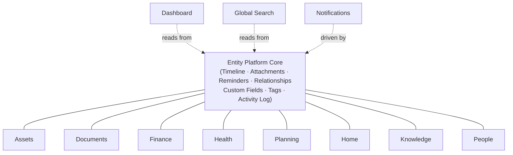
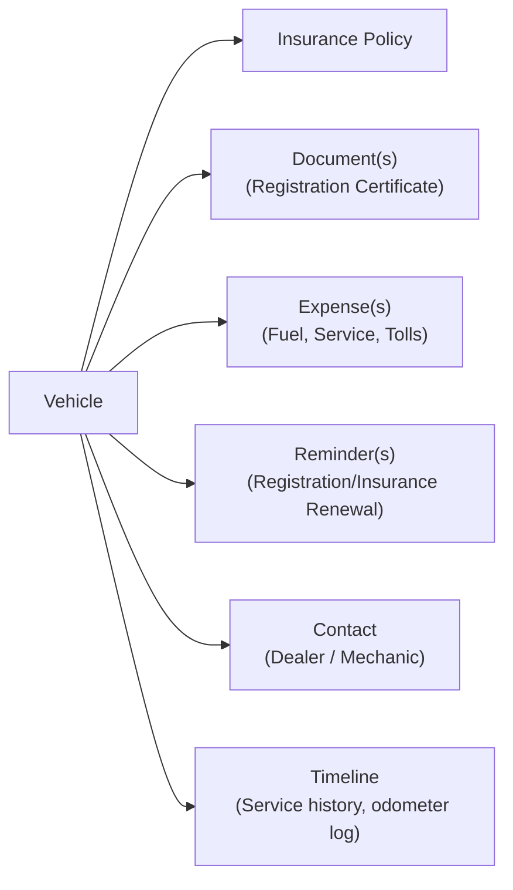

# LifeOS — Feature Catalogue

# Document Information

| Field | Value |
|---|---|
| Document | Feature Catalogue |
| File | `docs/product/03_Feature_Catalogue.md` |
| Version | 1.2 |
| Status | Draft |
| Owner | Product Team |
| Last Updated | 2026-07-02 |
| Depends On | `01_Product_Vision.md`, `02_Product_Requirements_Document.md`, `00_Glossary.md` |
| Used By | `04_User_Research.md`, `06_Information_Architecture.md`, `07_Screen_Inventory.md`, and all subsequent Engineering documents |

---

This document is the single source of truth for **what LifeOS does**: every module, every feature, every entity, and how they connect. It builds directly on [`01_Product_Vision.md`](./01_Product_Vision.md) and [`02_Product_Requirements_Document.md`](./02_Product_Requirements_Document.md) and does not repeat their content. It contains no implementation, architecture, API, database, or technology detail — only product functionality, at a level of detail sufficient for engineering to later derive the data model, API contracts, and UI screens.

A note on how to read this document: LifeOS is **platform-first**. Almost every entity in the system — regardless of module — shares one **Standard Entity Capability Set** (defined once in Section 2 and referenced throughout, rather than repeated per module). Sections 2–6 are written to make that reuse explicit, not to hide it behind repetition.

---

## 1. Module Catalogue

A **module** is a navigable area of the product. Most modules are collections of one or more **entity types** (Section 3) that all share the Standard Entity Capability Set. A few modules are cross-cutting and hold no entities of their own.

| # | Module | Type | Purpose | Primary Entity Types |
|---|---|---|---|---|
| 1 | **Dashboard** | Cross-cutting | The assistant-style home view — surfaces what needs attention today | None (aggregates across all modules) |
| 2 | **Assets** | Domain | Track things of significant value that the user owns | Vehicle*, Property, Device, Valuable, Digital Asset |
| 3 | **Documents** | Domain | Store and track identity and official documents | Document |
| 4 | **Finance** | Domain | Track financial instruments, obligations, and money movement | Bank Account, Loan, Investment, Insurance Policy, Expense, Income, Subscription |
| 5 | **Health** | Domain | Track personal and family health records | Medical Record, Medicine, Vaccination Record, Fitness Record |
| 6 | **Planning** | Domain | Track goals, actionable to-dos, and trips | Goal, Task, Trip, Calendar Event |
| 7 | **Home** | Domain | Track the household itself — what's in it and what it needs | Inventory Item, Maintenance Record, Utility Bill |
| 8 | **Knowledge** | Domain | Freeform personal knowledge not tied to a specific asset or record | Knowledge Note, Bookmark, Checklist |
| 9 | **People** | Domain | Track people relevant to the user's life | Contact |
| 10 | **Global Search** | Cross-cutting | Find anything, anywhere in the system, instantly | None |
| 11 | **Notifications** | Cross-cutting | Deliver reminders and system alerts to the user | Notification (system-generated only) |
| 12 | **Settings** | Cross-cutting | Manage account, security, and system-level preferences | None |

*\*Vehicle is the reference implementation of the Entity Platform — see [`01_Product_Vision.md`](./01_Product_Vision.md).*

Modules 10–12 did not exist as entity-bearing modules in earlier discussion but are formalized here because Global Search and Notifications are approved platform decisions that need a home in the navigation, and Settings is required for any real product (auth, profile, data export). This is an intentional expansion of the example list, not a deviation from approved decisions.

An `Activity & Audit` module was originally included here as Module #12 but has since been folded into **Dashboard** (Global Activity Feed → "Recent Activity" widget) and **Settings** (Security Audit Log) — see `docs/decisions/DEC-011-fold-activity-audit-module.md`. Per-entity Activity History is unaffected; it remains part of the Standard Entity Capability Set (Section 2.1) on every Entity.

---

## 2. Feature Catalogue

### 2.1 The Standard Entity Capability Set

Every entity type in every domain module (Vehicle, Property, Document, Bank Account, Medical Record, Task, Contact, etc.) supports the following capabilities **by default**, unless explicitly marked as not applicable in Section 6. This set is defined once here and referenced — not re-described — for every module below.

| Capability | What it does |
|---|---|
| **Create** | Add a new instance of the entity type |
| **View / Overview** | See the entity's own typed fields and custom fields |
| **Edit** | Modify the entity's fields |
| **Archive / Unarchive** | Reversibly hide an entity from default views without deleting it |
| **Soft Delete / Restore** | Remove an entity from all normal views, recoverable for a grace period |
| **Favorite / Unfavorite** | Pin an entity for quick access |
| **Tag / Untag** | Apply freeform labels for cross-cutting organization |
| **Timeline** | See a chronological feed of everything that happened to this entity |
| **Notes** | Attach freeform annotations to this entity |
| **Attachments** | Attach one or more files (documents, images, PDFs, videos, audio) to this entity |
| **Expenses** | View/log money spent in connection with this entity |
| **Reminders** | Schedule one or more future notifications tied to this entity |
| **Relationships** | Link this entity to any other entity in the system |
| **Custom Fields** | Add entity-type-specific fields beyond the built-in typed fields |
| **Activity History** | See a system-generated audit trail of changes to this entity |

### 2.2 Per-Module Features

Each module below lists **only what's unique to it** — entity-specific actions and fields beyond the Standard Entity Capability Set already covered in 2.1. Applicability exceptions to 2.1 are called out in Section 6.

#### Dashboard
| Feature | Description |
|---|---|
| Today's Agenda | Reminders and due items for today, across every module |
| Expiring Soon | Documents, policies, registrations, subscriptions approaching expiry (configurable window, e.g. 30/60/90 days) |
| Pending Bills | Upcoming or overdue utility bills, subscriptions, loan payments |
| Recent Activity | A rollup of recent Activity Log entries across all entities — this is the Global Activity Feed, surfaced here rather than as a separate module (see `docs/decisions/DEC-011-fold-activity-audit-module.md`) |
| Favorites Shortcut | Quick access to favorited entities |
| Upcoming Trips | Trips starting soon |
| Quick Add | Fast entry point to create any entity type without navigating to its module |

#### Assets
| Feature | Description |
|---|---|
| Add / Edit / Archive / Delete Vehicle, Property, Device, Valuable, Digital Asset | Standard Entity Capability Set applied to each Assets entity type |
| Vehicle: Registration & Insurance Renewal Tracking | Track and remind on registration and insurance expiry specifically |
| Vehicle: Odometer Log | Record odometer readings over time as part of the Timeline |
| Property: Ownership & Occupancy Details | Track ownership type, purchase date, occupancy status |
| Device / Valuable: Warranty Tracking | Track warranty start/end and remind before expiry |
| Digital Asset: Access Notes | Freeform notes on how to access the asset (not credentials — see Product Boundaries) |

#### Documents
| Feature | Description |
|---|---|
| Add / Edit / Archive / Delete Document | Standard Entity Capability Set applied to the Document entity |
| Document Category | Classify a document (Passport, Driving License, National ID, Birth Certificate, Educational Certificate, Professional License, Contract, Warranty, Other) |
| Expiry Tracking | Track and remind on document expiry where applicable |
| Issuing Authority & Document Number | Track who issued the document and its reference number |
| Primary Scan/Copy | Attach the canonical scanned copy via the Attachments capability |

#### Finance
| Feature | Description |
|---|---|
| Add / Edit / Archive / Delete Bank Account, Loan, Investment, Insurance Policy, Expense, Income, Subscription | Standard Entity Capability Set applied to each Finance entity type |
| Loan: Repayment Schedule Tracking | Track installment due dates as Reminders |
| Investment: Valuation Snapshots | Record value over time as part of the Timeline |
| Insurance Policy: Coverage Summary | Track policy type, coverage amount, premium, renewal date |
| Expense: Category & Linked Entity | Classify an expense and link it to the entity it belongs to (e.g., a Vehicle) via Relationships |
| Subscription: Recurrence & Auto-Renewal Flag | Track billing cycle and whether it renews automatically |

#### Health
| Feature | Description |
|---|---|
| Add / Edit / Archive / Delete Medical Record, Medicine, Vaccination Record, Fitness Record | Standard Entity Capability Set applied to each Health entity type |
| Medical Record: Provider & Diagnosis Summary | Track treating doctor, facility, and summary |
| Medicine: Dosage & Schedule | Track dosage, frequency, and course duration as Reminders |
| Vaccination Record: Next Dose Due | Track and remind on next scheduled dose |
| Fitness Record: Metric Logging | Log recurring measurements (e.g., weight) over time via Timeline |

#### Planning
| Feature | Description |
|---|---|
| Add / Edit / Archive / Delete Goal, Task, Trip, Calendar Event | Standard Entity Capability Set applied to each Planning entity type |
| Task: Due Date, Priority, Status | Track actionable to-do state (Open / In Progress / Done) |
| Goal: Target Date & Progress | Track a longer-horizon objective and its progress, optionally broken into linked Tasks via Relationships |
| Trip: Itinerary Summary | Track destination, dates, and key bookings as Notes/Attachments/Timeline entries |
| Calendar Event: Date & Recurrence | Track a scheduled event, one-off or recurring |

#### Home
| Feature | Description |
|---|---|
| Add / Edit / Archive / Delete Inventory Item, Maintenance Record, Utility Bill | Standard Entity Capability Set applied to each Home entity type |
| Inventory Item: Category | Classify an item (Furniture, Appliance, Electronics, Other) — see Section 8 for why this replaces separate "Furniture"/"Appliance" entity types |
| Maintenance Record: Recurrence | Track recurring maintenance schedules (e.g., annual HVAC service) as Reminders |
| Utility Bill: Recurring Reminder | Track recurring due dates for utility payments |

#### Knowledge
| Feature | Description |
|---|---|
| Add / Edit / Archive / Delete Knowledge Note, Bookmark, Checklist | Standard Entity Capability Set applied to each Knowledge entity type |
| Knowledge Note: Rich Text Body | A standalone note as a first-class entity (distinct from the Notes *capability* — see the [Glossary](./00_Glossary.md)) |
| Bookmark: URL & Preview | Save a link with an optional preview/description |
| Checklist: Checklist Items | A list of check-off items within a single Checklist entity |

#### People
| Feature | Description |
|---|---|
| Add / Edit / Archive / Delete Contact | Standard Entity Capability Set applied to the Contact entity |
| Role Tagging | Classify a contact (Self, Family Member, Emergency Contact, Doctor, Lawyer, Other), multiple roles allowed |
| Key Dates | Track birthdays/anniversaries as recurring Reminders |
| Emergency Contact Flag | Mark a contact as reachable in an emergency (foundation for future emergency-access sharing) |

#### Global Search
| Feature | Description |
|---|---|
| Universal Query | Search across every entity type, every module, by name and key fields in one query |
| Filter by Module / Entity Type | Narrow results after searching |
| Filter by Date Range | Narrow results to a time window |
| Recent Searches | Quickly repeat a recent query |

#### Notifications
| Feature | Description |
|---|---|
| In-App Notification Center | A feed of all reminders and system alerts |
| Email Notification | Reminders and alerts also delivered via email |
| Notification Preferences | Per-category control over what triggers a notification and through which channel |
| Mark Read / Unread | Standard inbox-style triage |

#### Settings
| Feature | Description |
|---|---|
| Profile Management | Name, email, password |
| Security | Change password, view active sessions, view Security Audit Log (login events, data exports, sensitive-field access — see `docs/decisions/DEC-011-fold-activity-audit-module.md`) |
| Notification Preferences | Same as under Notifications; surfaced here for discoverability |
| Custom Field Management | Define custom fields available per entity type |
| Data Export | Export all data and files in a portable form |
| Tag Management | View/rename/merge/delete tags across the system |

---

## 3. Entity Catalogue

### 3.1 Domain Entities

| Entity | Module | Description | Illustrative Key Attributes |
|---|---|---|---|
| **Vehicle** ⭐ | Assets | A car, bike, or other owned vehicle — the platform's reference implementation | Make, Model, Year, Registration Number, VIN, Fuel Type, Odometer |
| **Property** | Assets | An owned or rented property | Address, Ownership Type, Purchase/Lease Date, Area |
| **Device** | Assets | A high-value personal electronic device | Type, Brand, Model, Serial Number, Purchase Date |
| **Valuable** | Assets | Jewelry, collectibles, or other high-value items | Description, Estimated Value, Purchase Date |
| **Digital Asset** | Assets | A domain, digital subscription-linked asset, or other non-physical asset | Type, Provider, Access Notes |
| **Document** | Documents | Any official or identity document | Document Category, Document Number, Issuing Authority, Issue Date, Expiry Date |
| **Bank Account** | Finance | A bank or financial account | Bank Name, Account Type, Account Number (masked) |
| **Loan** | Finance | Money owed, with a repayment plan | Lender, Principal, Interest Rate, Term, Next Due Date |
| **Investment** | Finance | An investment holding | Type, Institution, Current Value, Purchase Value |
| **Insurance Policy** | Finance | An insurance policy of any kind | Policy Number, Insurer, Coverage Type, Premium, Renewal Date |
| **Expense** | Finance | A logged expenditure | Amount, Date, Category, Linked Entity |
| **Income** | Finance | A logged income entry | Amount, Date, Source |
| **Subscription** | Finance | A recurring paid service | Provider, Amount, Billing Cycle, Renewal Date, Auto-Renew Flag |
| **Medical Record** | Health | A health event or diagnosis record | Date, Provider, Facility, Summary |
| **Medicine** | Health | A prescribed medication | Name, Dosage, Frequency, Start/End Date |
| **Vaccination Record** | Health | A vaccination event | Vaccine Name, Dose Number, Date, Next Due Date |
| **Fitness Record** | Health | A recurring personal health metric | Metric Type, Value, Date |
| **Goal** | Planning | A longer-horizon personal objective | Title, Target Date, Progress |
| **Task** | Planning | A single actionable to-do | Title, Due Date, Priority, Status |
| **Trip** | Planning | A planned or past trip | Destination, Start Date, End Date |
| **Calendar Event** | Planning | A scheduled, dated event | Title, Date/Time, Recurrence |
| **Inventory Item** | Home | A household item tracked for insurance/record purposes | Category (Furniture / Appliance / Electronics / Other), Description, Value |
| **Maintenance Record** | Home | A record of upkeep performed on the home | Description, Date Performed, Next Due Date |
| **Utility Bill** | Home | A recurring household utility bill | Utility Type, Provider, Amount, Due Date |
| **Knowledge Note** | Knowledge | A standalone freeform note | Title, Body |
| **Bookmark** | Knowledge | A saved link | Title, URL, Description |
| **Checklist** | Knowledge | A list of check-off items | Title, Items |
| **Contact** | People | A person relevant to the user's life | Name, Role(s), Phone, Email, Key Dates |

*⭐ = Reference implementation entity.*

### 3.2 System (Platform) Entities

These are not user-facing "modules" in their own right — they exist to power the Standard Entity Capability Set and are created automatically or as a side effect of using it.

| Entity | Description |
|---|---|
| **Attachment** | A file linked to an entity |
| **Reminder** | A scheduled future notification linked to an entity |
| **Relationship** | A typed link between two entities |
| **Custom Field Definition** | A user-defined field available on a given entity type |
| **Custom Field Value** | The value of a custom field on a specific entity instance |
| **Tag** | A freeform label applicable to any entity |
| **Timeline Event** | A chronological entry on an entity's Timeline |
| **Activity Log Entry** | A system-generated record of a change to an entity |
| **Audit Log Entry** | A system-generated security-relevant event (login, export, sensitive access) |
| **Notification** | A system-generated message delivered to the user through one or more channels |

---

## 4. Entity Relationships

Relationships in LifeOS are **typed links between any two entities**, not fixed foreign keys hardcoded per domain — this is what lets Vehicle, Property, and every future entity type interconnect through the same mechanism.

### 4.1 Vehicle (reference implementation)

| From | Relationship | To | Why it matters |
|---|---|---|---|
| Vehicle | is insured by | Insurance Policy | Renewal, coverage, claims context in one place |
| Vehicle | has document | Document (Registration Certificate) | Legal proof of ownership/registration accessible from the vehicle |
| Vehicle | incurs | Expense | Total cost of ownership over time |
| Vehicle | serviced by | Contact (Mechanic/Dealer) | Know who to call, and their history with this vehicle |
| Vehicle | reminds via | Reminder | Renewal/service due dates surfaced on the Dashboard |

### 4.2 Property
| From | Relationship | To |
|---|---|---|
| Property | is insured by | Insurance Policy |
| Property | has document | Document (Deed, Lease Agreement) |
| Property | contains | Inventory Item |
| Property | maintained via | Maintenance Record |
| Property | billed via | Utility Bill |

### 4.3 Finance hub (Insurance Policy / Loan / Bank Account)
| From | Relationship | To |
|---|---|---|
| Insurance Policy | covers | Vehicle / Property / Contact (Health) |
| Loan | secured against | Vehicle / Property |
| Bank Account | funds | Expense / Income |

### 4.4 Document
| From | Relationship | To |
|---|---|---|
| Document | belongs to | Contact (e.g., Passport belongs to a specific family member) |
| Document | proves ownership of | Vehicle / Property / Device |

### 4.5 Medical Record
| From | Relationship | To |
|---|---|---|
| Medical Record | belongs to | Contact |
| Medical Record | treated by | Contact (Doctor) |
| Medical Record | incurs | Expense |

### 4.6 Contact
| From | Relationship | To |
|---|---|---|
| Contact | related to | Contact (family relationships) |
| Contact | associated with | Vehicle / Property / Medical Record / Document |

### 4.7 Trip / Goal
| From | Relationship | To |
|---|---|---|
| Trip | incurs | Expense |
| Trip | has document | Document (visa, tickets, bookings) |
| Goal | tracked via | Task |

---

## 5. Functional Requirements

This section defines expected system behavior — what must happen, not how it's built.

| Area | Expected Behavior |
|---|---|
| **Entity Creation** | A user can create an instance of any entity type from within its module or from the Dashboard's Quick Add. Only a minimal set of fields is required to save; everything else can be filled in later. |
| **Entity Editing** | Any field, including custom fields, can be edited after creation. Every edit is captured in the entity's Activity History. |
| **Archive** | Archiving an entity removes it from default list views but keeps all of its data, attachments, relationships, and history intact and reversible. Archived entities are excluded from Dashboard surfacing and Global Search by default, but remain findable via an explicit "include archived" filter. |
| **Soft Delete** | Deleting an entity removes it from all views immediately but retains the underlying data for a defined grace period, during which it can be restored. After the grace period, it is permanently purged. Deleting an entity does not delete other entities it was related to — only the relationship link is removed. |
| **Favorites** | Any entity can be favorited for quick access from the Dashboard, independent of its module or archive/active state (while active). |
| **Tags** | Any entity can carry any number of freeform tags. Tags are managed globally in Settings and are shared across all modules. |
| **Timeline** | Every entity has an automatically maintained, chronological Timeline combining system-generated events (created, edited, reminder fired) and user-logged events (e.g., a service performed). |
| **Notes (capability)** | A user can attach one or more freeform text notes to any entity, timestamped and independently editable/deletable. This is distinct from the standalone **Note** entity in the Knowledge module (see Section 8). |
| **Attachments** | A user can attach one or more files of common types (images, PDFs, documents, videos, audio) to any entity. Attachments must be previewable where feasible (images, PDFs) and downloadable in their original form. |
| **Reminders** | A user can schedule one or more future-dated reminders on any entity, optionally recurring. A reminder fires a Notification through the user's configured channels at the scheduled time and appears on the Dashboard as it approaches. A fired reminder can be marked done, snoozed, or dismissed. |
| **Relationships** | A user can link any entity to any other entity, choosing a relationship type where applicable (e.g., "insured by," "belongs to"). Relationships are visible from both linked entities. Removing a relationship never deletes either entity. |
| **Custom Fields** | For any entity type, a user can define additional fields (text, number, date, boolean, single-select) beyond the type's built-in fields. Custom field values are entered like any other field and are included in Global Search. |
| **Activity History** | Every create, edit, archive, restore, delete, and relationship change on an entity is automatically logged and viewable on that entity, without user action. Activity History entries cannot be edited or deleted by the user. |
| **Audit Log** | Security-relevant events (login, logout, failed login, data export, access to sensitive fields) are automatically logged and viewable in Settings > Security. Audit Log entries are immutable and never deleted by the user. |
| **Global Search** | A single search query returns matching results across all modules and entity types, ranked by relevance, matching entity names, key typed fields, custom fields, tags, and document/attachment filenames. Results can be filtered by module, entity type, or date range after the fact. |
| **Dashboard** | On login/home, the user sees: items due or overdue today, items expiring within a configurable window (default 30 days), favorited entities, recent activity, and upcoming trips — never charts or analytics. |
| **Notifications** | Reminders and system alerts are delivered in-app always, and via email if enabled. A user can control, per category, whether a notification fires and through which enabled channel. |
| **Data Export** | A user can export the entirety of their data — all entities, custom fields, relationships, and original attachment files — in a portable, human-usable form at any time. |

---

## 6. Cross-Module Features

This table makes explicit which entity categories support which platform capabilities, and flags the exceptions.

| Capability | Assets | Documents | Finance | Health | Planning | Home | Knowledge | People |
|---|:---:|:---:|:---:|:---:|:---:|:---:|:---:|:---:|
| Global Search | ✅ | ✅ | ✅ | ✅ | ✅ | ✅ | ✅ | ✅ |
| Timeline | ✅ | ✅ | ✅ | ✅ | ✅ | ✅ | ✅ | ✅ |
| Attachments | ✅ | ✅ | ✅ | ✅ | ✅ | ✅ | ✅ | ✅ |
| Notes (capability) | ✅ | ✅ | ✅ | ✅ | ✅ | ✅ | ➖¹ | ✅ |
| Relationships | ✅ | ✅ | ✅ | ✅ | ✅ | ✅ | ✅ | ✅ |
| Reminders | ✅ | ✅ | ✅ | ✅ | ✅ | ✅ | ⚠️² | ✅ |
| Expenses | ✅ | ⚠️³ | ➖⁴ | ✅ | ⚠️⁵ | ✅ | ❌ | ⚠️⁶ |
| Custom Fields | ✅ | ✅ | ✅ | ✅ | ✅ | ✅ | ✅ | ✅ |
| Tags | ✅ | ✅ | ✅ | ✅ | ✅ | ✅ | ✅ | ✅ |
| Favorites | ✅ | ✅ | ✅ | ✅ | ✅ | ✅ | ✅ | ✅ |
| Archive | ✅ | ✅ | ✅ | ✅ | ✅ | ✅ | ✅ | ✅ |
| Soft Delete | ✅ | ✅ | ✅ | ✅ | ✅ | ✅ | ✅ | ✅ |
| Activity History | ✅ | ✅ | ✅ | ✅ | ✅ | ✅ | ✅ | ✅ |

✅ Fully supported · ⚠️ Supported but not commonly used · ➖ Not applicable (see note) · ❌ Not offered

1. The standalone **Knowledge Note** entity already *is* freeform text; a Notes-capability-on-a-Knowledge-Note would be redundant, so it's omitted for that entity only. Other Knowledge entities (Bookmark, Checklist) still support Notes.
2. Reminders on Knowledge entities are supported but expected to be lightly used (e.g., "review this note in a week").
3. A Document itself rarely incurs an expense, though a renewal fee could be logged — supported, not emphasized in the UI.
4. Expenses is the *source* capability for Finance entities like Bank Account/Loan, not something attached to itself; N/A to the Expense entity by definition.
5. Trip supports Expenses meaningfully (travel costs); Goal and Task generally do not, though the capability is not blocked.
6. A Contact can have Expenses logged against them (e.g., a dependent's costs), but this is a secondary use case.

---

## 7. MVP Scope

### Must Have (MVP)
The minimum needed for a genuinely usable, self-hosted V1 — and enough supporting entities for Vehicle to be a *meaningful* reference implementation (a Vehicle with nothing to relate to proves nothing).

| Area | Included |
|---|---|
| Platform | Auth (email/password), single user, Entity Platform core (Create/Edit/Archive/Soft Delete/Restore, Timeline, Attachments, Notes, Reminders, Relationships, Custom Fields, Tags, Favorites, Activity History) |
| Entities | **Vehicle** (full reference implementation), **Insurance Policy**, **Expense**, **Document**, **Contact** (minimal — needed for Vehicle's Dealer/Mechanic relationship) |
| Cross-cutting | Global Search (basic), Dashboard (Today's Agenda, Expiring Soon, Recent Activity), Notifications (in-app + email), Settings (profile, password, data export) |

### Should Have
Fast-follow after MVP — proves platform reuse quickly, per the PRD's success metric on reuse efficiency.

- **Property** (second Assets entity, validates reuse beyond Vehicle)
- Documents module expansion (multiple Document Categories fully exercised)
- **Bank Account**, **Loan** (broader Finance)
- Full Global Search filtering (by module, entity type, date range)

### Nice to Have
- Health module (Medical Record, Medicine, Vaccination Record, Fitness Record)
- Home module (Inventory Item, Maintenance Record, Utility Bill)
- Knowledge module (Note, Bookmark, Checklist)
- Planning module (Goal, Task, Trip, Calendar Event)
- People module expansion (multi-role Contacts, Key Dates reminders)
- Additional notification channels (push, WhatsApp, SMS)

### Future Versions
- Household / family sharing
- Emergency / legacy access sharing
- AI-assisted capabilities (document extraction, smart reminders, natural-language search)
- Flutter mobile application
- Hosted multi-tenant offering
- User-defined custom entity types *(explicitly out of scope per Product Boundaries — not just deferred)*

---

## 8. Assumptions & Open Questions

### Assumptions Made (and why)

| Assumption | Reasoning |
|---|---|
| **People consolidated into one `Contact` entity** with a multi-select Role field, instead of separate Self/Family/Emergency Contact/Doctor/Lawyer entity types | These differ only by role, not by structure — modeling them as five entity types would fragment the People module without adding real capability that a role field doesn't already provide |
| **Documents consolidated into one `Document` entity** with a Document Category field, instead of separate Passport/License/Certificate/Contract entity types | Same reasoning as above — these differ in category and a couple of fields (expiry, issuing authority), not in structure. Custom Fields exist specifically to handle category-specific variation without new entity types |
| **`Furniture` and `Appliance` folded into `Inventory Item`** (Home) with a Category field, and kept separate from `Device` (Assets) | Avoids three near-duplicate entity types (Assets>Furniture, Assets>Device, Home>Appliance) describing the same underlying concept — physical items in a home — differentiated only by portability/value, which a category field and module placement already capture |
| **"Notes" (capability) is distinct from "Knowledge Note" (entity)** — Notes is a lightweight annotation attached to *any* entity (e.g., "Dealer notes" on a Vehicle); Knowledge Note is a standalone, first-class Knowledge-module entity with its own Timeline/Attachments/Reminders | Both concepts were approved in earlier discussion; without this rename they would collide in the data model. Resolved and canonicalized in [`00_Glossary.md`](./00_Glossary.md) |
| **"Reminder" is distinct from "Task"** — Reminder is a lightweight, date-triggered notification attached to any entity; Task is a fuller to-do entity in Planning with status and priority, which can itself carry Reminders | Prevents Reminder from silently becoming a second, weaker to-do system |
| **MVP requires supporting entities alongside Vehicle** (Insurance Policy, Expense, Document, Contact) | Vehicle's Relationships and Expenses tabs are meaningless in a demo/first-use if nothing exists to relate them to; a "Vehicle-only" MVP would not actually prove the platform |

### Documentation Gaps & Inconsistencies Identified

- **`04_User_Personas.md` (planned in the repo structure) is now redundant** — Section 8 of `02_Product_Requirements_Document.md` already delivers five detailed personas, per that document's own required section list. Recommend either dropping `04_User_Personas.md` from the plan, or repurposing it as deeper persona-specific journey scenarios and folding it into `05_User_Journeys.md` (renumbering follow-on documents accordingly). **This needs a Product Owner decision before Document 04 is generated.**
- **`08_MVP_Definition.md` (planned) substantially overlaps with Section 7 of this document.** Recommend repurposing `08_MVP_Definition.md` as a phased **Release Plan** (timeline/sequencing across the Should Have / Nice to Have tiers already defined here) rather than re-deriving MVP scope from scratch.
- **No glossary exists yet**, and this document had to resolve two real naming collisions (Notes vs. Note, Reminder vs. Task) that a future contributor could easily reintroduce. Recommend a short `docs/product/00_Glossary.md` capturing these resolved terms as the canonical reference.
- **`docs/decisions/` is currently empty.** The Documents/People/Home entity-consolidation calls made in this document are exactly the kind of decision that should be logged as a lightweight decision record so a future contributor doesn't "fix" the taxonomy back toward the original longer entity list without knowing why it was consolidated.

### Suggested Product Improvements

- Consider a global, browsable **"All Files"** view (distinct from the Documents module, which is for first-class identity/official documents) — a place to see every raw attachment across the system, similar to a file browser. Not required for MVP.
- Consider allowing a fired Reminder to be **promoted into a Task** with one action, bridging the lightweight Reminder system and the fuller Planning module without merging them.

### Open Questions for the Product Owner

1. Confirm the `04_User_Personas.md` / `08_MVP_Definition.md` redundancy resolution above before those documents are generated.
2. What is the exact Soft Delete retention window before permanent purge (e.g., 30 days)?
3. Should a `Contact` support multiple simultaneous roles in MVP (e.g., Family Member *and* Emergency Contact), or a single role at launch?
4. Is `Goal` truly distinct from `Task`, or should `Goal` simply be a `Task` with no fixed due date and child tasks linked via Relationships? This affects whether Planning needs two entity types or one.
5. Does `Trip` need structured itinerary sub-items (day-by-day, bookings) even at a product level, or is Timeline + Attachments + Notes sufficient for how users actually plan trips?
6. What is the definitive, closed list of Relationship *types* the system must support at launch (e.g., "insured by," "belongs to," "serviced by"), versus allowing freeform relationship labeling?

---

## Document Status

**Version:** 1.1
**Status:** Draft
**Dependencies:**
- `docs/product/01_Product_Vision.md`
- `docs/product/02_Product_Requirements_Document.md`
- `docs/product/00_Glossary.md`

**Generated On:** 2026-07-02
**Revision Note:** v1.1 renamed the `Note` entity to `Knowledge Note` throughout, per the naming resolution canonicalized in `00_Glossary.md`. v1.2 folds the `Activity & Audit` module into Dashboard and Settings per `docs/decisions/DEC-011-fold-activity-audit-module.md`, reducing the Module Catalogue from 13 to 12 top-level modules.

---

## Next Documents

The Product Owner has resolved the numbering questions raised above, and the sequence has since been revised three times more: first to move Information Architecture earlier, then to move User Journeys ahead of User Research, then to move Screen Inventory ahead of User Research as well. The current, confirmed sequence is:

`00_Glossary.md` → `01_Product_Vision.md` → `02_Product_Requirements_Document.md` → `03_Feature_Catalogue.md` (this document) → `04_Information_Architecture.md` → `05_User_Journeys.md` → `06_Screen_Inventory.md` → `07_User_Research.md` (real-world scenarios, pain points, daily routines, edge cases, behavioral analysis — not a repeat of the personas already in `02_Product_Requirements_Document.md`) → `08_Release_Plan.md` (phased delivery: MVP → Phase 2 → Phase 3 → Future Vision) → `09_Product_Roadmap.md`.

The next document to generate is `docs/product/07_User_Research.md`; `docs/product/04_Information_Architecture.md`, `docs/product/05_User_Journeys.md`, and `docs/product/06_Screen_Inventory.md` are already complete.
