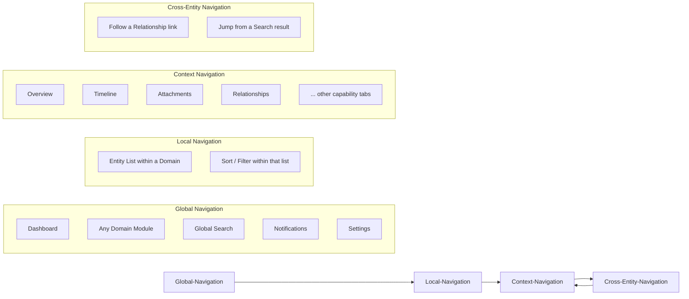
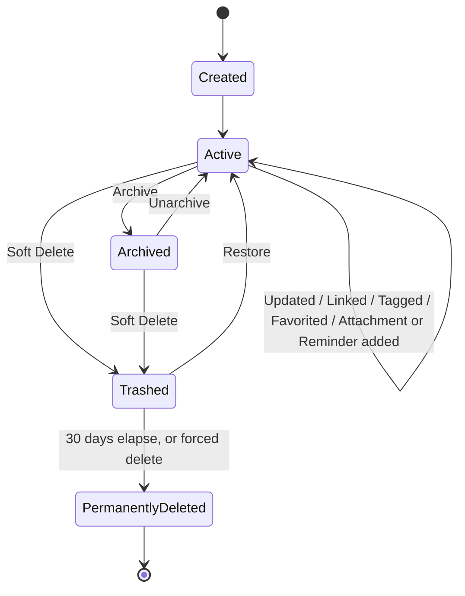
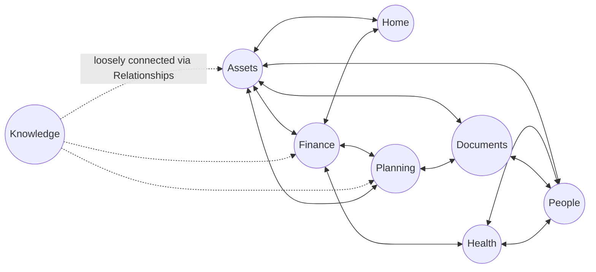

# LifeOS — Information Architecture

# Document Information

| Field | Value |
|---|---|
| Document | Information Architecture |
| File | `docs/product/04_Information_Architecture.md` |
| Version | 1.2 |
| Status | Draft |
| Owner | Product Team |
| Last Updated | 2026-07-02 |
| Depends On | `01_Product_Vision.md`, `02_Product_Requirements_Document.md`, `03_Feature_Catalogue.md`, `00_Glossary.md`, `docs/decisions/DEC-011-fold-activity-audit-module.md` |
| Used By | `07_Screen_Inventory.md`, all future Design and Engineering documents |

---

## Purpose

This document defines the **conceptual structure** of LifeOS: how information is organized, how it's owned, how it's discovered, and how a user moves through it. It is not a UI design or screen design document — no layouts, components, or visual hierarchy are defined here, only the underlying structure that any future UI must express. It builds directly on the Module Catalogue, Entity Catalogue, and Entity Relationships already defined in [`03_Feature_Catalogue.md`](./03_Feature_Catalogue.md) and does not redefine them — it organizes them into a navigable structure and states the rules that keep that structure coherent as LifeOS grows.

---

## 1. Product Hierarchy

```mermaid
graph TD
    LifeOS[LifeOS]
    LifeOS --> Dashboard
    LifeOS --> Assets
    LifeOS --> Documents
    LifeOS --> Finance
    LifeOS --> Health
    LifeOS --> Planning
    LifeOS --> Home
    LifeOS --> Knowledge
    LifeOS --> People
    LifeOS --> Search[Global Search]
    LifeOS --> Notifications
    LifeOS --> Settings

    Assets --> Vehicle
    Assets --> Property
    Assets --> Device
    Assets --> Valuable
    Assets --> DigitalAsset[Digital Asset]

    Documents --> Document

    Finance --> BankAccount[Bank Account]
    Finance --> Loan
    Finance --> Investment
    Finance --> InsurancePolicy[Insurance Policy]
    Finance --> Expense
    Finance --> Income
    Finance --> Subscription

    Health --> MedicalRecord[Medical Record]
    Health --> Medicine
    Health --> VaccinationRecord[Vaccination Record]
    Health --> FitnessRecord[Fitness Record]

    Planning --> Goal
    Planning --> Task
    Planning --> Trip
    Planning --> CalendarEvent[Calendar Event]

    Home --> InventoryItem[Inventory Item]
    Home --> MaintenanceRecord[Maintenance Record]
    Home --> UtilityBill[Utility Bill]

    Knowledge --> KnowledgeNote[Knowledge Note]
    Knowledge --> Bookmark
    Knowledge --> Checklist

    People --> Contact

    Settings --> Profile
    Settings --> Security
    Settings --> NotificationPrefs[Notification Preferences]
    Settings --> CustomFieldMgmt[Custom Field Management]
    Settings --> DataExport[Data Export]
    Settings --> TagMgmt[Tag Management]
```

The hierarchy is intentionally **two levels deep at most** below LifeOS itself: Module → Entity Type. No Entity Type is nested inside another Entity Type — connections between entities that would otherwise tempt a deeper hierarchy (e.g., a Vehicle's Insurance Policy) are handled by **Relationships**, not by nesting (see Section 6, and Principle 4 in Section 10).

`Dashboard`, `Global Search`, `Notifications`, and `Settings` are cross-cutting Modules — they organize functionality, not domain entities, and hold no Entity Types of their own (`Settings` holds configuration areas, which are not Entities). An `Activity & Audit` module was considered but folded into Dashboard and Settings instead — see `docs/decisions/DEC-011-fold-activity-audit-module.md` and the Quality Review note below.

---

## 2. Domain Map

| Domain | Owned Entity Types |
|---|---|
| **Assets** | Vehicle ⭐, Property, Device, Valuable, Digital Asset |
| **Documents** | Document |
| **Finance** | Bank Account, Loan, Investment, Insurance Policy, Expense, Income, Subscription |
| **Health** | Medical Record, Medicine, Vaccination Record, Fitness Record |
| **Planning** | Goal, Task, Trip, Calendar Event |
| **Home** | Inventory Item, Maintenance Record, Utility Bill |
| **Knowledge** | Knowledge Note, Bookmark, Checklist |
| **People** | Contact |

*⭐ Vehicle is the platform's Reference Implementation — see `docs/decisions/DEC-001-vehicle-reference-implementation.md`.*

**Ownership rule:** every Entity Type belongs to exactly **one** Domain. An Entity Type is never dual-homed across two Domains — where an entity is conceptually relevant to more than one domain (e.g., an Expense is Finance's, but clearly relevant to Assets when it's about a Vehicle), that relevance is expressed through a **Relationship** (Section 6), not by the entity belonging to two Domains at once. This keeps "where does this live" unambiguous.

---

## 3. Navigation Model

LifeOS has four distinct, conceptual layers of navigation. A user is always in exactly one Domain/Entity context, but can reach any other context through one of these four mechanisms.

| Layer | Definition | Purpose | Example |
|---|---|---|---|
| **Global Navigation** | The fixed set of entry points always reachable regardless of where the user currently is | Gets the user from "anywhere" to any Module, Search, Notifications, or Settings | Jumping from a Vehicle's Timeline directly to the Finance module via the global nav |
| **Local Navigation** | Movement within a single Domain Module, between the entity types and lists it owns | Lets a user browse and filter what a Domain contains | Switching from the Bank Account list to the Loan list, both within Finance |
| **Context Navigation** | Movement between the capability tabs of a single Entity Instance (Overview, Timeline, Attachments, Notes, Expenses, Reminders, Relationships, Activity History) plus the `⋮` overflow menu (Archive, Delete) | Lets a user explore everything about *one* entity without leaving it | Moving from a Vehicle's Overview to its Timeline |
| **Cross-Entity Navigation** | Jumping from one Entity Instance to a *different* Entity Instance it's connected to, via a Relationship link or a Search result | The mechanism that makes the product feel interconnected rather than siloed — directly serves the "what's related to this" guiding question from the Product Vision | From a Vehicle's Relationships tab, clicking through to its linked Insurance Policy, landing on that Insurance Policy's own Overview |

Cross-Entity Navigation is the most important layer architecturally: it's what turns a set of independent Domain Modules into a single connected system, and it's the layer most directly at risk if a future feature is built as an isolated module rather than on the shared platform (see Principle 4, Section 10).

---

## 4. Universal Platform Capabilities

The full definition of each capability and the applicability matrix (which entity types support which capability, and the handful of exceptions) already exists in [`03_Feature_Catalogue.md`](./03_Feature_Catalogue.md), Sections 2.1 and 6 — this section does not repeat that matrix, only organizes the capabilities architecturally.

| Capability | Nature | Why it's universal |
|---|---|---|
| **Attachments** | Per-entity, user-invoked | Every entity may need supporting files (a photo, a scan, a receipt) — this is true regardless of domain |
| **Timeline** | Per-entity, system + user generated | Every entity has a history worth seeing chronologically; this is the mechanism that answers "when did this happen" |
| **Notes** | Per-entity, user-invoked | Freeform context doesn't fit a structured field on any entity type; every entity benefits from a place to jot something |
| **Relationships** | Per-entity, user-invoked, bidirectional | The mechanism that connects entities across Domains — this is what makes LifeOS entity-driven rather than module-driven |
| **Activity (Activity History)** | Per-entity, system-generated only | Every entity needs an automatic, tamper-proof record of what changed on it |
| **Reminders** | Per-entity, user-invoked, time-triggered | Any entity can have a future date that matters (a renewal, a check-up, a due date) |
| **Custom Fields** | Per-entity-type, user-defined | Every entity type has room for user-specific variation the built-in schema didn't anticipate |
| **Expenses** | Per-entity, user-invoked (linked) | Most entities can accumulate cost over time; this builds each entity's total cost of ownership |
| **Tags** | Per-entity, user-invoked, global vocabulary | Cross-cutting organization that doesn't belong to any one Domain |
| **Favorites** | Per-entity, user-invoked | Quick access is a need that isn't domain-specific |
| **Archive / Soft Delete** | Per-entity, lifecycle state | Every entity needs the same safe, reversible path out of active use (see Section 5) |

Two capabilities named informally as "universal" are architecturally different in kind from the list above, and are treated separately:

- **Search** is not a tab that lives *on* an entity the way Attachments or Timeline do — it is a discovery layer *over* all entities. Every entity is searchable, but "being searchable" is a property of the platform's indexing, not a capability a user opens within a specific entity. See Section 8.
- **Notifications** are not invoked from within an entity either — they are a *consequence* of a Reminder firing or a system event occurring, delivered through a separate, global channel (Notification Center, email). See Section 9.

---

## 5. Entity Lifecycle

The illustrative lifecycle in the brief (`Created → Updated → Linked → Archived → Deleted`) implies a strict, one-directional sequence. In practice, only **Created**, **Trashed**, and **Permanently Deleted** are true one-way stages — everything else (Updated, Linked, Tagged, Archived) is a reversible state or an ongoing action that can happen repeatedly, in any order, while an entity is otherwise active. The corrected model:

| Stage | Description |
|---|---|
| **Created** | An Entity Instance is instantiated with its minimum required fields. It immediately becomes fully capable — Attachments, Timeline, Relationships, etc. are available from the first moment, not unlocked later. |
| **Active** | The normal, everyday state. Updated (fields edited), Linked (Relationships formed), Tagged, Favorited, and given Attachments/Reminders/Expenses/Notes — all of these are actions *within* Active, not separate stages, and can happen any number of times in any order. |
| **Archived** | A reversible, non-destructive exit from default visibility. All data is retained. Can return to Active at any time via Unarchive. |
| **Trashed (Soft Deleted)** | Reachable from Active or Archived. Removed from all normal views immediately; recoverable via Restore for 30 days (`docs/decisions/DEC-007-soft-delete-retention.md`). |
| **Permanently Deleted** | Terminal. Reached automatically 30 days after Trashed, or by an explicit "delete forever" action. Irreversible. |

---

## 6. Cross-Domain Relationships

| Domain Pair | Representative Relationship | Why it matters |
|---|---|---|
| Assets ↔ Finance | Vehicle **insured by** Insurance Policy; Vehicle **incurs** Expense; Loan **secured against** Property | Total cost of ownership and coverage live next to the asset itself |
| Assets ↔ Documents | Vehicle **has document** Registration Certificate; Property **has document** Deed | Legal proof of ownership is one click from the asset |
| Assets ↔ People | Vehicle **maintained by** Contact (Dealer/Mechanic) | Know who to call, and their history with this specific asset |
| Assets ↔ Home | Property **contains** Inventory Item | A property's contents are discoverable from the property itself |
| Finance ↔ Health | Insurance Policy **covers** Medical Record context; Medical Record **incurs** Expense | Health costs and coverage are traceable without leaving the record |
| Finance ↔ Planning | Trip **incurs** Expense | Total trip cost is visible from the Trip itself |
| Finance ↔ Home | Utility Bill / Maintenance Record **incurs** Expense | Household running costs roll up automatically |
| Documents ↔ People | Document **belongs to** Contact | A family member's documents are discoverable from their Contact record |
| Planning ↔ Documents | Trip **has document** (visa, tickets, bookings) | Trip logistics are self-contained |
| People ↔ Health | Medical Record **belongs to** / **treated by** Contact | Whose record it is, and who treated them, both visible |
| Knowledge ↔ any Domain | Knowledge Note **related to** any Entity | Freeform context can still be tied back to something structured, without forcing every note into a rigid schema |

This is a summary at the Domain level; the full entity-to-entity relationship list already exists in [`03_Feature_Catalogue.md`](./03_Feature_Catalogue.md), Section 4, and is not repeated here.

---

## 7. Information Ownership

| Level | What lives here | Examples | Notes |
|---|---|---|---|
| **Global Application** | Data that applies to the whole system, not any one Domain or Entity | User profile, Settings, Notification preferences, Tag vocabulary, Custom Field *definitions*, Global Search index, Audit Log | Global-level information is managed centrally (Settings), even though it's *used* everywhere |
| **Domain** | Structural definitions specific to a Domain, shared by every Entity Type within it | Document Category options, Inventory Item Category options, which Entity Types the Domain owns | A Domain owns *definitions*, not user data itself |
| **Entity** | The actual data of one specific Entity Instance | A Vehicle's Make/Model/VIN, a Contact's phone number, a Document's expiry date | This is where the overwhelming majority of a user's real data lives |
| **Capability** | Data generated *by* a Capability, but always scoped to and owned by a specific Entity Instance | A Timeline entry, an Attachment file, a Reminder, a Relationship link | Capability-level data never exists independently of an owning Entity — there is no "orphaned" Timeline entry or "global" Attachment |

**Rule:** everything that is not explicitly Global or Domain-level structural data belongs to exactly one Entity Instance. This is what makes Data Export (Settings) complete by construction — exporting a user's Entities and their Capability-level data together is exporting the whole system, because nothing meaningful lives outside that structure.

---

## 8. Search Architecture (Conceptual)

Global Search exists to answer the Product Vision's first guiding question: *"where did I keep that?"* Conceptually, a query should be able to discover:

| Searchable | Included | Notes |
|---|---|---|
| Entity names | Yes | "Honda City" finds the Vehicle |
| Typed field values | Yes | A VIN, a policy number, a document number |
| Custom Field values | Yes | "Dealer Notes" content on a Vehicle |
| Tags | Yes | Any entity tagged `2026-taxes` |
| Attachment / Document filenames | Yes | `passport_scan.pdf` |
| Notes (capability) content | Yes | Freeform annotations attached to an entity |
| Contact names and roles | Yes | "my lawyer," if a Contact is tagged with that Role |
| Timeline / Activity entries | **No** (by design) | Search surfaces *things a user named or labeled*, not the full historical log of changes — the Timeline is discovered by opening the entity Search already found, not searched independently. Revisit only if user testing shows a real need. |

Every search result is, conceptually, an **Entity** — even a result that matched because of an Attachment filename resolves to that Attachment's owning Entity, landing the user on that Entity's Overview (or directly on its Attachments tab). This keeps Search consistent with the rest of the IA: nothing is surfaced that doesn't belong to an Entity (Section 7).

Results are expected to be filterable after the fact by Domain, Entity Type, and date range (already specified functionally in `03_Feature_Catalogue.md`, Section 5) — this document adds no new filtering behavior, only confirms it fits the ownership model above.

---

## 9. Dashboard Information Sources

The Dashboard introduces no data of its own — every widget is a read-only aggregation of information that already exists on Entities elsewhere in the system (Principle 5, Section 10). This is what keeps the Dashboard truthful and cheap to reason about: nothing can be "on the Dashboard but wrong on the entity," because the Dashboard has no independent source of truth.

| Dashboard Widget | Domains It Pulls From | Underlying Source |
|---|---|---|
| Today's Agenda | All Domains | Reminders due today, across every Entity Type |
| Expiring Soon | Assets, Documents, Finance | Any entity with an expiry/renewal-type field (Insurance Policy renewal, Document expiry, Subscription renewal) approaching its configured window |
| Pending Bills | Finance, Home | Upcoming/overdue Loan installments, Utility Bills, Subscriptions |
| Recent Activity | All Domains | The Global Activity Feed, sourced from each Entity's Activity History and rolled up here (see `docs/decisions/DEC-011-fold-activity-audit-module.md`) |
| Favorites Shortcut | All Domains | Any Entity with the Favorite flag set |
| Upcoming Trips | Planning | Trip entities with a Start Date in the near future |

---

## 10. Information Architecture Principles

These rules are binding on every future Domain, Entity Type, or feature added to LifeOS, so the structure defined above doesn't erode over time.

1. **One Entity, one Domain.** Every Entity Type belongs to exactly one Domain. Cross-domain relevance is expressed through Relationships, never dual-membership. *(Section 2)*
2. **No nesting below Entity Type.** The Product Hierarchy is Module → Entity Type and no deeper. Anything that looks like it wants to nest further (a Vehicle's Insurance) is a Relationship between two peer Entities, not a parent-child hierarchy. *(Section 1, Section 6)*
3. **Every Entity is reachable at least two ways.** Via its owning Domain Module, and via Global Search — and, wherever a Relationship exists, via Cross-Entity Navigation from a related Entity. No Entity should require the user to already know which Domain it lives in. *(Section 3, Section 8)*
4. **Cross-domain connections are Relationships, never duplicated data.** An Expense linked to a Vehicle is a link, not a copy of the Vehicle's fields onto the Expense. *(Section 6, Section 7)*
5. **The Dashboard aggregates; it never originates.** No Dashboard widget may introduce a field or fact that doesn't already exist on some Entity elsewhere in the system. *(Section 9)*
6. **A Capability's data always belongs to exactly one Entity.** There is no global or orphaned Attachment, Timeline entry, or Reminder — every piece of Capability-level data is owned by the Entity Instance it's attached to. *(Section 7)*
7. **A Capability is either universal or it doesn't exist.** A new capability is not added for a single Entity Type — if it's not generically useful across Domains, it belongs on that Entity Type's Custom Fields, not as a new platform Capability. *(Section 4)*
8. **New Domains extend the hierarchy as peers, not as children.** A new Domain (e.g., a future "Work" or "Legal" domain) is added alongside Assets/Finance/etc. at the top level — never nested inside an existing Domain — keeping the hierarchy shallow and predictable as the product grows. *(Section 1)*

---

## Quality Review

**Corrections made to the brief's illustrative examples:**
- The example Entity Lifecycle (`Created → Updated → Linked → Archived → Deleted`) was corrected from a strict linear sequence to a state model (Section 5), because Updated/Linked/Tagged are repeatable actions within an Active state, not one-time stages, and Archive/Trash are independent, reversible paths rather than sequential steps toward deletion. Treating them as linear would misrepresent how `03_Feature_Catalogue.md`'s Functional Requirements already define Archive and Soft Delete.
- "Search" and "Activity" were included in the brief's example Capability list (Section 4) alongside Attachments/Timeline/Notes/etc. They're treated separately in this document: Search is a discovery layer *over* all entities, not a tab *on* an entity; Activity History is auto-generated only, never user-invoked like the others. Grouping them identically would misstate how each actually works.

**Consistency check against previous documents:** the Entity Catalogue, Domain groupings, and Standard Entity Capability Set used throughout this document match `03_Feature_Catalogue.md` exactly, including the post-consolidation entity names (`Document`, `Contact`, `Inventory Item`, `Knowledge Note`) established in `docs/decisions/DEC-002` through `DEC-005`. No new entity types or capabilities were introduced.

**Simplification applied:** `Activity & Audit` originally existed as its own top-level Module (per `03_Feature_Catalogue.md`, Module #12) purely to hold the Global Activity Feed and Audit Log. Both already had a natural home elsewhere: the Global Activity Feed is conceptually just a "Recent Activity" Dashboard widget (Section 9), and the Audit Log already surfaced under Settings > Security. Per your confirmation, this has been applied: `Activity & Audit` is folded into `Dashboard` + `Settings`, reducing the Product Hierarchy from 13 top-level nodes to 12, better satisfying Principle 8. Logged as `docs/decisions/DEC-011-fold-activity-audit-module.md`; `03_Feature_Catalogue.md` (now v1.2) and this document have both been updated to match.

**Numbering note:** this document occupies the slot originally planned as `06_Information_Architecture.md`, moved earlier per your request. The Product, Design & Engineering document sequence is now:

| # | Document | Status |
|---|---|---|
| 00 | Glossary | Complete |
| 01 | Product Vision | Complete |
| 02 | Product Requirements Document | Complete |
| 03 | Feature Catalogue | Complete |
| 04 | **Information Architecture** | Complete (this document) |
| 05 | User Research *(was 04_User_Research.md)* | Next |
| 06 | User Journeys *(was 05_User_Journeys.md)* | Pending |
| 07 | Screen Inventory | Pending |
| 08 | Release Plan | Pending |
| 09 | Product Roadmap | Pending |

`docs/product/03_Feature_Catalogue.md`'s footer, which previously named `04_User_Research.md` as the next document, has been updated to reflect this resequencing.

---

## Document Status

**Version:** 1.1
**Status:** Draft
**Dependencies:**
- `docs/product/01_Product_Vision.md`
- `docs/product/02_Product_Requirements_Document.md`
- `docs/product/03_Feature_Catalogue.md`
- `docs/product/00_Glossary.md`
- `docs/decisions/DEC-011-fold-activity-audit-module.md`

**Generated On:** 2026-07-02
**Revision Note:** v1.1 applies `DEC-011` — folds `Activity & Audit` into Dashboard and Settings, removing it as a standalone top-level module. v1.2 applies `DEC-012` — removes Settings from the Context Navigation capability-tab list; Archive/Delete now reached via a `⋮` overflow menu.

**Next Document:** `docs/product/05_User_Journeys.md` (moved ahead of User Research per Product Owner's request; User Research now follows as `06_User_Research.md`)
