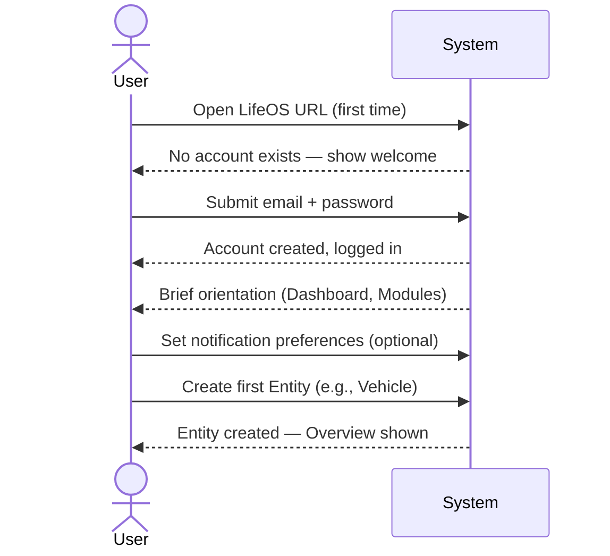
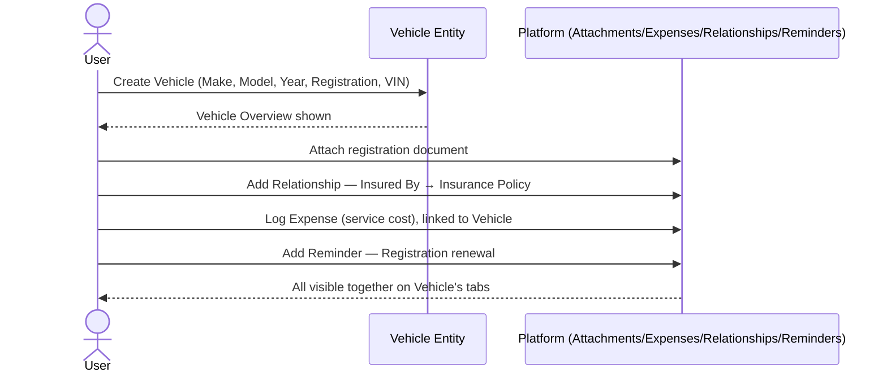
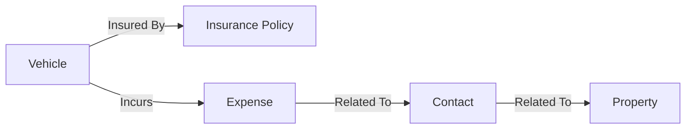
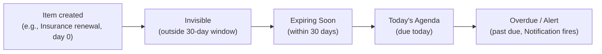

# LifeOS — User Journeys

# Document Information

| Field | Value |
|---|---|
| Document | User Journeys |
| File | `docs/product/05_User_Journeys.md` |
| Version | 1.0 |
| Status | Draft |
| Owner | Product Team |
| Last Updated | 2026-07-02 |
| Depends On | `01_Product_Vision.md`, `02_Product_Requirements_Document.md`, `03_Feature_Catalogue.md`, `04_Information_Architecture.md`, `00_Glossary.md` |
| Used By | `06_User_Research.md`, `07_Screen_Inventory.md`, all future Design and Engineering documents |

---

## Purpose

This document describes how a user moves from intent to completed outcome in LifeOS — behavior, not screens. It assumes the Entity Platform, Modules, Capabilities, and terminology already defined in [`03_Feature_Catalogue.md`](./03_Feature_Catalogue.md), [`04_Information_Architecture.md`](./04_Information_Architecture.md), and [`00_Glossary.md`](./00_Glossary.md), and does not redefine them. Every journey below uses a fixed template so journeys can be compared and reused consistently:

**User Goal · Preconditions · Trigger · Main Flow · Alternate Flows · Edge Cases · Expected Outcome · Success Criteria**

---

## Category 1: Getting Started

### J1.1 — First Launch

| Field | Detail |
|---|---|
| User Goal | Understand what LifeOS is and get oriented before committing any personal data |
| Preconditions | LifeOS is deployed and reachable; no account exists yet |
| Trigger | User opens the LifeOS URL for the first time |

**Main Flow:** System detects no account exists → presents a welcome/setup screen → user proceeds to Account Creation.

**Alternate Flows:** If an account already exists but the user isn't logged in, they're routed to Login instead of Account Creation.

**Edge Cases:** Instance was deployed but never accessed — First Launch still triggers on first visit regardless of elapsed time since deployment.

**Expected Outcome:** User understands this is a fresh, empty, self-hosted instance.

**Success Criteria:** User reaches Account Creation without confusion about whether existing data is present.

---

### J1.2 — Account Creation

| Field | Detail |
|---|---|
| User Goal | Create a personal, secured account to begin using LifeOS |
| Preconditions | First Launch completed; no account exists (single-user V1) |
| Trigger | User submits email + password |

**Main Flow:** User enters email and password → system validates format/strength → account created → user automatically logged in → proceeds to Initial Setup.

**Alternate Flows:** User closes the app mid-creation and returns later — creation resumes since no account was finalized yet.

**Edge Cases:** Weak password → rejected with guidance, account not created. A second account-creation attempt after one already exists is not applicable — LifeOS V1 is single-user (`02_Product_Requirements_Document.md`, Product Boundaries).

**Expected Outcome:** A single authenticated user account exists.

**Success Criteria:** User is logged in and reaches Initial Setup in the same session.

---

### J1.3 — Initial Setup

| Field | Detail |
|---|---|
| User Goal | Configure the essentials before entering real data, without heavy forced setup |
| Preconditions | Account created and logged in |
| Trigger | First login immediately following Account Creation |

**Main Flow:** System presents a brief orientation to Dashboard and Domain Modules → user optionally sets notification preferences → user proceeds to create their first Entity, or skips to an empty Dashboard.

**Alternate Flows:** User skips setup entirely.

**Edge Cases:** User abandons setup mid-way — partial preferences are saved as-is; nothing is forced to completion.

**Expected Outcome:** User has a working mental model of Dashboard + Modules and default notification settings in place.

**Success Criteria:** User reaches either "Creating the First Entity" or the empty Dashboard with no blocking steps.

---

### J1.4 — Creating the First Entity

| Field | Detail |
|---|---|
| User Goal | Add the first real piece of data, converting LifeOS from "an empty tool" to "my system" |
| Preconditions | Account created; Initial Setup complete or skipped |
| Trigger | User selects "Add" from a Domain Module or Dashboard Quick Add |

**Main Flow:** User chooses an Entity Type (e.g., Vehicle) → fills minimum required fields → saves → Entity created in Active state with an empty Timeline → user lands on the new Entity's Overview.

**Alternate Flows:** User adds a Custom Field during creation instead of afterward.

**Edge Cases:** User provides only the bare minimum and skips everything else — the Entity is still created successfully; per `04_Information_Architecture.md` (Section 5), an Entity is fully capable from the moment of creation regardless of how sparse its data is. No draft/incomplete state exists — an entity is either created or it isn't.

**Expected Outcome:** A real Entity Instance exists, and the user has directly experienced the create → view flow once.

**Success Criteria:** The new Entity appears on the Dashboard (if applicable) and in Global Search immediately after creation.

---

## Category 2: Dashboard

### J2.1 — Daily Review

| Field | Detail |
|---|---|
| User Goal | Quickly understand what needs attention today, across all of life, in one place |
| Preconditions | User has at least one Entity (Dashboard still functions, more sparsely, with none) |
| Trigger | User opens LifeOS, habitually or from a Notification |

**Main Flow:** Dashboard loads → Today's Agenda shows due/overdue Reminders → Expiring Soon shows items nearing expiry → user scans Favorites, Recent Activity, Upcoming Trips → clicks into any item needing action, landing on that Entity.

**Alternate Flows:** Dashboard is empty (new user) — shows a lightweight empty state encouraging Entity creation, not a blank screen.

**Edge Cases:** Multiple items overdue simultaneously — Today's Agenda sorts most-overdue first.

**Expected Outcome:** User leaves knowing exactly what, if anything, needs action today.

**Success Criteria:** User can assess "what needs attention" without navigating into any individual Domain Module.

---

### J2.2 — Reviewing Upcoming Reminders

| Field | Detail |
|---|---|
| User Goal | See everything scheduled soon, not just today, to plan ahead |
| Preconditions | At least one Reminder exists |
| Trigger | User opens Today's Agenda / "see all reminders" |

**Main Flow:** User views Reminders sorted by due date → marks done, snoozes, or dismisses directly from the list → optionally clicks through to the owning Entity for context.

**Alternate Flows:** User filters Reminders by Domain (e.g., only Finance-related).

**Edge Cases:** A Reminder's owning Entity has since been Archived or Trashed — the Reminder is hidden accordingly; reminders don't outlive their entity's visibility state.

**Expected Outcome:** Full visibility into near-term obligations without hunting through individual entities.

**Success Criteria:** No Reminder due within the visible window is missed during this review.

---

### J2.3 — Reviewing Recent Activity

| Field | Detail |
|---|---|
| User Goal | Understand what changed recently across the system |
| Preconditions | At least one Activity Log entry exists |
| Trigger | User opens the Recent Activity widget |

**Main Flow:** User views a chronological feed of recent changes across all Entities → clicks an entry to jump to that Entity's own Timeline for full context.

**Alternate Flows:** User filters Recent Activity by Domain or date range.

**Edge Cases:** A very high-activity period (e.g., bulk data entry) — feed paginates rather than overwhelming the widget.

**Expected Outcome:** User can retrace recent changes without remembering which Entity they touched.

**Success Criteria:** The most recent change to any Entity is visible within Recent Activity without additional navigation.

---

## Category 3: Asset Management

Vehicle is the platform's Reference Implementation (`docs/decisions/DEC-001`) — these journeys are written against Vehicle specifically, but apply identically to any Assets entity.

### J3.1 — Adding a Vehicle

| Field | Detail |
|---|---|
| User Goal | Register an owned vehicle so it can be tracked going forward |
| Preconditions | User logged in |
| Trigger | User selects "Add Vehicle" from Assets or Dashboard Quick Add |

**Main Flow:** User selects Vehicle as Entity Type → enters Make, Model, Year, Registration Number, VIN → saves → Vehicle Entity created, Overview shown → user optionally adds Custom Fields, Attachments, or Relationships immediately, or defers.

**Alternate Flows:** User adds Insurance/Contact/Document relationships inline during creation rather than afterward.

**Edge Cases:** A Vehicle with the same registration number already exists — system does not block creation (no hard uniqueness constraint assumed at product level); Global Search surfaces both, letting the user notice and reconcile manually.

**Expected Outcome:** A Vehicle Entity exists with baseline data.

**Success Criteria:** The Vehicle appears in Assets, Global Search, and (once a Reminder/expiry exists) the Dashboard.

---

### J3.2 — Updating Vehicle Information

| Field | Detail |
|---|---|
| User Goal | Keep the Vehicle's data current as real-world facts change |
| Preconditions | Vehicle Entity exists |
| Trigger | User opens Vehicle Overview and edits a field |

**Main Flow:** User opens Vehicle → edits one or more fields → saves → change reflected on Overview and recorded on Timeline/Activity History automatically.

**Alternate Flows:** User logs an odometer reading as a Timeline entry rather than overwriting a single field, preserving a history of readings rather than only the latest.

**Edge Cases:** Concurrent edits by more than one user — out of scope for V1 (single-user); to be revisited if household sharing ships.

**Expected Outcome:** Vehicle record reflects current reality.

**Success Criteria:** The edit is visible immediately on Overview and appears as a new Activity entry on the Timeline.

---

### J3.3 — Recording a Service

| Field | Detail |
|---|---|
| User Goal | Log that maintenance/service was performed, building the vehicle's service history |
| Preconditions | Vehicle Entity exists |
| Trigger | User returns from a service appointment |

**Main Flow:** User opens the Vehicle's Timeline → adds a user-logged Event (date, description) → optionally attaches a receipt (Attachment) and logs the cost (Expense, linked via Relationship) → optionally links the Contact who performed it.

**Alternate Flows:** User logs the Expense first from Finance, then links it to the Vehicle afterward.

**Edge Cases:** Service performed with no cost (e.g., warranty work) — Timeline entry is still logged without an Expense.

**Expected Outcome:** The Vehicle's Timeline reflects a complete, chronological service history.

**Success Criteria:** A future viewer can reconstruct everything ever done to this vehicle from its Timeline alone.

---

### J3.4 — Uploading Documents (for a Vehicle)

| Field | Detail |
|---|---|
| User Goal | Attach the vehicle's official paperwork alongside the vehicle itself |
| Preconditions | Vehicle Entity exists |
| Trigger | User has a registration certificate or similar to add |

**Main Flow:** User opens Vehicle > Attachments for a quick file, or creates/links a Document Entity via Relationships for a formal record with its own expiry tracking → uploads the file → available from both the Vehicle and (if a Document Entity was used) the Documents module.

**Alternate Flows:** User uploads under the Documents module first, then relates it to the Vehicle afterward.

**Edge Cases:** Unsupported file type — rejected with guidance before upload completes. Very large file (e.g., a video walkaround) — upload proceeds with progress indication.

**Expected Outcome:** The vehicle's paperwork is retrievable from the vehicle itself, not just a generic file store.

**Success Criteria:** The document is visible on the Vehicle and discoverable via Global Search by filename/category.

---

### J3.5 — Adding Expenses (for a Vehicle)

| Field | Detail |
|---|---|
| User Goal | Track money spent on this vehicle over time |
| Preconditions | Vehicle Entity exists |
| Trigger | User incurs a cost related to the vehicle |

**Main Flow:** User creates an Expense from Finance, or inline from the Vehicle's Expenses tab → enters amount, date, category → links to the Vehicle via Relationship (automatic if created inline) → Expense appears on both the Vehicle's Expenses tab and Finance's Expense list.

**Alternate Flows:** Recurring costs (e.g., monthly parking) are logged as individual Expense entries each time — see Cross-Journey Analysis for a noted automation opportunity.

**Edge Cases:** Expense entered with no linked Entity — remains a standalone Finance record, retrievable but not contributing to any Vehicle's total.

**Expected Outcome:** The Vehicle's total cost of ownership becomes visible over time.

**Success Criteria:** Summing the Vehicle's linked Expenses produces an accurate running cost for that vehicle.

---

### J3.6 — Linking Insurance (to a Vehicle)

| Field | Detail |
|---|---|
| User Goal | Connect the vehicle to its insurance coverage, visible from both sides |
| Preconditions | Vehicle Entity exists; an Insurance Policy exists or is being created |
| Trigger | User wants to record that a Vehicle is covered by a specific policy |

**Main Flow:** User opens the Vehicle's Relationships tab → adds a System Relationship (`Insures` / `Insured By`) → selects or creates the Insurance Policy → Relationship saved, visible from both sides.

**Alternate Flows:** User starts from the Insurance Policy and links to the Vehicle instead — same resulting Relationship, opposite entry point.

**Edge Cases:** User links an Archived Insurance Policy — allowed (Archived entities remain valid for Relationships, only hidden from default list views), with a note surfaced that the linked policy is archived.

**Expected Outcome:** Vehicle and Insurance Policy are bidirectionally connected.

**Success Criteria:** Navigating from either Entity's Relationships tab reaches the other in exactly one click (`04_Information_Architecture.md`, Section 3).

---

### J3.7 — Creating Reminders (for a Vehicle)

| Field | Detail |
|---|---|
| User Goal | Ensure an upcoming date related to the vehicle isn't forgotten |
| Preconditions | Vehicle Entity exists |
| Trigger | User knows of an upcoming date to track (e.g., registration renewal) |

**Main Flow:** User opens the Vehicle's Reminders tab → adds a Reminder with title and due date, optionally recurring → saved, surfaces on the Dashboard as it approaches, fires a Notification at the scheduled time.

**Alternate Flows:** A Reminder is system-suggested from a linked Insurance Policy's or Document's expiry field rather than manually created — see Cross-Journey Analysis; not assumed as guaranteed default behavior in this document.

**Edge Cases:** Reminder date is already in the past at creation — accepted, immediately surfaced as overdue.

**Expected Outcome:** The user is proactively notified before the date in question passes.

**Success Criteria:** The Reminder appears in Today's Agenda / Expiring Soon exactly when expected, and firing it produces a Notification.

---

## Category 4: Documents

### J4.1 — Creating a Document

| Field | Detail |
|---|---|
| User Goal | Record an official/identity document as a first-class, trackable record |
| Preconditions | User logged in |
| Trigger | User has a document to formally record (e.g., a new Passport) |

**Main Flow:** User selects "Add Document" → chooses Document Category → enters document number, issuing authority, issue/expiry dates → saves → prompted to attach the scanned copy and link the owning Contact.

**Alternate Flows:** User creates the Document from within a Contact's Relationships tab instead of the Documents module directly.

**Edge Cases:** Document has no expiry (e.g., a birth certificate) — expiry field left blank; no expiry-based Reminder is suggested.

**Expected Outcome:** A structured Document record exists, distinct from a loose file.

**Success Criteria:** The Document appears in the Documents module and is linked to its owning Contact.

---

### J4.2 — Attaching Files (to a Document)

| Field | Detail |
|---|---|
| User Goal | Attach the actual scanned copy/copies to the Document record |
| Preconditions | Document Entity exists |
| Trigger | User has a scan or photo of the physical document |

**Main Flow:** User opens the Document's Attachments tab → uploads one or more files → files are previewable directly from the Document.

**Alternate Flows:** Mobile capture via a future Flutter client rather than uploading an existing file — noted as future, not assumed here.

**Edge Cases:** Poor-quality scan uploaded — not rejected on quality; re-upload is the user's responsibility if needed.

**Expected Outcome:** The Document's content is retrievable at any time without locating the physical original.

**Success Criteria:** All relevant faces/pages of the physical document are represented among its Attachments.

---

### J4.3 — Finding a Document

| Field | Detail |
|---|---|
| User Goal | Retrieve a specific document quickly when needed |
| Preconditions | At least one Document exists |
| Trigger | User needs a document urgently (e.g., asked to produce a Passport number) |

**Main Flow:** User opens Global Search → types a relevant term (document number, category, owning Contact's name) → selects the matching Document → lands on its Overview with Attachments immediately accessible.

**Alternate Flows:** User instead browses the Documents module, filtering by Category, if they don't remember specifics.

**Edge Cases:** Search term matches multiple Documents (e.g., "passport" for two family members) — results disambiguated by owning Contact in the result list.

**Expected Outcome:** The user locates the correct document in seconds, not minutes.

**Success Criteria:** Time from query to viewing the Attachment is under the target defined in `02_Product_Requirements_Document.md`, Section 10 (under 5 seconds).

---

### J4.4 — Renewing an Expiring Document

| Field | Detail |
|---|---|
| User Goal | Act on an expiring document before it lapses, and keep the record current afterward |
| Preconditions | Document Entity exists with an approaching expiry date |
| Trigger | A Reminder fires, or the Expiring Soon widget surfaces the Document |

**Main Flow:** User sees the Document flagged as expiring → completes the real-world renewal process (outside LifeOS) → returns to the Document → updates the document number (if changed) and new expiry date → replaces or adds the new scanned copy as an Attachment, retaining the old one for history → Timeline logs the renewal event.

**Alternate Flows:** User creates a new Document Entity for the renewed document instead of updating in place, Archiving the old one — acceptable, though updating in place is recommended (see Quality Review).

**Edge Cases:** Document lapses before renewal completes — the Expiring Soon flag escalates to an overdue/Alert-level Notification rather than disappearing silently.

**Expected Outcome:** The Document reflects renewed, current information, and the expiry Reminder cycle continues for the new date.

**Success Criteria:** No gap exists between the old expiry being handled and a new expiry-based Reminder becoming active.

---

## Category 5: Finance

### J5.1 — Recording an Expense

| Field | Detail |
|---|---|
| User Goal | Log a specific expenditure |
| Preconditions | User logged in |
| Trigger | User spends money on something worth tracking |

**Main Flow:** User creates an Expense from Finance, or inline from a related Entity → enters amount, date, category → optionally links it to an Entity via Relationship → saves.

**Alternate Flows:** Several expenses from one trip/day are each still created as individual Expense entries — batch-entry UX is a UI concern, out of scope here.

**Edge Cases:** No category selected — allowed, categorized "Uncategorized" for later cleanup rather than blocking save.

**Expected Outcome:** A standalone, searchable financial record exists.

**Success Criteria:** The Expense is visible in Finance and, if linked, on the related Entity's Expenses tab.

---

### J5.2 — Reviewing Yearly Expenses

| Field | Detail |
|---|---|
| User Goal | Understand total spend over a year, optionally by category or linked entity |
| Preconditions | Multiple Expense entities exist across the year |
| Trigger | User wants a retrospective view (e.g., for taxes or general awareness) |

**Main Flow:** User opens Finance > Expense list → filters by date range → optionally filters/groups by category or linked Entity → reviews the resulting list and total.

**Alternate Flows:** User reaches the same filtered view via Global Search with a date filter instead of browsing Finance directly.

**Edge Cases:** Some Expenses are "Uncategorized" — included in the total regardless, surfaced distinctly so the user can clean them up.

**Expected Outcome:** User has an accurate picture of the year's spending.

**Success Criteria:** The filtered total matches the sum of all Expense entities dated within that year.

> **Boundary note:** LifeOS is explicitly not a budgeting engine (`02_Product_Requirements_Document.md`, Product Boundaries) — this journey ends at reviewing, not at setting a budget or variance analysis.

---

### J5.3 — Linking Expenses to Assets

| Field | Detail |
|---|---|
| User Goal | Attribute a cost to the specific Entity it belongs to |
| Preconditions | Expense and target Entity both exist |
| Trigger | User realizes an existing standalone Expense should be attributed to an Entity |

**Main Flow:** User opens the Expense → adds a Relationship to the relevant Entity (e.g., Vehicle) → the Expense now appears on that Entity's Expenses tab going forward.

**Alternate Flows:** Done inline while creating the Expense from the Entity's own Expenses tab (Relationship created automatically).

**Edge Cases:** One Expense linked to multiple Entities (e.g., a shared household cost relevant to both Property and a Contact) — supported, since Relationships are many-to-many.

**Expected Outcome:** Cost data rolls up accurately to the Entities it's actually associated with.

**Success Criteria:** The Expense appears identically whether viewed from Finance or from any linked Entity's Expenses tab.

---

## Category 6: Search

### J6.1 — Global Search

| Field | Detail |
|---|---|
| User Goal | Find any entity, file, or piece of information anywhere in the system in one query |
| Preconditions | At least one Entity exists |
| Trigger | User invokes Global Search from anywhere (Global Navigation, `04_Information_Architecture.md` Section 3) |

**Main Flow:** User types a query → results return across all Domains, ranked by relevance → user selects a result, landing on that Entity.

**Alternate Flows:** Query matches nothing — empty state suggests checking spelling or browsing by Domain instead.

**Edge Cases:** Very short/generic query (e.g., "car") — many results returned; ranking surfaces the most recently active/relevant first rather than alphabetically.

**Expected Outcome:** The user finds what they were looking for without knowing in advance which Domain it lives in.

**Success Criteria:** Matches the search scope defined in `04_Information_Architecture.md` Section 8, within the 5-second target (`02_Product_Requirements_Document.md`, Section 10).

---

### J6.2 — Filtering

| Field | Detail |
|---|---|
| User Goal | Narrow a broad result set to what's actually relevant |
| Preconditions | A Global Search has returned multiple results |
| Trigger | User applies a Filter (Domain, Entity Type, or date range) |

**Main Flow:** User reviews initial results → applies one or more filters → result set narrows without re-typing the query.

**Alternate Flows:** User combines filters (e.g., Finance + last 12 months).

**Edge Cases:** Filters narrow the result set to zero — system indicates no matches under current filters and suggests removing one, rather than a bare empty screen.

**Expected Outcome:** A precise, relevant result set.

**Success Criteria:** Filtering never requires re-entering the search query.

---

### J6.3 — Jumping Between Related Entities

| Field | Detail |
|---|---|
| User Goal | Follow a chain of connected information without returning to Search each time |
| Preconditions | At least two Entities are linked via Relationship |
| Trigger | User is viewing one Entity and wants to see something connected to it |

**Main Flow:** User opens the Entity's Relationships tab → selects a linked Entity → lands on that Entity's own Overview, with its own Relationships tab available to continue the chain.

**Alternate Flows:** User jumps via an inline Timeline reference (e.g., an "Expense logged" entry links directly to that Expense) rather than the Relationships tab.

**Edge Cases:** A linked Entity has since been soft-deleted — the link shows as unavailable, since Trashed entities are removed from all views (`04_Information_Architecture.md`, Section 5), rather than leading to a broken page.

**Expected Outcome:** The user experiences LifeOS as one connected system, not isolated modules — the direct product validation of Cross-Entity Navigation.

**Success Criteria:** A user can move from any Entity to any of its directly related Entities in exactly one click.

---

## Category 7: Relationships

### J7.1 — Connecting Entities Across Domains

| Field | Detail |
|---|---|
| User Goal | Build a connected picture of how different parts of life relate, not just record them in isolation |
| Preconditions | At least two Entities exist that are conceptually related in real life |
| Trigger | User recognizes two things are connected and wants that reflected in the system |

**Main Flow (worked example):**

1. User starts at Vehicle, adds Relationship `Insured By` → Insurance Policy.
2. From the Vehicle, adds Relationship `Incurs` → Expense (a repair cost).
3. From that Expense, adds Relationship `Related To` → Contact (the mechanic paid).
4. Separately, that same Contact is linked `Related To` → Property (e.g., the mechanic is also the user's neighbor — an incidental but real connection).
5. The user can now navigate the whole chain — Vehicle → Insurance → Expense → Contact → Property — one hop at a time, in either direction.

**Alternate Flows:** User uses a Custom Relationship instead of a System Relationship where the closed list doesn't fit (`docs/decisions/DEC-009-hybrid-relationship-model.md`).

**Edge Cases:** User creates a Relationship that reads backwards (e.g., "Property Owns Vehicle" instead of "Vehicle Belongs To Property Owner") — the system does not enforce semantic correctness beyond the chosen Relationship Type; the user is responsible for choosing the type that reads correctly from both sides.

**Expected Outcome:** A connected graph of the user's real-life context, navigable from any entry point.

**Success Criteria:** Every Relationship created is visible and traversable from both linked Entities.

---

## Category 8: Archive

### J8.1 — Archiving and Restoring an Entity

| Field | Detail |
|---|---|
| User Goal | Remove an Entity from active daily views without losing its data (e.g., a sold Vehicle) |
| Preconditions | Entity exists in Active state |
| Trigger | The Entity is no longer relevant to daily use, but its history is still worth keeping |

**Main Flow:** User selects Archive → Entity removed from default list views, Dashboard, and default Global Search results → data, Attachments, Relationships, and Timeline remain fully intact, viewable via direct access or an "include archived" filter → user can Unarchive at any time to return it to Active.

**Alternate Flows:** User archives an Entity that still has active Reminders — those Reminders stop surfacing on the Dashboard while archived (consistent with Archived entities being excluded from default Dashboard/Search), but are not deleted, and resume surfacing if unarchived.

**Edge Cases:** User archives an Entity that other Entities still relate to (e.g., archiving a Vehicle with a linked Insurance Policy) — the Relationship persists; the linked Insurance Policy simply shows the Vehicle as archived, rather than the link breaking.

**Expected Outcome:** A decluttered active workspace without any data loss.

**Success Criteria:** An archived Entity's full Timeline and Relationships are exactly as they were the moment before archiving, when later viewed or restored.

---

### J8.2 — Trashing and Permanently Losing an Entity

| Field | Detail |
|---|---|
| User Goal | Remove an Entity the user genuinely no longer wants, with a safety net against mistakes |
| Preconditions | Entity exists (Active or Archived) |
| Trigger | User selects Delete |

**Main Flow:** Entity moves to Trash, disappearing from all normal views immediately → for 30 days, the user can Restore it back to Active (`docs/decisions/DEC-007-soft-delete-retention.md`) → after 30 days (or an explicit "delete forever"), the Entity and its owned data are Permanently Deleted.

**Alternate Flows:** User empties Trash manually before the 30-day window elapses, accelerating Permanent Deletion for that item.

**Edge Cases:** A Trashed Entity has Relationships to still-active Entities — those Relationships are hidden (not traversable) while Trashed, and either restored (if the Entity is restored) or permanently removed (if Permanently Deleted) — never left dangling.

**Expected Outcome:** True deletion only ever happens after a deliberate window, never by accident.

**Success Criteria:** No Entity is Permanently Deleted without either 30 days elapsing in Trash or an explicit, separate "delete forever" confirmation.

---

## Category 9: Dashboard Assistant

### J9.1 — The Assistant Throughout the Day

| Field | Detail |
|---|---|
| User Goal | Have LifeOS proactively surface what matters, rather than requiring the user to remember to check |
| Preconditions | User has Reminders, expiring items, or Notifications enabled |
| Trigger | Ambient — this journey describes ongoing behavior, not a single invocation |

**Main Flow:**
1. **Morning:** user opens LifeOS (or receives an email digest) and sees Today's Agenda already populated — nothing needed to be manually queried.
2. **Throughout the day:** if a Reminder fires, a Notification is delivered (in-app, and email if enabled) without the user needing the app open.
3. **Next visit:** Recent Activity reflects anything the user did, confirming actions were saved correctly.
4. **Ongoing:** as expiry dates approach their configured window (default 30 days), items escalate in visibility automatically — invisible → Expiring Soon → Today's Agenda → overdue/Alert — without the user having to check proactively.

**Alternate Flows:** User disables email Notifications and relies on in-app only — Today's Agenda remains the source of truth, just without proactive delivery outside the app.

**Edge Cases:** User doesn't open LifeOS for an extended period — overdue items accumulate and are all shown, sorted most-overdue-first, on next visit rather than being lost or silently dismissed.

**Expected Outcome:** The user experiences LifeOS as something that watches their life administration for them, not a filing cabinet they must remember to check.

**Success Criteria:** No time-sensitive item ever reaches its due date without first appearing in Today's Agenda or Expiring Soon, or triggering a Notification — the direct behavioral test of the Dashboard's assistant-style design principle (`02_Product_Requirements_Document.md`, Section 6).

---

## Cross-Journey Analysis

### Common Actions
The following actions recur, identically, across many journeys above — direct evidence that the Standard Entity Capability Set (`03_Feature_Catalogue.md`, Section 2.1) is doing its job:

| Action | Appears In |
|---|---|
| Create Entity | J1.4, J3.1, J4.1, J5.1 |
| Add Attachment | J3.4, J4.2 |
| Add Relationship | J3.5, J3.6, J5.3, J7.1 |
| Add Reminder | J3.7, J4.4 |
| Filter a list/search result | J5.2, J6.2 |
| Navigate via Relationship (Cross-Entity Navigation) | J3.6, J6.3, J7.1 |

### Reusable Workflows
- **"Add Relationship"** is functionally identical whether it originates from a Vehicle, an Expense, or a Contact — same flow, different Entities (J3.6, J5.3, J7.1). This validates the platform-first design: it was built once and is reused, not reimplemented per Domain.
- **"Upload and attach a file"** is identical whether attaching to a Vehicle or a Document (J3.4, J4.2).
- **"Filter a result set by date/Domain/Entity Type"** is identical whether applied to Expense review or Search results (J5.2, J6.2).

### Opportunities for Automation (Deterministic, Not AI)
- Auto-creating a Reminder from a Document's or Insurance Policy's expiry field, rather than requiring the user to manually add a matching Reminder (touches J3.7, J4.4). **Needs a product decision** on whether this is default, opt-in, or never — see Quality Review.
- Auto-suggesting a Relationship when an Expense is created from within an Entity's own context, rather than requiring a separate linking step (touches J3.5, J5.3).
- Recurring Expense/Reminder templates (e.g., a monthly utility bill) so the user doesn't manually recreate the same entry every cycle — not assumed present in MVP.
- Surfacing possible duplicate Entities (e.g., two Vehicles with the same registration number) as a gentle suggestion rather than a blocking validation (touches J3.1).

### Opportunities for Future AI (Named Only — Not Designed Here)
Per Product Principle 7 (`02_Product_Requirements_Document.md`, Section 6 — "AI must earn its place") and the MVP's no-AI decision, these are named as future directions only:
- Extracting structured fields automatically from an uploaded Document scan (e.g., auto-filling expiry date from a passport photo) — touches J4.1/J4.2.
- Natural-language Global Search ("what did I spend on my car last year") rather than keyword-only search — touches J6.1.
- Summarizing an Entity's Timeline into a plain-language digest — touches J3.3, J2.3.
- Smart Reminder suggestions based on patterns in past renewal costs — carefully scoped to stay within the "not a budgeting engine" boundary (J5.2).

---

## Quality Review

### Missing Journeys Identified
This document covers everything explicitly requested, but the following journeys are real, necessary parts of the product that were not in scope for this pass and should be written before Screen Inventory:
- **Returning User Sign-In** — every session after Day 1 is a Login, not a First Launch; this document only covers the one-time onboarding path.
- **Editing or Removing a Relationship** — only *creating* a Relationship was covered (J3.6, J7.1); removing one, or changing its type, was not.
- **Defining a Custom Field** — Settings > Custom Field Management exists (`03_Feature_Catalogue.md`, Section 2.2) but no journey walks through actually defining one.
- **Exporting Data** — a binding Product Principle (data portability is non-negotiable) with no corresponding journey yet.
- **Configuring Notification Preferences** — mentioned inside J1.3 and J9.1 but never walked through as its own journey.
- **Tagging and Favoriting an Entity** — both are part of the Standard Entity Capability Set but have no dedicated journey.
- **Account Security** — changing password, viewing active sessions, viewing the Security Audit Log.

### Unnecessary Complexity Identified
- **J3.4** offers two paths for adding a vehicle file (a plain Attachment vs. a full Document Entity), which risks decision fatigue for what's usually a simple "attach a scan" moment. **Recommendation:** default to the simpler Attachment path, with an easy "promote to Document" upgrade action later, rather than asking the user to decide upfront every time.
- **J4.4** offers two paths for renewal (update in place vs. create new + archive old), which risks inconsistent records over time (some documents renewed in place, others forked into new records for no clear reason). **Recommendation:** standardize on "update in place" as the only supported MVP path, keeping exactly one continuous record per real-world document; revisit only if user research shows a real need for renewal history as separate records.

### Open Question Requiring a Decision
Reminder creation from an expiry field is referenced inconsistently across this document (sometimes manual, sometimes "system-suggested") because **no decision has been made yet** on whether an expiry field on a Document or Insurance Policy should always auto-generate a Reminder, never do so, or prompt the user each time. This should be settled — as a new Decision Log entry — before `07_Screen_Inventory.md` is written, since it directly affects whether "Creating Reminders" needs its own UI step at all for expiry-driven cases.

---

## Document Status

**Version:** 1.0
**Status:** Draft
**Dependencies:**
- `docs/product/01_Product_Vision.md`
- `docs/product/02_Product_Requirements_Document.md`
- `docs/product/03_Feature_Catalogue.md`
- `docs/product/04_Information_Architecture.md`
- `docs/product/00_Glossary.md`

**Generated On:** 2026-07-02

**Next Document:** `docs/product/06_Screen_Inventory.md` (moved ahead of User Research per Product Owner's request; User Research now follows as `07_User_Research.md`)
