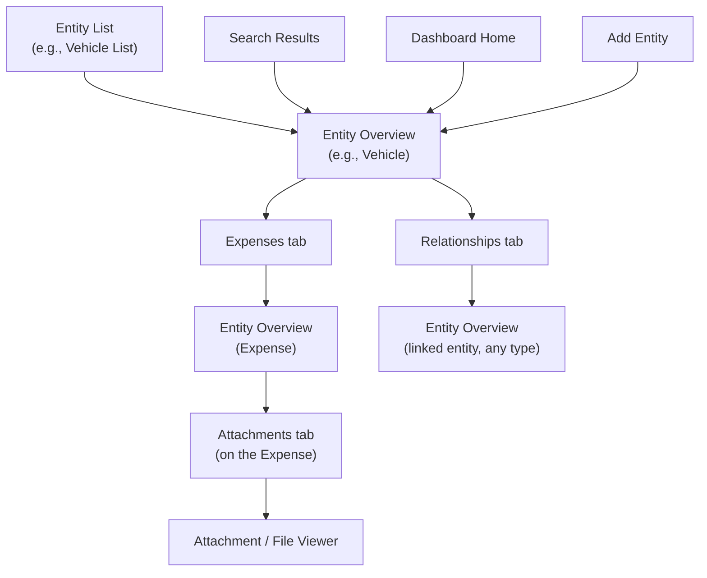

# LifeOS — Screen Inventory

# Document Information

| Field | Value |
|---|---|
| Document | Screen Inventory |
| File | `docs/product/06_Screen_Inventory.md` |
| Version | 1.1 |
| Status | Draft |
| Owner | Product Team |
| Last Updated | 2026-07-02 |
| Depends On | `03_Feature_Catalogue.md`, `04_Information_Architecture.md`, `05_User_Journeys.md`, `00_Glossary.md` |
| Used By | UX Design, Engineering (Frontend), `07_User_Research.md` |

---

## Purpose

This is the definitive inventory of every screen required to build LifeOS — the bridge between Product Documentation and UX Design. It identifies *what* screens exist and *why*, not how they look. No layouts, components, or wireframes are defined here.

The single most important finding of this document is stated up front because it should shape how every later section is read: **because LifeOS is platform-first (`docs/decisions/DEC-001`), the overwhelming majority of screens are not built per Entity Type.** A small set of generic, reusable screen templates — parameterized by each Entity Type's Configuration (Glossary) — cover all 28 domain entity types. Genuinely entity-specific screens are the rare exception, not the rule. Section 12 (Quality Review) quantifies exactly how much smaller this makes the inventory than a naive, module-by-module screen list would be.

---

## 1. Screen Catalogue

### Authentication & Onboarding *(Global)*
- Login
- Register (Account Creation)
- Forgot Password
- Reset Password
- Welcome / First Launch
- Initial Setup

### Dashboard *(Global)*
- Dashboard Home

### Global Search *(Global)*
- Search Results

### Notifications *(Global)*
- Notification Center

### Generic Entity Platform *(reused by every Domain below — see Section 4)*
- Entity List
- Entity Overview
- Add Entity
- Edit Entity
- Timeline (tab)
- Attachments (tab)
- Notes (tab)
- Expenses (tab)
- Reminders (tab)
- Relationships (tab)
- Activity History (tab)
- Attachment / File Viewer

*(Archive and Delete are not a tab — they live in a `⋮` overflow menu on Entity Overview, per `docs/decisions/DEC-012-remove-entity-settings-tab.md`.)*

### Archive & Trash *(Global, cross-Domain)*
- Archive & Trash List

### Assets — *uses the Generic Entity Platform, parameterized for:* Vehicle, Property, Device, Valuable, Digital Asset
- *(no entity-specific screens required — see Section 5)*

### Documents — *parameterized for:* Document
- *(no entity-specific screens required)*

### Finance — *parameterized for:* Bank Account, Loan, Investment, Insurance Policy, Expense, Income, Subscription
- *(no entity-specific screens required)*

### Health — *parameterized for:* Medical Record, Medicine, Vaccination Record, Fitness Record
- *(no entity-specific screens required for MVP; see Section 11 for a possible Fitness Trend view)*

### Planning — *parameterized for:* Goal, Task, Trip, Calendar Event
- Trip Itinerary *(entity-specific — Future, not MVP; see Section 5, 11)*

### Home — *parameterized for:* Inventory Item, Maintenance Record, Utility Bill
- *(no entity-specific screens required)*

### Knowledge — *parameterized for:* Knowledge Note, Bookmark, Checklist
- Checklist Items *(entity-specific — Future, not MVP; see Section 5, 11)*

### People — *parameterized for:* Contact
- *(no entity-specific screens required)*

### Settings *(Global)*
- Profile
- Security
- Notification Preferences
- Custom Field Definitions (list)
- Add / Edit Custom Field Definition
- Data Export
- Tag Management

### Modals & Confirmations *(reused everywhere)*
- Quick Add (Entity Type picker)
- Add Attachment
- Add Relationship
- Add Reminder
- Add Expense (quick, from within an Entity)
- Confirm Archive
- Confirm Delete (Soft Delete)
- Confirm Permanent Delete

---

## 2. Screen Classification

| Screen | Classification |
|---|---|
| Login, Register, Forgot Password, Reset Password | Global |
| Welcome / First Launch | Global |
| Initial Setup | Wizard |
| Dashboard Home | Global |
| Search Results | Global |
| Notification Center | Global |
| Entity List | Module |
| Entity Overview | Entity |
| Add Entity | Wizard |
| Edit Entity | Entity |
| Timeline / Attachments / Notes / Expenses / Reminders / Relationships / Activity History (tabs) | Entity |
| Archive / Delete (`⋮` overflow menu, Entity Overview) | Modal (Confirm Action, for Delete only — Archive is immediate + Undo) |
| Attachment / File Viewer | Modal |
| Archive & Trash List | Module |
| Trip Itinerary *(Future)* | Entity |
| Checklist Items *(Future)* | Entity |
| Profile, Security, Notification Preferences, Data Export, Tag Management | Settings |
| Custom Field Definitions (list) | Settings |
| Add / Edit Custom Field Definition | Modal |
| Quick Add | Modal |
| Add Attachment / Add Relationship / Add Reminder / Add Expense | Modal |
| Confirm Archive / Confirm Delete / Confirm Permanent Delete | Modal |

---

## 3. MVP Screens

Per `03_Feature_Catalogue.md` Section 7, MVP scope is Vehicle + Insurance Policy + Expense + Document + Contact, plus full Platform core. Because almost every screen in this inventory is generic, **the MVP screen list is nearly identical to the full generic screen list** — the only screens excluded from MVP are the two genuinely entity-specific ones (Trip Itinerary, Checklist Items), which belong to Domains (Planning, Knowledge) that are themselves out of MVP scope.

| Included in MVP | Excluded from MVP |
|---|---|
| All Authentication & Onboarding screens | Trip Itinerary (Planning is Nice to Have, not MVP) |
| Dashboard Home, Search Results, Notification Center | Checklist Items (Knowledge is Nice to Have, not MVP) |
| All Generic Entity Platform screens (12) | All Future screens (Section 11) |
| Archive & Trash List | |
| All Settings screens (7) | |
| All Modals & Confirmations (8) | |

This is a direct, practical consequence of platform-first architecture: shipping MVP does not mean building "MVP versions" of screens for future Domains — it means building the generic templates once, fully, and pointing them at a smaller set of Entity Types first.

---

## 4. Generic Screens

These screens are defined once and reused, unmodified in structure, for every Entity Type that supports the corresponding capability (applicability per `03_Feature_Catalogue.md`, Section 6).

| Screen | Purpose | Driven By |
|---|---|---|
| **Entity List** | Browse all instances of a given Entity Type within a Domain, with sort/filter | Entity Type Configuration (columns shown) |
| **Entity Overview** | View / edit an instance's typed fields and Custom Field values | Entity Type Configuration (fields, Custom Field Definitions) |
| **Add Entity** | Create a new instance | Entity Type Configuration (required fields) |
| **Edit Entity** | Modify an existing instance | Same as Add Entity |
| **Timeline** | Chronological feed of Events for one instance | Standard Entity Capability Set |
| **Attachments** | Files linked to one instance | Standard Entity Capability Set |
| **Notes** | Freeform annotations on one instance | Standard Entity Capability Set |
| **Expenses** | Expense entities linked to one instance | Standard Entity Capability Set |
| **Reminders** | Reminders scheduled against one instance | Standard Entity Capability Set |
| **Relationships** | Linked Entities, System or Custom Relationship types | Standard Entity Capability Set |
| **Activity History** | System-generated change log for one instance | Standard Entity Capability Set |
| **Attachment / File Viewer** | Preview/download a single file | Any Attachment, from any Entity |
| **Archive & Trash List** | Cross-Domain list of Archived and Trashed entities, filterable | All Domains |

**Custom Field Definitions are deliberately not a per-entity screen.** Values render inline on Entity Overview; the *definitions* themselves are managed once, globally, in Settings — consistent with `00_Glossary.md`'s distinction between Custom Field Definition (global, per Entity Type) and Custom Field Value (per instance).

**Entity Settings is deliberately not a screen or tab either**, per `docs/decisions/DEC-012-remove-entity-settings-tab.md` — Archive and Delete are reached via a `⋮` overflow menu on the Entity Overview header, not a dedicated destination.

---

## 5. Entity-Specific Screens

Two genuine exceptions exist — cases where an Entity Type's interaction pattern cannot be expressed through the generic templates above:

| Screen | Entity Type | Why it's an exception |
|---|---|---|
| **Checklist Items** | Checklist (Knowledge) | Adding, checking off, and reordering list items is a distinct interaction pattern, not a typed field or a generic capability tab |
| **Trip Itinerary** | Trip (Planning) | A day-by-day structure with bookings is a distinct interaction pattern beyond Overview + Attachments + Timeline |

Both are Future, not MVP (Section 3, Section 11).

**Two screens named in the original brief turn out, on inspection, not to be entity-specific at all** — worth stating explicitly since it's the clearest illustration of why the platform-first count is so much smaller than it first appears:
- *"Insurance Details"* is not a unique screen — it is the generic **Entity Overview** template, parameterized for the Insurance Policy Entity Type (Policy Number, Insurer, Coverage Type, Premium, Renewal Date are simply its typed fields).
- *"Health Record"* is not a unique screen either — it is the generic **Entity Overview** template, parameterized for the Medical Record Entity Type.

Neither needed a bespoke design; both are proof the Configuration model works as intended.

---

## 6. Navigation Entry Points

| Screen | Reached From | Leaves To |
|---|---|---|
| Login | Direct URL, session expiry redirect | Dashboard Home (on success) |
| Register | Welcome / First Launch | Initial Setup |
| Dashboard Home | Login, Global Navigation (always available) | Any Entity Overview (via widgets), Search Results, any Domain's Entity List |
| Search Results | Global Navigation (always available) | Any Entity Overview |
| Notification Center | Global Navigation, a Notification itself | The owning Entity's Overview |
| Entity List | Domain Module entry (Global Navigation), Dashboard widget | Entity Overview, Add Entity |
| Entity Overview | Entity List, Relationships tab of another Entity, Search Results, Dashboard widgets, Notification | Any of its own capability tabs, or (via Relationships) another Entity's Overview |
| Add Entity | Entity List, Dashboard Quick Add | Entity Overview (on save), back to Entity List (on cancel) |
| Capability tabs (Timeline, Attachments, etc.) | Entity Overview (as sibling tabs) | Attachment/File Viewer, or a linked Entity's Overview (from Relationships/Expenses tabs) |
| Archive & Trash List | Settings, or a link from an empty Entity List | The Entity's read-only Overview, with Restore available |
| Settings screens | Global Navigation (always available) | Back to Settings home, or Dashboard |
| Modals (Add Attachment, Add Relationship, etc.) | The relevant capability tab | Close back to the same tab, now updated |

The pattern above — List → Overview → Tabs → (Viewer or another Entity) — is identical for every Domain, which is itself evidence that Cross-Entity Navigation (`04_Information_Architecture.md`, Section 3) is a structural property of the platform, not something designed per Domain.

---

## 7. Screen Dependencies

Every dependency chain resolves to the same handful of generic screens regardless of which Domain it started in — there is no Domain-specific dependency graph to maintain separately.

---

## 8. Empty States

| Empty State | Where It Appears |
|---|---|
| No entities of this type yet | Any Entity List (first use of a Domain/Entity Type) |
| No Attachments | Attachments tab |
| No Notes | Notes tab |
| No Expenses linked | Expenses tab |
| No Reminders | Reminders tab |
| No Relationships | Relationships tab |
| No Activity yet | Activity History tab (immediately after creation) |
| No search results | Search Results |
| No notifications | Notification Center |
| Nothing due or expiring | Dashboard Home (Today's Agenda / Expiring Soon) |
| No favorites yet | Dashboard Home (Favorites Shortcut) |
| Trash is empty | Archive & Trash List |
| No Custom Fields defined | Settings > Custom Field Definitions |
| No Tags yet | Settings > Tag Management |
| Nothing created yet (new account) | Dashboard Home, first login (J1.4/J2.1 in `05_User_Journeys.md`) |

---

## 9. Error States

| Error | Where It Appears |
|---|---|
| Invalid email or password | Login |
| Session expired | Any screen — redirects to Login |
| Weak password | Register, Reset Password |
| Required field missing | Add Entity, Edit Entity, any modal form |
| Unsupported file type | Add Attachment |
| File upload interrupted | Add Attachment, Attachment / File Viewer |
| Entity not found (deep link to a permanently deleted entity) | Entity Overview |
| Linked entity unavailable (Trashed) | Relationships tab, per `05_User_Journeys.md` J6.3 |
| Save failed (connectivity/server error) | Any form |
| Search temporarily unavailable | Search Results |
| Action not permitted | Any screen guarded by auth |

---

## 10. Loading States

| Loading State | Where It Appears |
|---|---|
| Authentication check on app open | Global (before Login or Dashboard renders) |
| Dashboard widgets loading independently | Dashboard Home |
| Entity List loading (skeleton rows) | Entity List |
| Entity Overview loading | Entity Overview and each capability tab |
| Search results loading | Search Results, as the user types and after submit |
| File upload progress | Add Attachment |
| Large file rendering | Attachment / File Viewer (PDF, video) |
| Save in progress | Any form, on submit |

---

## 11. Future Screens (Not MVP)

| Screen | Reason Deferred |
|---|---|
| Checklist Items | Knowledge module is Nice to Have, not MVP (`03_Feature_Catalogue.md`, Section 7) |
| Trip Itinerary | Planning module is Nice to Have, not MVP |
| Fitness Trend view (chart over time) | Health module is Nice to Have; even then, Fitness Record is a borderline case for a bespoke visualization rather than the generic Timeline |
| Household / Family member management | Sharing is explicitly Future, not V1 (`02_Product_Requirements_Document.md`, Product Boundaries) |
| Emergency Access management | Future, per Product Boundaries |
| AI-assisted extraction review (e.g., confirming auto-filled Document fields) | No AI in MVP (`02_Product_Requirements_Document.md`) |
| Natural-language Search interface | No AI in MVP; named only as a future direction in `05_User_Journeys.md` Cross-Journey Analysis |
| Mobile capture flow (camera → Attachment) | Flutter mobile app is a later phase, not V1 |
| Push / WhatsApp / SMS notification channel setup | Only in-app + email ship in V1 (`03_Feature_Catalogue.md`) |
| Hosted account / billing management | Multi-tenant SaaS is Future, not V1 |

---

## Quality Review

### Estimated Screen Count

| Group | Count |
|---|---|
| Authentication & Onboarding | 6 |
| Dashboard / Search / Notifications | 3 |
| Generic Entity Platform screens | 12 |
| Archive & Trash List | 1 |
| Entity-specific (Future) | 2 |
| Settings | 7 |
| Modals & Confirmations | 8 |
| **Total unique screens** | **39** |

**This is the headline number worth sitting with:** LifeOS has 28 domain Entity Types. A module-driven approach — one List/Overview/Add/Edit screen per Entity Type, plus one screen per capability tab per Entity Type — would require roughly `28 × 4 (CRUD) + 28 × 8 (capability tabs) = 336` screens. The actual number, because the platform is generic, is **39** — about 12% of what a naive inventory would produce. This is the most concrete evidence yet, across the whole documentation set, of what "platform-first" is actually buying the product. (This already reflects `docs/decisions/DEC-012-remove-entity-settings-tab.md` — the Entity Settings tab counted in earlier drafts is gone; Archive/Delete now live in a `⋮` overflow menu, not a tab.)

### Opportunities to Merge Screens
- **Add Entity and Edit Entity** are the same form in two modes (empty vs. pre-filled) and should be a single "Entity Form" screen, not two. This drops the generic count from 12 to 11.
- **Confirm Archive, Confirm Delete, and Confirm Permanent Delete** are the same confirmation pattern with different copy and consequence. Recommend a single generic "Confirm Action" modal parameterized by action type, dropping the Modals group from 8 to 6. (Per `docs/design/01_UX_Decision_Record.md`, UX-043 — still Pending Approval — Archive would move to immediate-action-plus-Undo rather than a confirmation at all, which would reduce this further; not yet applied here since UX-043 isn't approved.)
- **Add Attachment, Add Relationship, Add Reminder, and Add Expense** all follow the same shell (a modal with a type-specific form inside). They don't need to merge into one screen, but should share one modal *template*, which is a UX Design concern, not a reduction in the screen count itself.

Applying just the two merges above brings the realistic total from 39 to **36 unique screens.**

### Reusable Screen Templates
- **Entity Form** (merged Add/Edit) — used by every Entity Type.
- **Capability Tab Shell** — a single "list of items within a tab" pattern underlying Timeline, Attachments, Notes, Expenses, Reminders, Relationships, and Activity History; each supplies its own item renderer, but the shell (header, empty state, add action, list) is one design, not seven.
- **Filterable List Shell** — underlies Entity List, Search Results, Archive & Trash List, Notification Center, and Custom Field Definitions; all are, structurally, "a filterable, sortable list of items with an entry point into a detail view."
- **Confirm Action** — a single parameterized confirmation modal (see above).

### Screens Generated Dynamically from the Entity Platform
Every screen in Section 4 (Generic Screens) — Entity List, Entity Overview, Entity Form, and all seven Capability Tab instances — is, in principle, generated entirely from an Entity Type's Configuration (Glossary: which Capabilities apply, which fields exist, which Custom Field Definitions are registered) rather than hand-built per Domain. This is the direct product-level expression of the Platform Layer / Domain Layer distinction (`00_Glossary.md`, Section 10): the Domain Layer contributes only field definitions and Configuration; the screens themselves belong entirely to the Platform Layer.

---

## Document Status

**Version:** 1.1
**Status:** Draft
**Dependencies:**
- `docs/product/03_Feature_Catalogue.md`
- `docs/product/04_Information_Architecture.md`
- `docs/product/05_User_Journeys.md`
- `docs/product/00_Glossary.md`
- `docs/decisions/DEC-012-remove-entity-settings-tab.md`

**Generated On:** 2026-07-02
**Revision Note:** v1.1 applies `DEC-012` — removes the Entity Settings tab (Archive/Delete move to a `⋮` overflow menu on Entity Overview), reducing the Generic Entity Platform screen count from 13 to 12 and the total inventory from ~40 to ~39.

**Next Document:** `docs/product/07_User_Research.md`
